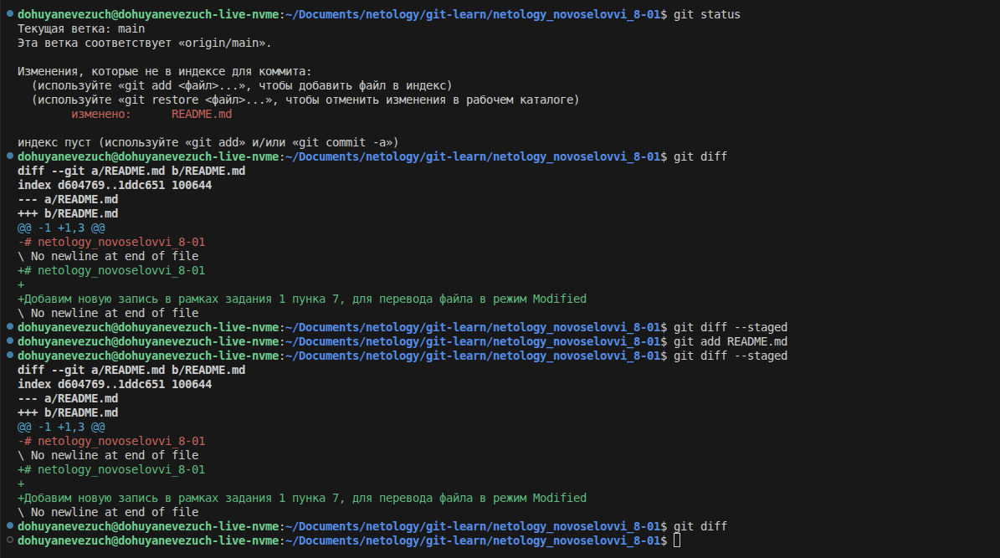
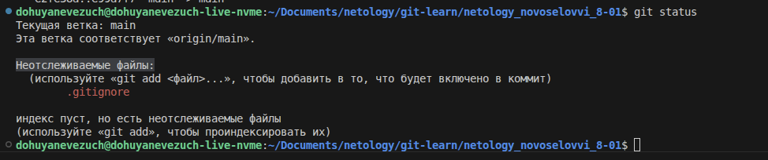
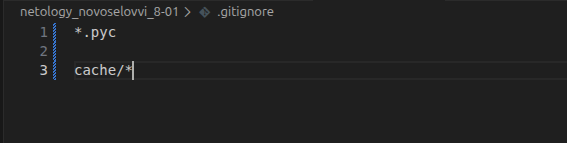
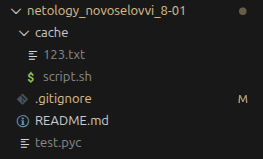
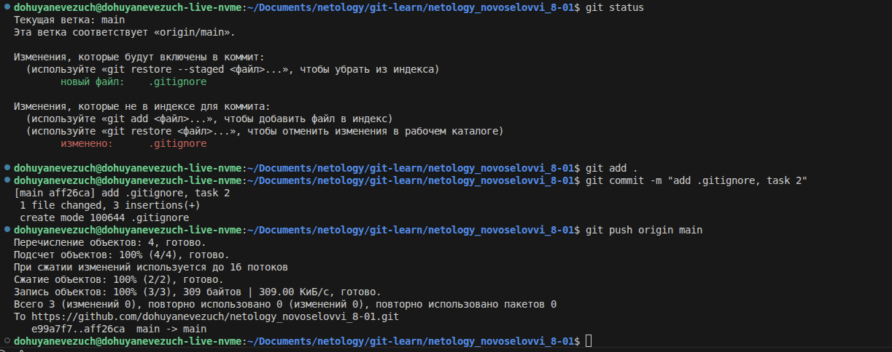
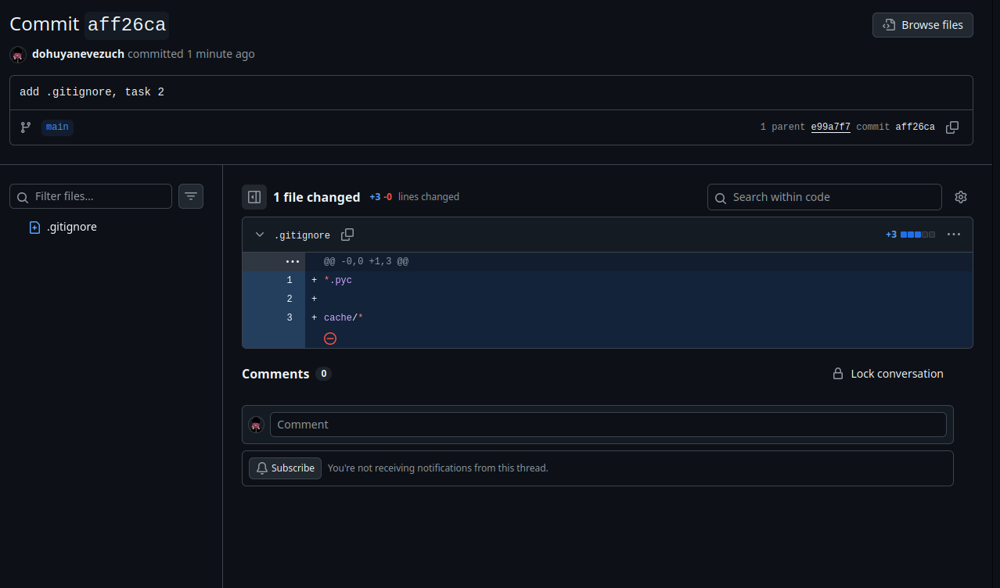
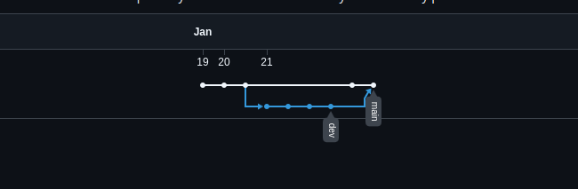

# Домашнее задание к занятию "`Git`" - `Новоселов Виктор Иванович`

### Задание 1

#### Текст задания

1. Зарегистрируйте аккаунт на GitHub.
2. Создайте новый отдельный публичный репозиторий. Обязательно поставьте галочку в поле «Initialize this repository with a README».
3. Склонируйте репозиторий, используя https протокол git clone ....
4. Перейдите в каталог с клоном репозитория.
5. Произведите первоначальную настройку Git, указав своё настоящее имя и email: git config --global user.name и git config --global user.email johndoe@example.com.
6. Выполните команду git status и запомните результат.
7. Отредактируйте файл README.md любым удобным способом, переведя файл в состояние Modified.
8. Ещё раз выполните git status и продолжайте проверять вывод этой команды после каждого следующего шага.
9. Посмотрите изменения в файле README.md, выполнив команды git diff и git diff --staged.
10. Переведите файл в состояние staged или, как говорят, добавьте файл в коммит, командой git add README.md.
11. Ещё раз выполните команды git diff и git diff --staged.
12. Теперь можно сделать коммит git commit -m 'First commit'.
13. Сделайте git push origin master.

В качестве ответа добавьте ссылку на этот коммит в ваш md-файл с решением.

#### Выполнение задания

Создание репозитория

Клонирование репозитория с помощью `git clone`, переход в каталог репо, указание имени и почты через
`git config --global user.name` и `git config --global user.email`, проверка статуса.

Редактирование файла `README.md`, повторная проверка статуса и просмотр изменений в файле командами `git diff`, `git diff --staged`, перевод файла в staged и повторный вывод команд по отображению изменения в файле

После выполнения команды `git add README.md` Мы видим, что теперь `diff` дает пустое значение, а `diff --staged` показывает изменения,
все потому что просто `diff` показывает изменения в директории, а `diff --staged` в коммите 

Выполнение коммита и отправка изменений `git push origin main`

[**Ссылка на Коммит**](https://github.com/dohuyanevezuch/netology_novoselovvi_8-01/commit/e99a7f7ee25d6fff20a1ed89edfc9490af0f2300)

---

### Задание 2

#### Текст задания

1. Создайте файл .gitignore (обратите внимание на точку в начале файла) и проверьте его статус сразу после создания.
2. Добавьте файл .gitignore в следующий коммит git add....
3. Напишите правила в этом файле, чтобы игнорировать любые файлы .pyc, а также все файлы в директории cache.
4. Сделайте коммит и пуш.

В качестве ответа добавьте ссылку на этот коммит в ваш md-файл с решением.

#### Выполнение задания

Создание файла .gitignore и проверка статуса

добавляем файл в коммит

Напишем правила игнорирования по заданию

и создадим каталог `cache` в который поместим рандомные файлы, а так же в корне файл с расширением `.рус`. И как мы видим, нам даже IDE уже подчеркиваем, что git их не будет учитывать

Проверка статуса тоже не учитывает эти файлы.

Добавляем файлы в коммит, делаем сам коммит, пушим в репо

Новых файлов не появилось, а коммит отработал

И, собственно, сам коммит

[**Ссылка на коммит**](https://github.com/dohuyanevezuch/netology_novoselovvi_8-01/commit/aff26ca89a49a001935d0a375eb20882b9f386e7)

---

### Задание 3

#### Текст задания

1. Создайте новую ветку dev и переключитесь на неё.
2. Создайте в ветке dev файл test.sh с произвольным содержимым.
3. Сделайте несколько коммитов и пушей в ветку dev, имитируя активную работу над файлом в процессе разработки.
4. Переключитесь на основную ветку.
5. Добавьте файл main.sh в основной ветке с произвольным содержимым, сделайте комит и пуш . Так имитируется продолжение общекомандной разработки в основной ветке во время разработки отдельного функционала в de3. ветке.
6. Сделайте мердж dev ветки в основную с помощью git merge dev. Напишите осмысленное сообщение в появившеес3. окно комита.
7. Сделайте пуш в основной ветке.
8. Не удаляйте ветку dev.

В качестве ответа прикрепите ссылку на граф коммитов https://github.com/ваш-логин/ваш-репозиторий/network в ваш md-файл с решением.

Ваш граф комитов должен выглядеть аналогично скриншоту:

#### Выполнение задания

Создадим новую ветку `git checkout -b dev`

Создадим файл `test.sh` и сделаем несколько коммитов и пушей

Вернемся на основную ветку

Создадим фалй `main.sh` и так же немного его заполним и запушим

Выполним `git merge dev` и сделаем пуш 

Получим граф

[Ссылка на граф](https://github.com/dohuyanevezuch/netology_novoselovvi_8-01/network)

---

### Задание 4

#### Текст задания

Сэмулируем конфликт. Перед выполнением изучите документацию.

1. Создайте ветку conflict и переключитесь на неё.
2. Внесите изменения в файл test.sh.
3. Сделайте коммит и пуш.
4. Переключитесь на основную ветку.
5. Измените ту же самую строчку в файле test.sh.
6. Сделайте коммит и пуш.
7. Сделайте мердж ветки conflict в основную ветку и решите конфликт так, чтобы в результате в файле оказалс2. код из ветки conflict.

В качестве ответа на задание прикрепите ссылку на граф коммитов https://github.com/ваш-логин/ваш-репозиторий/network в ваш md-файл с решением.

#### Выполнение задания

Создали ветку, внесли изменения, сделали коммит и пуш, аналогично в ветке main

Далее проводим слияние, фиксим конфликт и делаем коммит и пуш

[Ссылка на граф](https://github.com/dohuyanevezuch/netology_novoselovvi_8-01/network)