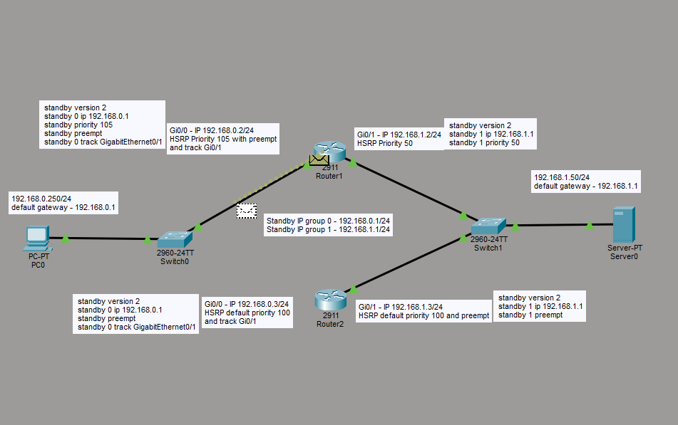
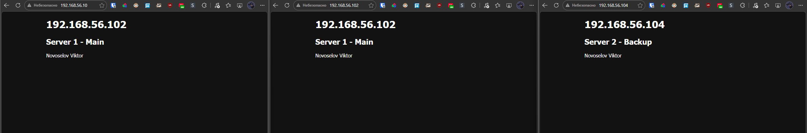
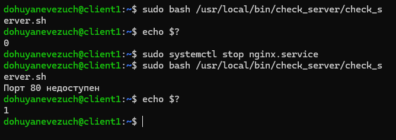
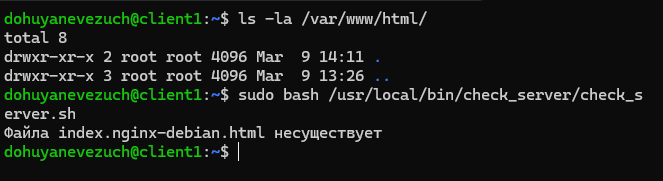
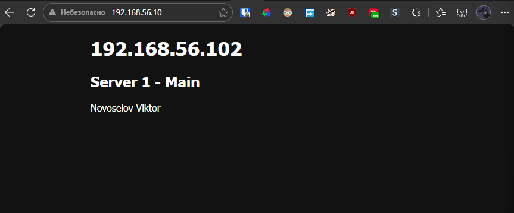
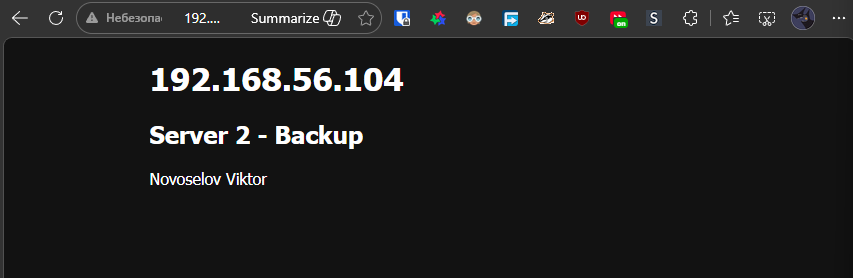

# Домашнее задание к занятию `Disaster recovery и Keepalived` - `Новоселов Виктор Иванович`

### Задание 1

#### Текст задания

- Дана схема для Cisco Packet Tracer, рассматриваемая в лекции.
- На данной схеме уже настроено отслеживание интерфейсов маршрутизаторов Gi0/1 (для нулевой группы)
- Необходимо аналогично настроить отслеживание состояния интерфейсов Gi0/0 (для первой группы).
- Для проверки корректности настройки, разорвите один из кабелей между одним из маршрутизаторов и Switch0 и запустите ping между PC0 и Server0.
- На проверку отправьте получившуюся схему в формате pkt и скриншот, где виден процесс настройки маршрутизатора.

#### Выполнение задания

1. На роутере 2 поменяем приоритет на 55
2. Настроим слежку за Интерфейсом Gig0/0, при его падении приоритет трека 1 будет падать на 10 пунктов
3. Настроим параметр preempt для Роутера 1 при треке 1

```Cisco
# Router2
enable
configure terminal
interface GigabitEthernet0/1
standby 1 priority 50
standby 1 preempt
standby 1 track GigabitEthernet0/0
```
```Cisco
# Router1
enable
configure terminal
interface GigabitEthernet0/1
standby 1 preempt
```
Дарее разрываем связь между Router2 и Switch0 и видим, что пакет начинает возвращаться через Router1


---

### Задание 2

#### Текст задания

- Запустите две виртуальные машины Linux, установите и настройте сервис Keepalived как в лекции, используя пример конфигурационного файла.
- Настройте любой веб-сервер (например, nginx или simple python server) на двух виртуальных машинах
- Напишите Bash-скрипт, который будет проверять доступность порта данного веб-сервера и существование файла index.html в root-директории данного веб-сервера.
- Настройте Keepalived так, чтобы он запускал данный скрипт каждые 3 секунды и переносил виртуальный IP на другой сервер, если bash-скрипт завершался с кодом, отличным от нуля (то есть порт веб-сервера был недоступен или отсутствовал index.html). Используйте для этого секцию vrrp_script
- На проверку отправьте получившейся bash-скрипт и конфигурационный файл keepalived, а также скриншот с демонстрацией переезда плавающего ip на другой сервер в случае недоступности порта или файла index.html

#### Выполнение задания

1. Установили keepalived и nginx на обе ВМ
2. У nginx настроили html на вывод какой это сервер (ip и название)



3. Написали простой bash скрипт, который проверипт, который проверяет доступность порта и файла index.html

```bash
#!/bin/bash

if ! nc -zv localhost 80 > /dev/null 2>&1; then
        echo "Порт 80 недоступен"
        exit 1
fi

if [ ! -f /var/www/html/index.nginx-debian.html ]; then
        echo "Файла index.nginx-debian.html несуществует"
        exit 1
fi

exit 0
```

и поместили его в каталог `/keepalived-script` на обеих ВМ.




4. Создадим нового пользователя `keepalived_script` и сделаем его владельцем каталога `/keepalived-script` и всех вложенных файлов.

5. Настроили keepalived, так, чтоб каждые 3 секунды выполнялся этот скрипт и если 2 раза выподают провалы выполнения скрипта то приоритет мастер сервера падает на 2 пункта -> идет переключение на backup сервер

```config
# ВМ Master

global_defs {
        enable_script_security
        script_user keepalived_script
}
vrrp_script check_server {
        script "/bin/bash /keepalived-script/check-server.sh"
        interval 3
        weight -2
        fall 2
        rise 2
}
vrrp_instance VI_1 {
        state MASTER
        interface enp0s8
        virtual_router_id 10
        priority 201
        advert_int 1

        virtual_ipaddress {
              192.168.56.10/24
        }
        track_script {
                check_server
        }

}
```
```config
# ВМ Backup

global_defs {
        enable_script_security
        script_user keepalived_script
}
vrrp_script check_server {
        script "/bin/bash /keepalived-script/check-server.sh"
        interval 3
        weight -2
        fall 2
        rise 2
}
vrrp_instance VI_1 {
        state BACKUP
        interface enp0s8
        virtual_router_id 10
        priority 200
        advert_int 1

        virtual_ipaddress {
              192.168.56.10/24
        }
        track_script {
                check_server
        }

}
```

nginx включен на обеих ВМ, файлы в целости



Создадим ситуацию недоступности 80 порта, остановим службу nginx



Как видим выполнение скрипта завершается с кодом 1, и перенаправляет на backup сервер

Если запустим службу nginx, ip опять перейдет на сервер Master

##### Файлы конфигураций и скрипт:

[keepalived config MASTER](./files/02/MASTER-config/keepalived.conf)

[keepalived config BACKUP](./files/02/BACKUP-config/keepalived.conf)

[Script](./files/02/keepalived-script.sh)


---
