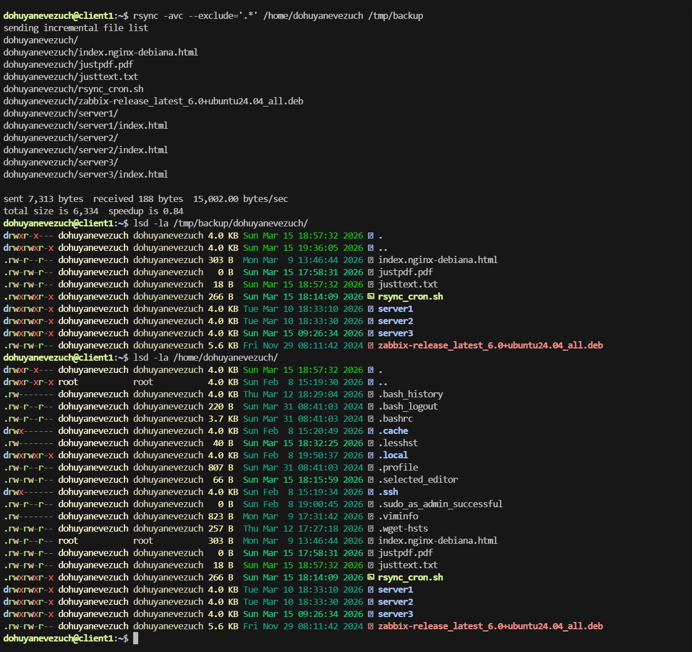
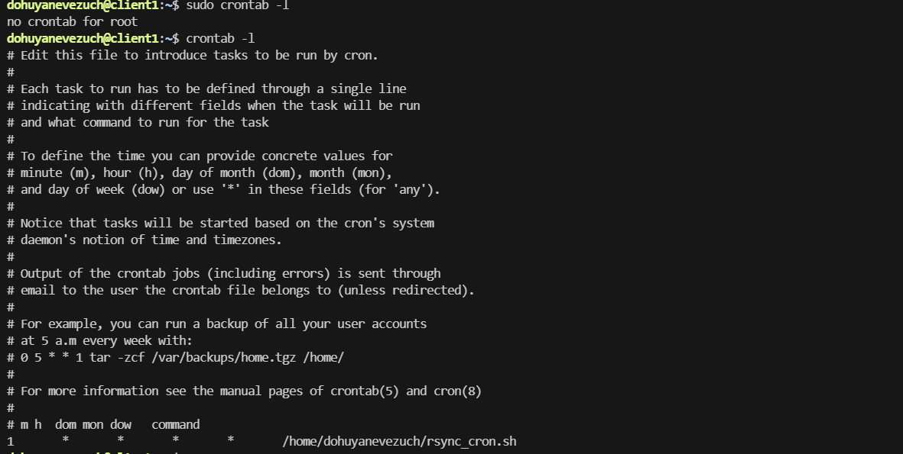
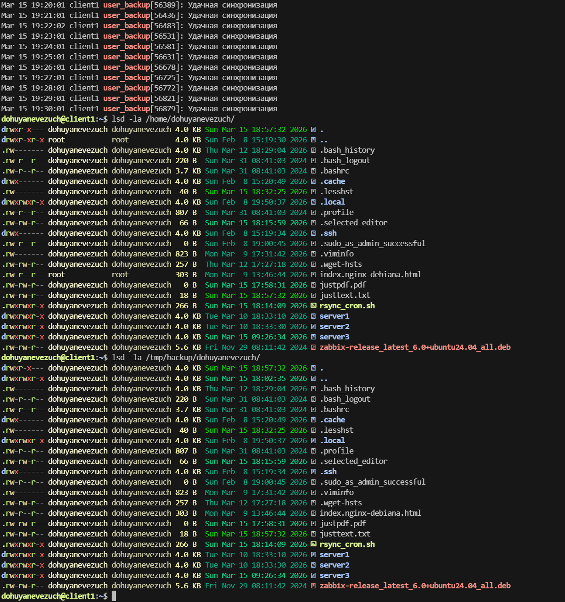
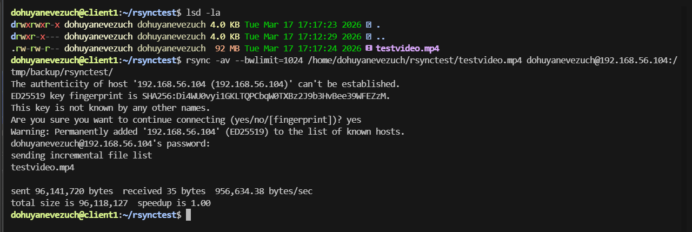

# Домашнее задание к занятию `Резервное копирование` - `Новоселов Виктор Иванович`

### Задание 1

#### Текст задания

- Составьте команду rsync, которая позволяет создавать зеркальную копию домашней директории пользователя в директорию /tmp/backup
- Необходимо исключить из синхронизации все директории, начинающиеся с точки (скрытые)
- Необходимо сделать так, чтобы rsync подсчитывал хэш-суммы для всех файлов, даже если их время модификации и размер идентичны в источнике и приемнике.
- На проверку направить скриншот с командой и результатом ее выполнения

#### Выполнение задания

нам потребуется флаги:
- `a` - архивный режим 
- `v` - Визульация
- `c` - контрольная сумма
- `--exclude='.*'` - исключение всех файлов, начинающихся с точки

```bash
rsync -avc --exclude='.*' /home/dohuyanevezuch /tmp/backup
```



---

### Задание 2

#### Текст задания

- Написать скрипт и настроить задачу на регулярное резервное копирование домашней директории пользователя с помощью rsync и cron.
- Резервная копия должна быть полностью зеркальной
- Резервная копия должна создаваться раз в день, в системном логе должна появляться запись об успешном или неуспешном выполнении операции
- Резервная копия размещается локально, в директории /tmp/backup
На проверку направить файл crontab и скриншот с результатом работы утилиты.

#### файлы к заданию

[script](./files/02/rsync_cron.sh)

[cron](./files/02/crontab)

#### Выполнение задания

Напишим скрипт

```bash
#!/bin/bash

DIR="/home/dohuyanevezuch"
TAR="/tmp/backup"
LOG_TAG="user_backup"

rsync -a --delete $DIR $TAR

if [ $? -eq 0 ]; then
        logger -t $LOG_TAG "Удачная синхронизация"
else
        logger -t $LOG_TAG "ОШИБКА синхронизации"
fi
```

Сделаем его исполняемым

Добавим строчку в cron

```bash
0 12 * * * /home/dohuyanevezuch/rsync_cron.sh
```



Для наглядности работы сменим переодичность бекапов на каждую минуту

Результат работы



---

### Задание 3*

#### Текст задания

- Настройте ограничение на используемую пропускную способность rsync до 1 Мбит/c
- Проверьте настройку, синхронизируя большой файл между двумя серверами
- На проверку направьте команду и результат ее выполнения в виде скриншота

#### Выполнение задания

Выполним команду 

```bash
rsync -av --bwlimit=1024 /home/dohuyanevezuch/rsynctest/testvideo.mp4 dohuyanevezuch@192.168.56.104:/tmp/backup/rsynctest/
```




---
