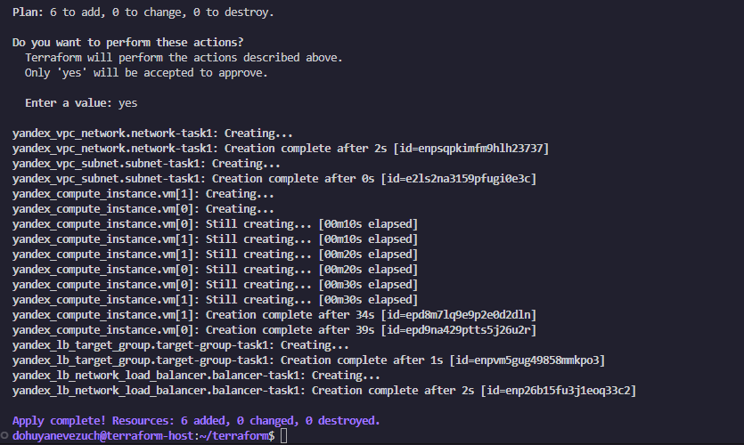
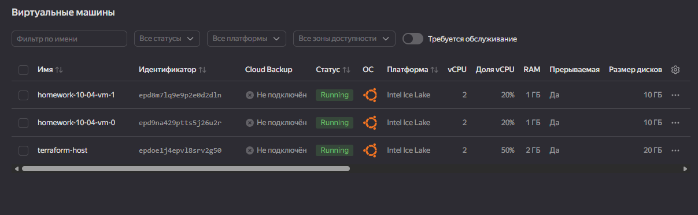
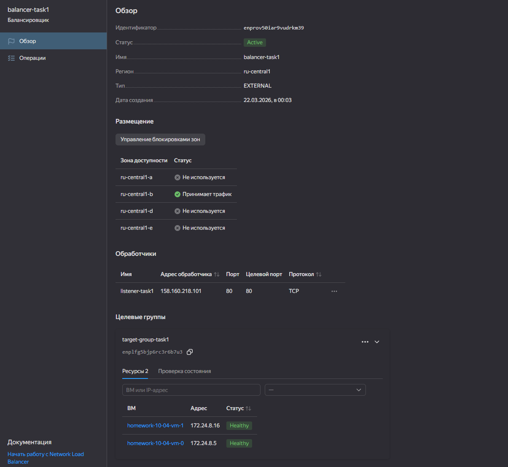
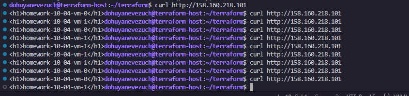
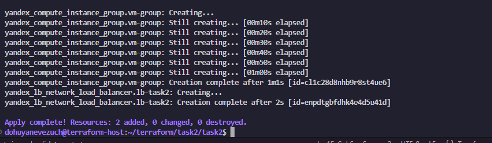
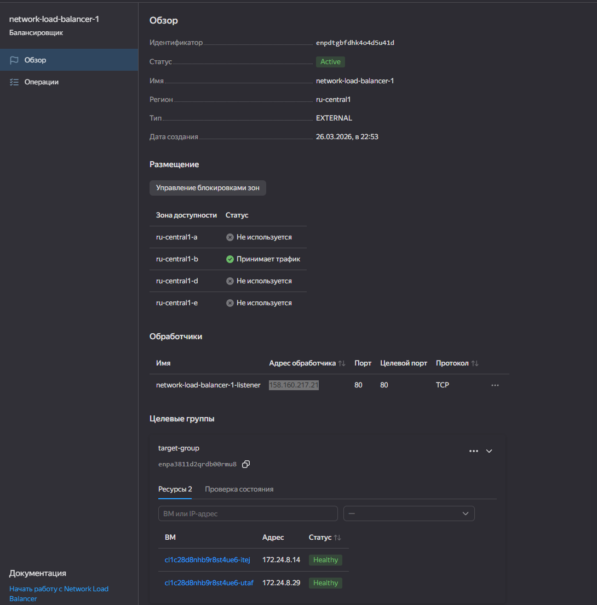
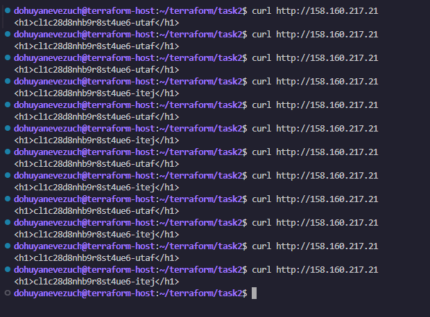

# Домашнее задание к занятию `Отказоустойчивость в облаке` - `Новоселов Виктор Иванович`

### Задание 1

#### Текст задания

1. Теперь вместо одной виртуальной машины сделайте terraform playbook, который:
- создаст 2 идентичные виртуальные машины. Используйте аргумент count для создания таких ресурсов;
- создаст таргет-группу. Поместите в неё созданные на шаге 1 виртуальные машины;
- создаст сетевой балансировщик нагрузки, который слушает на порту 80, отправляет трафик на порт 80 виртуальных машин и http healthcheck на порт 80 виртуальных машин.

2. Установите на созданные виртуальные машины пакет Nginx любым удобным способом и запустите Nginx веб-сервер на порту 80.

3. Перейдите в веб-консоль Yandex Cloud и убедитесь, что:

- созданный балансировщик находится в статусе Active,
- обе виртуальные машины в целевой группе находятся в состоянии healthy.

4. Сделайте запрос на 80 порт на внешний IP-адрес балансировщика и убедитесь, что вы получаете ответ в виде дефолтной страницы Nginx.

В качестве результата пришлите:

1. Terraform Playbook.

2. Скриншот статуса балансировщика и целевой группы.

3. Скриншот страницы, которая открылась при запросе IP-адреса балансировщика.

#### файлы к заданию

**terraform:**
- [main.tf](./files/01/main.tf)
- [compute.tf](./files/01/compute.tf)
- [net-load-balancer.ft](./files/01/net-load-balancer.tf)
- [target-group.tf](./files/01/target-group.tf)

**cloud-init:**
- [cloud-init.yaml](./files/01/cloud-init.yaml)

#### Выполнение задания

Описываем логику создания 2 ВМ, Таргет группы и балансера в конфигурационных файлах terraform и cloud-init ([Файлы тут](#файлы-к-заданию))

Выполняем `terraform apply` и проверяем результат

Терраформ отработал успешно

ВМ создались

Балансер активен, ресурсы в статусе `healthy`

балансер отрабатывает, миксуя ВМ

---

### Задание 2*

#### Текст задания

1. Теперь вместо создания виртуальных машин создайте группу виртуальных машин с балансировщиком нагрузки.

2. Nginx нужно будет поставить тоже автоматизированно. Для этого вам нужно будет подложить файл установки Nginx в user-data-ключ метадаты виртуальной машины.

3. Перейдите в веб-консоль Yandex Cloud и убедитесь, что:
- созданный балансировщик находится в статусе Active,
- обе виртуальные машины в целевой группе находятся в состоянии healthy.
4. Сделайте запрос на 80 порт на внешний IP-адрес балансировщика и убедитесь, что вы получаете ответ в виде дефолтной страницы Nginx.

#### файлы к заданию

**terraform:**
- [main.tf](./files/02/main.tf)
- [compute-group.tf](./files/02/compute-group.tf)
- [network.tf](./files/02/network.tf)
- [variables.tf](./files/02/veriables.tf)

**cloud-init:**
- [cloud-init.yaml](./files/02/cloud-init.yaml)

#### Выполнение задания

>[!TIP]
>Вместо дефолтной страницы nginx, я использовал страницу с выводом имени VM с первого задания, но в конфиге забыл явно указать, чтоб было четко видно разнеицу имен. Имена создались автоматически, различить их можно, просто менее читаемо

Пишем конфиг terraform для создания группы виртуальных машин с балансировщиком нагрузки и cloud-init [Файлы тут](#файлы-к-заданию-1) и запускаем `terraform apply`

Вывод команды успешен

В YC создался балансировщик и обе VM в статусе healthy

Сделам пару запросов curl на адрес балансировшика и убедимся, что ответом приходят разные имена VM

---

