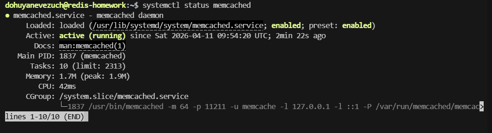
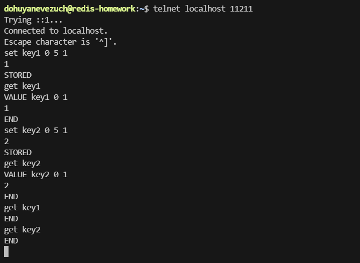
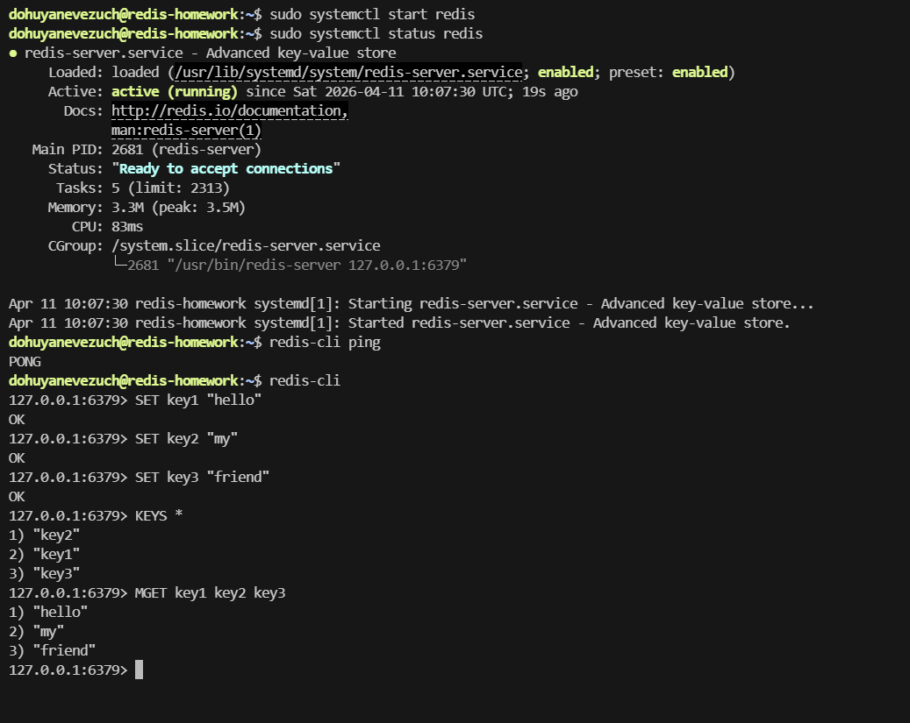
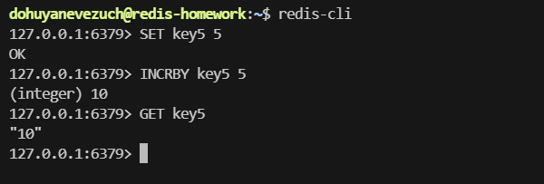

# Домашнее задание к занятию `Кеширование Redis/memcached` - `Новоселов Виктор Иванович`

### Задание 1

#### Текст задания
Приведите примеры проблем, которые может решить кеширование.

Приведите ответ в свободной форме.

#### Выполнение задания

Более быстрый доступ к часто используемым объектам, например в период массовой активности Сервиса

Снизить нагрузку на БД, чтоб все однотипные запросы не обращались и не нагружали саму БД

---

### Задание 2

#### Текст задания

Установите и запустите memcached.

Приведите скриншот systemctl status memcached, где будет видно, что memcached запущен.

#### Выполнение задания

---

### Задание 3

#### Текст задания

Запишите в memcached несколько ключей с любыми именами и значениями, для которых выставлен TTL 5.

Приведите скриншот, на котором видно, что спустя 5 секунд ключи удалились из базы.

#### Выполнение задания

Запишим 2 ключа `key1` и `key2` с значениями `1` и `2` и ttl 5 

Как видим спустя 5 секунд ключи удалились из базы.

---

### Задание 4

#### Текст задания

Запишите в Redis несколько ключей с любыми именами и значениями.

Через redis-cli достаньте все записанные ключи и значения из базы, приведите скриншот этой операции.

#### Выполнение задания

---

### Задание 5*

#### Текст задания

Запишите в Redis ключ key5 со значением типа "int" равным числу 5. Увеличьте его на 5, чтобы в итоге в значении лежало число 10.

Приведите скриншот, где будут проделаны все операции и будет видно, что значение key5 стало равно 10.

#### Выполнение задания

---