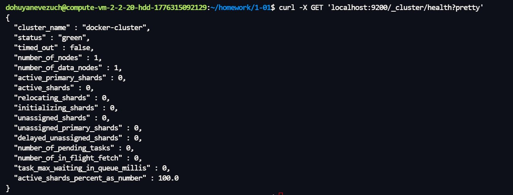
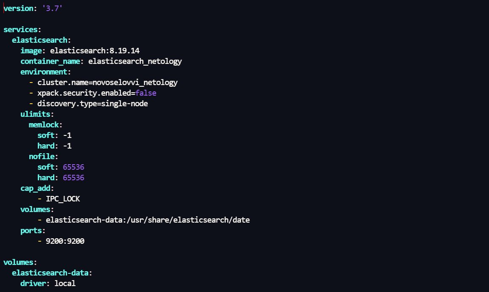
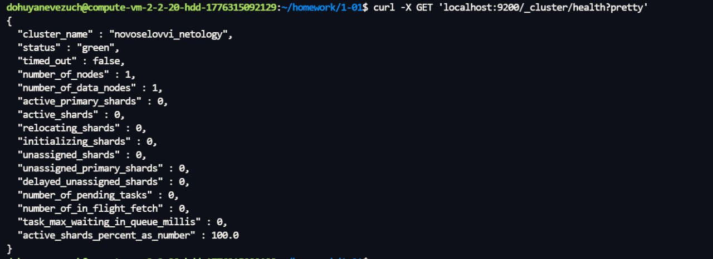
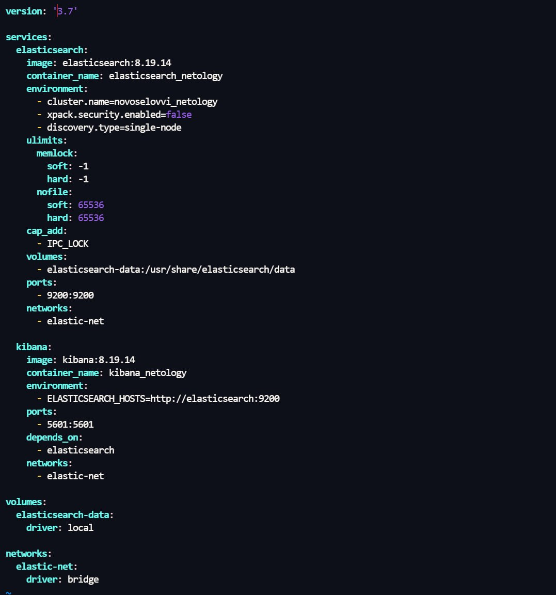
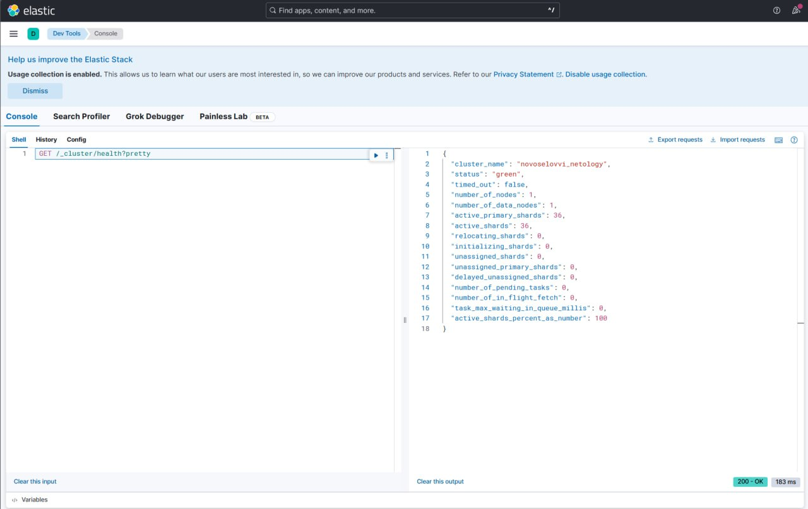
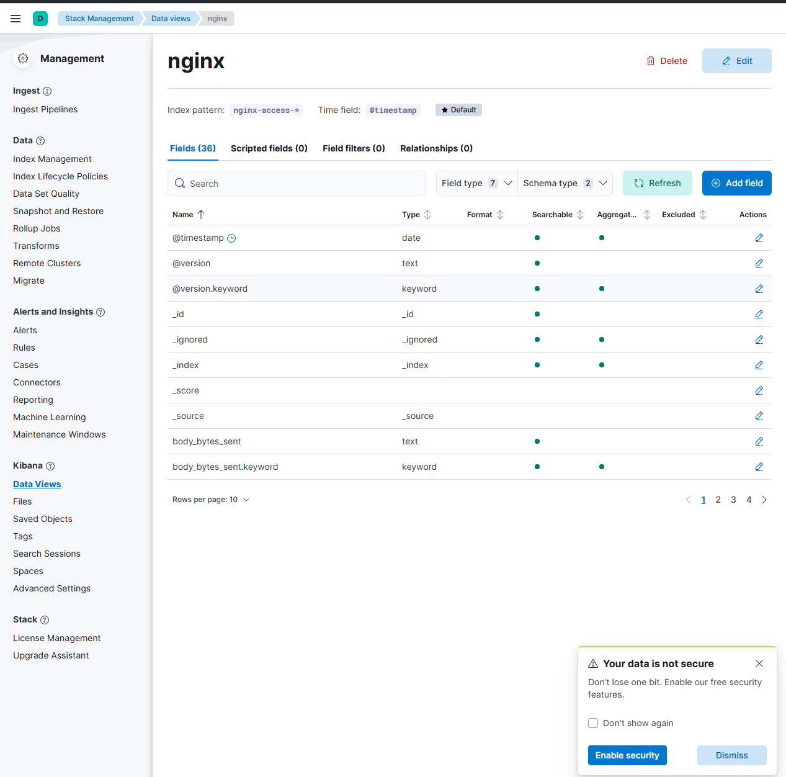
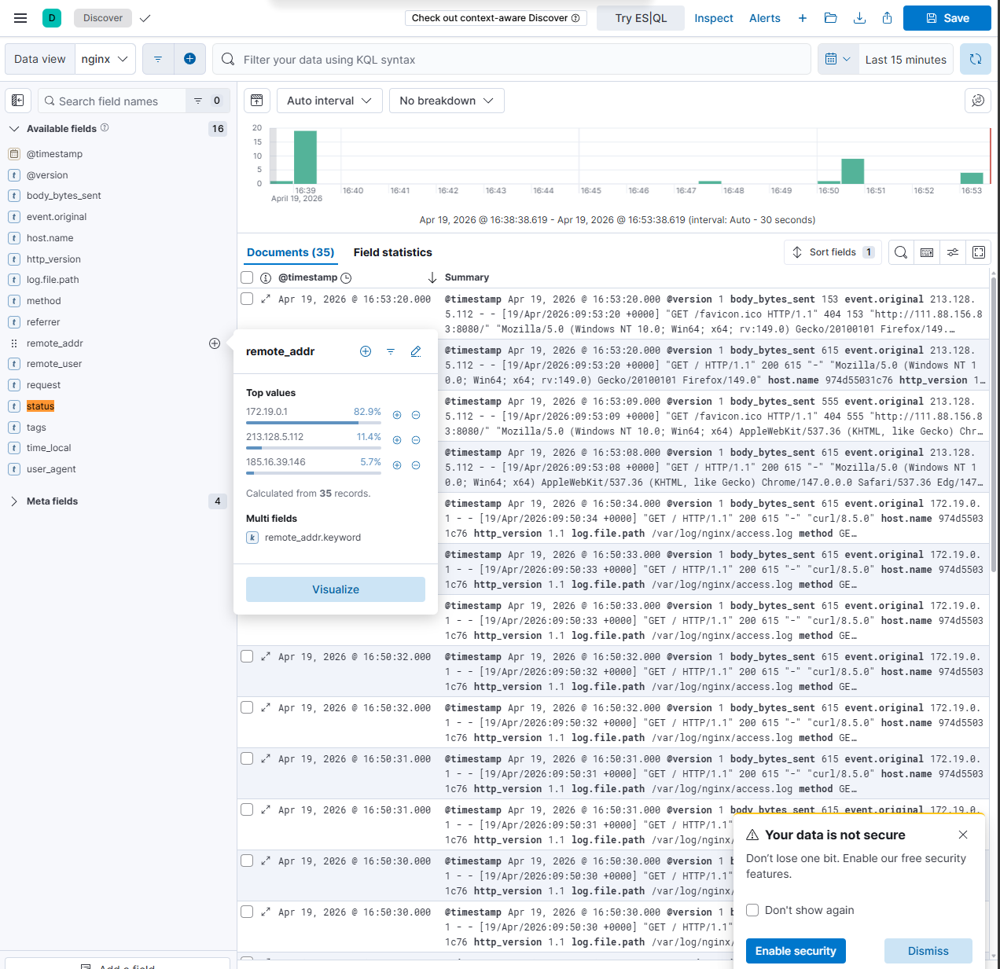
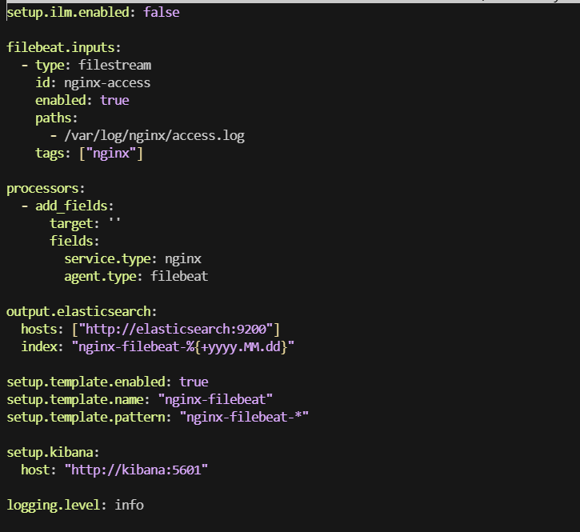
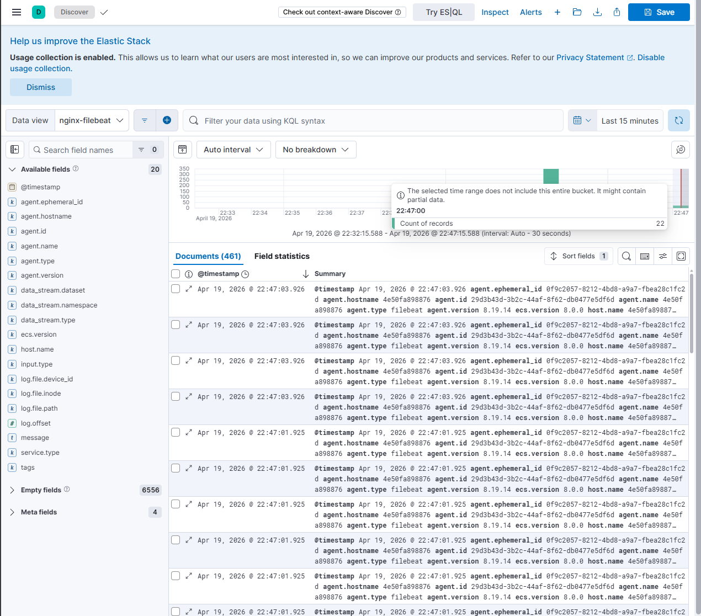

# Домашнее задание к занятию `ELK` - `Новоселов Виктор Иванович`

### Задание 1

#### Текст задания
Установите и запустите Elasticsearch, после чего поменяйте параметр cluster_name на случайный.

Приведите скриншот команды 'curl -X GET 'localhost:9200/_cluster/health?pretty', сделанной на сервере с установленным Elasticsearch. Где будет виден нестандартный cluster_name.

#### Выполнение задания

Установили ElasticSearch, вополнили команду `curl -X GET 'localhost:9200/_cluster/health?pretty`



Сменим имя кластера на свое



Повторим `curl -X GET 'localhost:9200/_cluster/health?pretty`




---

### Задание 2

#### Текст задания

Установите и запустите Kibana.

Приведите скриншот интерфейса Kibana на странице http://<ip вашего сервера>:5601/app/dev_tools#/console, где будет выполнен запрос GET /_cluster/health?pretty.


#### Выполнение задания

Изменим `docker-compose.yaml` для установки Kibana



Перейдем в kibana в dev_tool и выполним запрос `GET /_cluster/health?pretty`



---

### Задание 3

#### Текст задания

Установите и запустите Logstash и Nginx. С помощью Logstash отправьте access-лог Nginx в Elasticsearch.

Приведите скриншот интерфейса Kibana, на котором видны логи Nginx.

#### Выполнение задания

Создадим структуру папок для успешной работы

```bash
.
├── docker-compose.yaml
├── logstash/
│   └── pipeline/
│       └── nginx.conf
└── nginx/
    ├── logs/
    └── nginx.conf
```

В Пайплайне логстеша напишем конфиг `nginx.conf` с содержимым

```conf
input {
  file {
    path => "/var/log/nginx/access.log"
    start_position => "beginning"
    sincedb_path => "/dev/null"
    tags => ["nginx"]
  }
}

filter {
  grok {
    match => { "message" => "%{IPORHOST:remote_addr} - %{DATA:remote_user} \[%{HTTPDATE:time_local}\] \"%{WORD:method} %{DATA:request} HTTP/%{NUMBER:http_version}\" %{NUMBER:status} %{NUMBER:body_bytes_sent} \"%{DATA:referrer}\" \"%{DATA:user_agent}\"" }
    tag_on_failure => ["_grokparsefailure"]
  }

  date {
    match => [ "time_local", "dd/MMM/yyyy:HH:mm:ss Z" ]
    target => "@timestamp"
  }

  mutate {
    remove_field => ["message", "time_local"]
  }
}

output {
  elasticsearch {
    hosts => ["http://elasticsearch:9200"]
    index => "nginx-access-%{+YYYY.MM.dd}"
  }
  stdout { codec => rubydebug }
}
```

В папке nginx создадим файл конфигурации `nginx.conf`

```conf
events {}

http {
    log_format main '$remote_addr - $remote_user [$time_local] '
                    '"$request" $status $body_bytes_sent '
                    '"$http_referer" "$http_user_agent"';

    access_log /var/log/nginx/access.log main;
    error_log /var/log/nginx/error.log;

    server {
        listen 80;
        server_name localhost;

        location / {
            root /usr/share/nginx/html;
            index index.html;
        }
    }
}
```

Изменим `docker-compose.yaml` для установки nginx и logstash

```yaml
version: '3.8'

services:
  elasticsearch:
    image: elasticsearch:8.19.14
    container_name: elasticsearch_netology
    environment:
      - cluster.name=novoselovvi_netology
      - xpack.security.enabled=false
      - discovery.type=single-node
      - "ES_JAVA_OPTS=-Xms1g -Xmx1g"
    ulimits:
      memlock:
        soft: -1
        hard: -1
      nofile:
        soft: 65536
        hard: 65536
    cap_add:
      - IPC_LOCK
    volumes:
      - elasticsearch-data:/usr/share/elasticsearch/data
    ports:
      - 9200:9200
    networks:
      - elastic-net

  kibana:
    image: kibana:8.19.14
    container_name: kibana_netology
    environment:
      - ELASTICSEARCH_HOSTS=http://elasticsearch:9200
      - SERVER_HOST=0.0.0.0
      - XPACK_SECURITY_ENABLED=false
      - "KIBANA_JAVA_OPTS=-Xms512m -Xmx512m"
    ports:
      - 5601:5601
    depends_on:
      - elasticsearch
    networks:
      - elastic-net

  logstash:
    image: logstash:8.19.14
    container_name: logstash_netology
    environment:
      - "LS_JAVA_OPTS=-Xms512m -Xmx512m"
      - "PIPELINE_WORKERS=1"
    volumes:
      - ./logstash/pipeline:/usr/share/logstash/pipeline
      - ./nginx/logs:/var/log/nginx:ro
    depends_on:
      - elasticsearch
    networks:
      - elastic-net

  nginx:
    image: nginx:1.27-alpine
    container_name: nginx_netology
    ports:
      - 8080:80
    networks:
      - elastic-net
    volumes:
      - ./nginx/logs:/var/log/nginx
      - ./nginx/nginx.conf:/etc/nginx/nginx.conf:ro
    depends_on:
      - logstash

volumes:
  elasticsearch-data:
  nginx_logs:

networks:
  elastic-net:
    driver: bridge
```

Создаем некое количество логов

```bash
for i in {1..10}; do curl -s http://localhost:8080 > /dev/null; sleep 0.5; done
```

+ Зайдем с разных браузеров

Убеждаемся в записи логов `docker logs logstash_netology --tail 100`

```bash
dohuyanevezuch@compute-vm-2-2-20-hdd-1776315092129:~/homework/1-01$ docker logs logstash_netology --tail 100
        "file" => {
            "path" => "/var/log/nginx/access.log"
        }
    },
    "body_bytes_sent" => "153",
        "remote_user" => "-",
         "@timestamp" => 2026-04-19T09:53:20.000Z,
             "status" => "404",
               "tags" => [
        [0] "nginx"
    ],
             "method" => "GET",
            "request" => "/favicon.ico",
           "@version" => "1",
               "host" => {
        "name" => "974d55031c76"
    },
       "http_version" => "1.1"
}
{
        "remote_addr" => "185.16.39.146",
           "referrer" => "-",
              "event" => {
        "original" => "185.16.39.146 - - [19/Apr/2026:09:57:51 +0000] \"GET / HTTP/1.1\" 200 615 \"-\" \"Mozilla/5.0\""
    },
         "user_agent" => "Mozilla/5.0",
                "log" => {
        "file" => {
            "path" => "/var/log/nginx/access.log"
        }
    },
    "body_bytes_sent" => "615",
        "remote_user" => "-",
         "@timestamp" => 2026-04-19T09:57:51.000Z,
             "status" => "200",
               "tags" => [
        [0] "nginx"
    ],
             "method" => "GET",
            "request" => "/",
           "@version" => "1",
               "host" => {
        "name" => "974d55031c76"
    },
       "http_version" => "1.1"
}
...
```

Переходим в elasticsearch `http://localhost:9200/` -> Stask Management -> Kibana -> Data Views и добавляем дата вью с индекс паттерном nginx-access-*



Переходим в Discover и наблюдаем логи


---

### Задание 4

#### Текст задания

Установите и запустите Filebeat. Переключите поставку логов Nginx с Logstash на Filebeat.

Приведите скриншот интерфейса Kibana, на котором видны логи Nginx, которые были отправлены через Filebeat

#### Выполнение задания

Изменим docker-compose.yaml, уберем сервис ligstash и добавим filebeat

```yaml
version: '3.8'

services:
  elasticsearch:
    image: elasticsearch:8.19.14
    container_name: elasticsearch_netology
    environment:
      - cluster.name=novoselovvi_netology
      - xpack.security.enabled=false
      - discovery.type=single-node
      - "ES_JAVA_OPTS=-Xms1g -Xmx1g"
    ulimits:
      memlock:
        soft: -1
        hard: -1
      nofile:
        soft: 65536
        hard: 65536
    cap_add:
      - IPC_LOCK
    volumes:
      - elasticsearch-data:/usr/share/elasticsearch/data
    ports:
      - 9200:9200
    networks:
      - elastic-net

  kibana:
    image: kibana:8.19.14
    container_name: kibana_netology
    environment:
      - ELASTICSEARCH_HOSTS=http://elasticsearch:9200
      - SERVER_HOST=0.0.0.0
      - XPACK_SECURITY_ENABLED=false
      - "KIBANA_JAVA_OPTS=-Xms512m -Xmx512m"
    ports:
      - 5601:5601
    depends_on:
      - elasticsearch
    networks:
      - elastic-net

  filebeat:
    image: elastic/filebeat:8.19.14
    container_name: filebeat_netology
    user: root
    volumes:
      - ./filebeat/filebeat.yml:/usr/share/filebeat/filebeat.yml:ro
      - ./nginx/logs:/var/log/nginx:ro
    networks:
      - elastic-net
    depends_on:
      - elasticsearch

  nginx:
    image: nginx:1.27-alpine
    container_name: nginx_netology
    ports:
      - 8080:80
    networks:
      - elastic-net
    volumes:
      - ./nginx/logs:/var/log/nginx
      - ./nginx/nginx.conf:/etc/nginx/nginx.conf:ro
    depends_on:
      - elasticsearch

volumes:
  elasticsearch-data:
  nginx_logs:

networks:
  elastic-net:
    driver: bridge
```

Создадим `./filebeat/fileveat.conf` с содержимым



Ожидаемая структура файлов

```bash
.
├── docker-compose.yaml
├── filebeat
│   └── filebeat.yml
└── nginx
    ├── logs
    │   ├── access.log
    │   └── error.log
    └── nginx.conf
```

Запустим docker-compose и добавим новый dataview `nginx-filebeat-*`

Заполним логи командой

```bash
for i in {1..22}; do curl -s "http://localhost:8080/?from=filebeat_test_$i" > /dev/null; sleep 0.3; done
```

И в Dataview видим как те самые 22 лога записались



---
