# Домашнее задание к занятию `Очереди RabbitMQ` - `Новоселов Виктор Иванович`


### Задание 1

#### Текст задания

Используя Vagrant или VirtualBox, создайте виртуальную машину и установите RabbitMQ. Добавьте management plug-in и зайдите в веб-интерфейс.

Итогом выполнения домашнего задания будет приложенный скриншот веб-интерфейса RabbitMQ.

#### Выполнение задания

Я решил поднять сервис rabbitmq через докер, пишем `docker-compose.yaml`

```yaml
version: "3.8"

services:
  rabbitmq:
    image: rabbitmq:3.10.7-management
    container_name: rabbitmq
    environment:
      - RABBITMQ_DEFAULT_USER=${RABBITMQ_DEFAULT_USER}
      - RABBITMQ_DEFAULT_PASS=${RABBITMQ_DEFAULT_PASS}
      - RABBITMQ_ERLANG_COOKIE=${RABBITMQ_ERLANG_COOKIE}
      - RABBITMQ_CONFIG_FILE=./config/rabbitmq.conf
      - RABBIT_NODE_PORT=5672
    volumes:
      - ./config:/config
    ports:
      - 15672:15672
      - 5672:5672

```

Создаем `.env`

```
export RABBITMQ_DEFAULT_USER=netoilogy
export RABBITMQ_DEFAULT_PASS=netology
export RABBITMQ_ERLANG_COOKIE=12345
```

Создаем `config/rabbitmq.conf`

```conf

```

Запускаем сервис


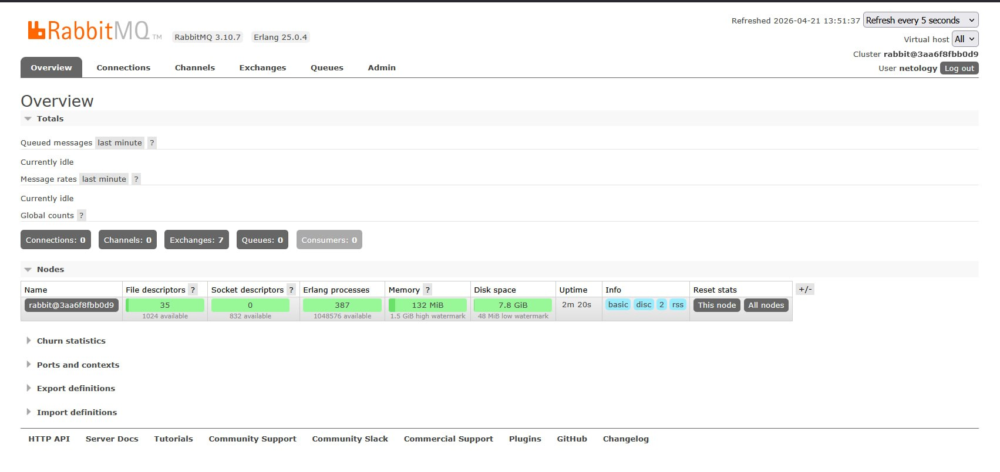

---

### Задание 2

#### Текст задания

Используя приложенные скрипты, проведите тестовую отправку и получение сообщения. Для отправки сообщений необходимо запустить скрипт producer.py.

Для работы скриптов вам необходимо установить Python версии 3 и библиотеку Pika. Также в скриптах нужно указать IP-адрес машины, на которой запущен RabbitMQ, заменив localhost на нужный IP.

```python
pip install pika
```

Зайдите в веб-интерфейс, найдите очередь под названием hello и сделайте скриншот. После чего запустите второй скрипт consumer.py и сделайте скриншот результата выполнения скрипта

В качестве решения домашнего задания приложите оба скриншота, сделанных на этапе выполнения.

Для закрепления материала можете попробовать модифицировать скрипты, чтобы поменять название очереди и отправляемое сообщение.


#### Выполнение задания

Выданные скрипты не отробатывали, пришлось редактировать как получилось:

```python
#consumer.py

#!/usr/bin/env python
# coding=utf-8
import pika

credentials = pika.PlainCredentials('netology', 'tetology')
connection = pika.BlockingConnection(
    pika.ConnectionParameters(
        '103.76.52.242',
        5672,
        '/',
        credentials
    )
)

channel = connection.channel()
channel.queue_declare(queue='hello')

def callback(ch, method, properties, body):
    print(f"Сообщение: {body.decode()}")
    ch.basic_ack(delivery_tag=method.delivery_tag)

channel.basic_consume(
    queue='hello',
    on_message_callback=callback
)

channel.start_consuming()

```

```python
#producer.py

#!/usr/bin/env python
# coding=utf-8
import pika

credentials = pika.PlainCredentials('netology', 'tetology')
connection = pika.BlockingConnection(
    pika.ConnectionParameters(
        '103.76.52.242',
        5672,
        '/',
        credentials
    )
)
channel = connection.channel()
channel.queue_declare(queue='hello')
channel.basic_publish(exchange='', routing_key='hello', body='Hello Netology!')
connection.close()
```

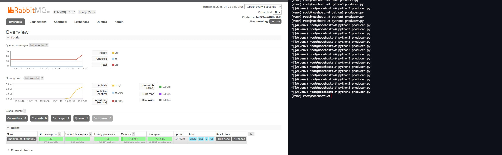

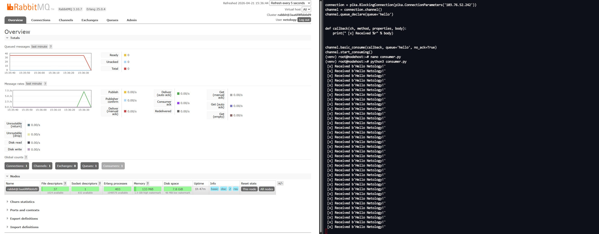

---

### Задание 3

#### Текст задания

Используя Vagrant или VirtualBox, создайте вторую виртуальную машину и установите RabbitMQ. Добавьте в файл hosts название и IP-адрес каждой машины, чтобы машины могли видеть друг друга по имени.

Пример содержимого hosts файла:

```diff
# cat /etc/hosts
+ 192.168.0.10 rmq01
+ 192.168.0.11 rmq02
```
После этого ваши машины могут пинговаться по имени.

Затем объедините две машины в кластер и создайте политику ha-all на все очереди.

В качестве решения домашнего задания приложите скриншоты из веб-интерфейса с информацией о доступных нодах в кластере и включённой политикой.

Также приложите вывод команды с двух нод:

```bash
rabbitmqctl cluster_status
```

Для закрепления материала снова запустите скрипт producer.py и приложите скриншот выполнения команды на каждой из нод:

```bash
rabbitmqadmin get queue='hello'
```

После чего попробуйте отключить одну из нод, желательно ту, к которой подключались из скрипта, затем поправьте параметры подключения в скрипте consumer.py на вторую ноду и запустите его.

Приложите скриншот результата работы второго скрипта.

#### Выполнение задания


Подготовим 2 ВМ с сервисом rabbitmq:

```yaml
# VM1

version: "3.8"

services:
  rmq1:
    image: rabbitmq:3.10.7-management
    container_name: rmq1
    hostname: rmq1
    environment:
      - RABBITMQ_DEFAULT_USER=${RABBITMQ_DEFAULT_USER}
      - RABBITMQ_DEFAULT_PASS=${RABBITMQ_DEFAULT_PASS}
      - RABBITMQ_ERLANG_COOKIE=${RABBITMQ_ERLANG_COOKIE}
      - RABBITMQ_CONFIG_FILE=/config/rabbitmq
      - RABBIT_NODE_PORT=5672
    volumes:
      - ./config:/config
    ports:
      - 15672:15672
      - 5672:5672
      - 4369:4369
      - 25672:25672
```

```yaml
# VM2

version: "3.8"

services:
  rmq1:
    image: rabbitmq:3.10.7-management
    container_name: rmq2
    hostname: rmq2
    environment:
      - RABBITMQ_DEFAULT_USER=${RABBITMQ_DEFAULT_USER}
      - RABBITMQ_DEFAULT_PASS=${RABBITMQ_DEFAULT_PASS}
      - RABBITMQ_ERLANG_COOKIE=${RABBITMQ_ERLANG_COOKIE}
      - RABBITMQ_CONFIG_FILE=/config/rabbitmq
      - RABBIT_NODE_PORT=5672
    volumes:
      - ./config:/config
    ports:
      - 15672:15672
      - 5672:5672
      - 4369:4369
      - 25672:25672
```

Добавим записи в hosts

```diff
+ 103.76.53.242 rmq2
+ 46.243.210.177 rmq1
```

Объеденим 2 ВМ в класстер, на rmq2 выполним команды:

```bash
docker exec -it rmq2 rabbitmqctl stop_app
docker exec -it rmq2 rabbitmqctl reset
docker exec -it rmq2 rabbitmqctl join_cluster rabbit@rmq1
docker exec -it rmq2 rabbitmqctl start_app
```

Видим что кластер создался

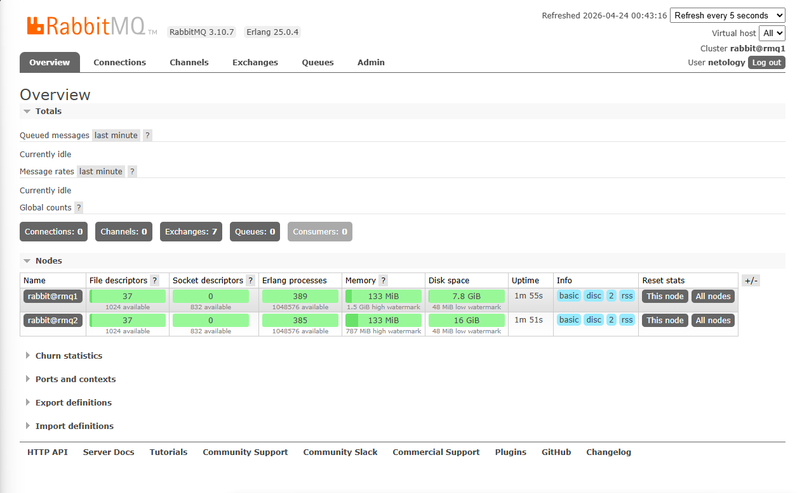

Создадим политику ha-all

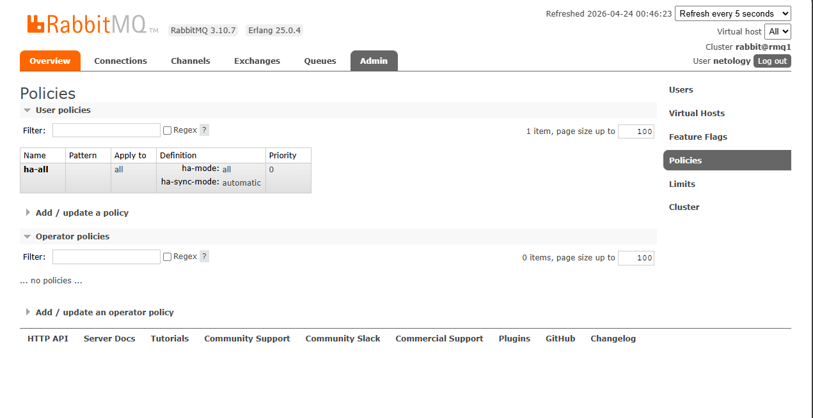

Вывод команды `rabbitmqctl cluster_status` с двух нод:

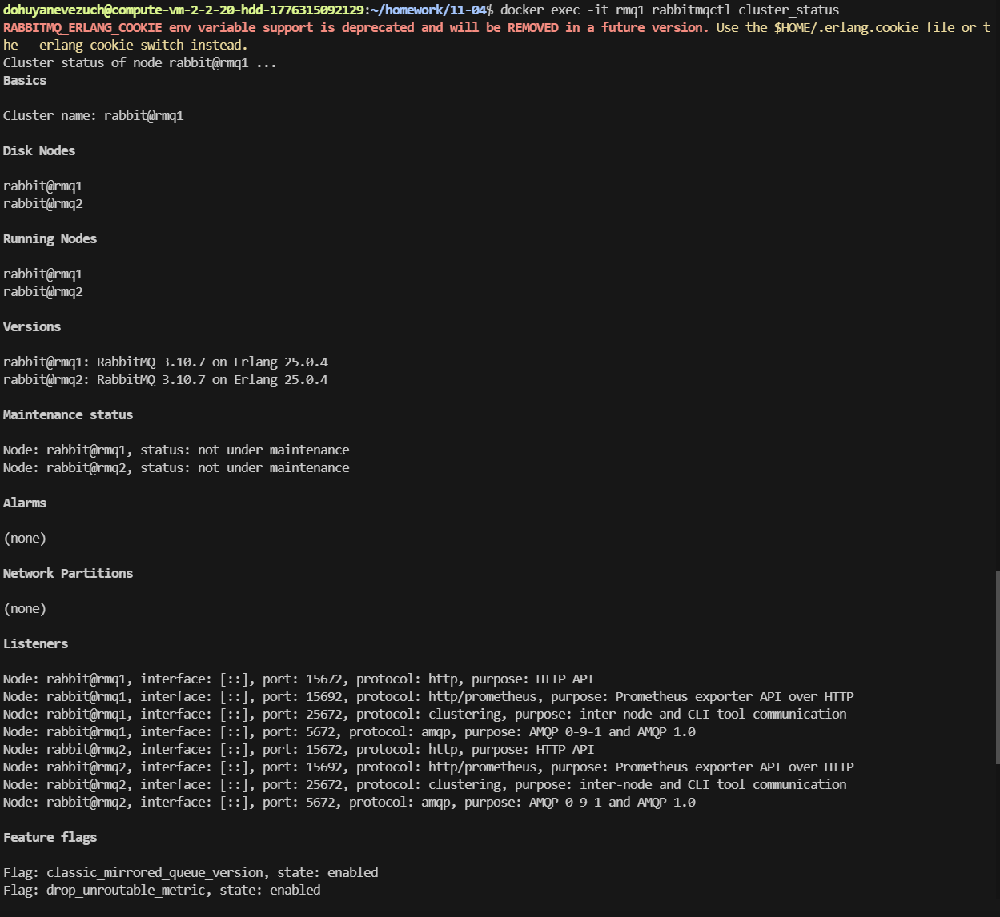

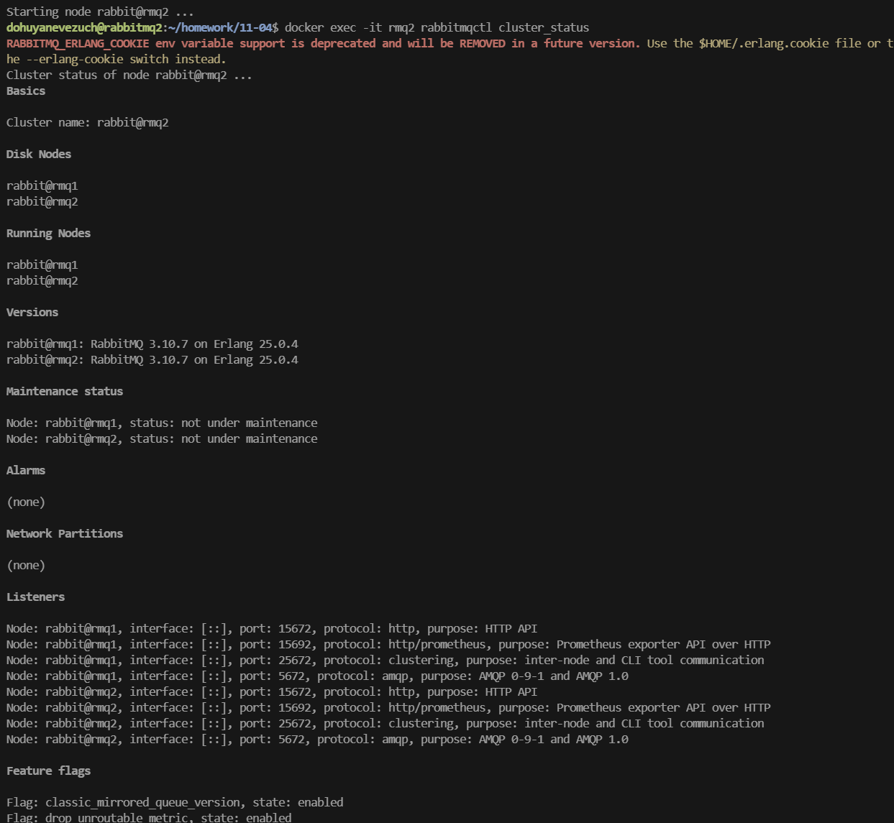

Повторноый запуск `producer.py` (немного исправленный)

```python
# producer.py

#!/usr/bin/env python
# coding=utf-8
import pika

credentials = pika.PlainCredentials('netology', 'netology')
connection = pika.BlockingConnection(
    pika.ConnectionParameters(
        '46.243.210.177',
        5672,
        '/',
        credentials
    )
)
channel = connection.channel()
channel.queue_declare(queue='netology', durable=True)
for  i in range(25):
        message = f"Hello Netology! {i}"
        channel.basic_publish(
                exchange='',
                routing_key='netology',
                body=message
        )

connection.close()

```

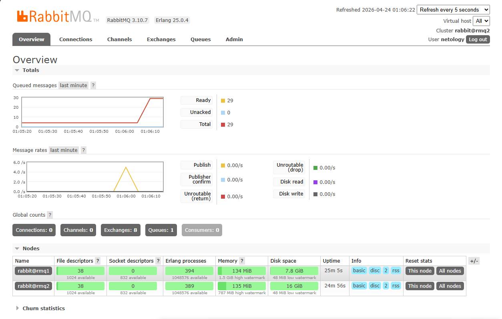

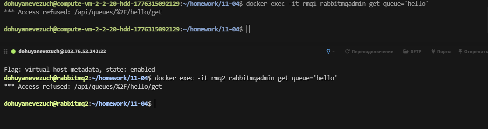

Отключим первую ноду

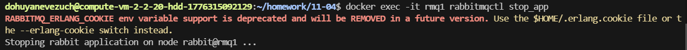

Запуским `consumer.py`

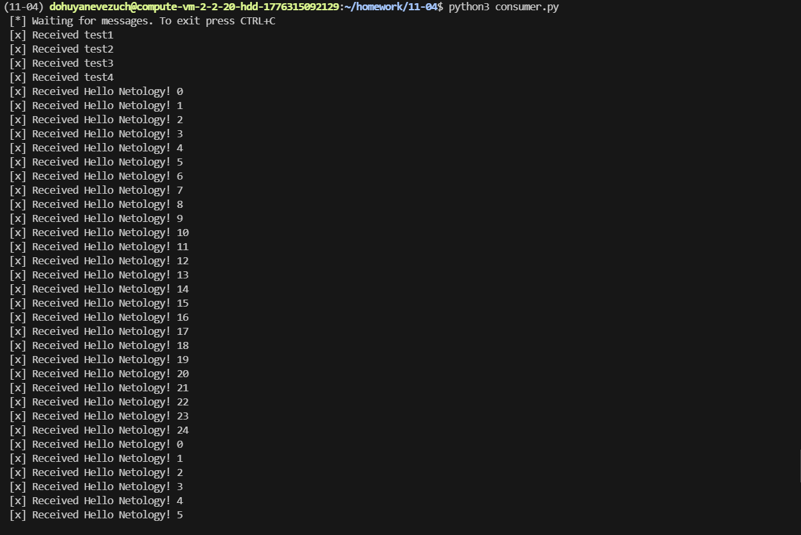

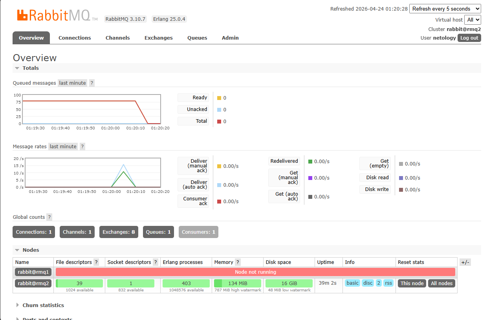

---
