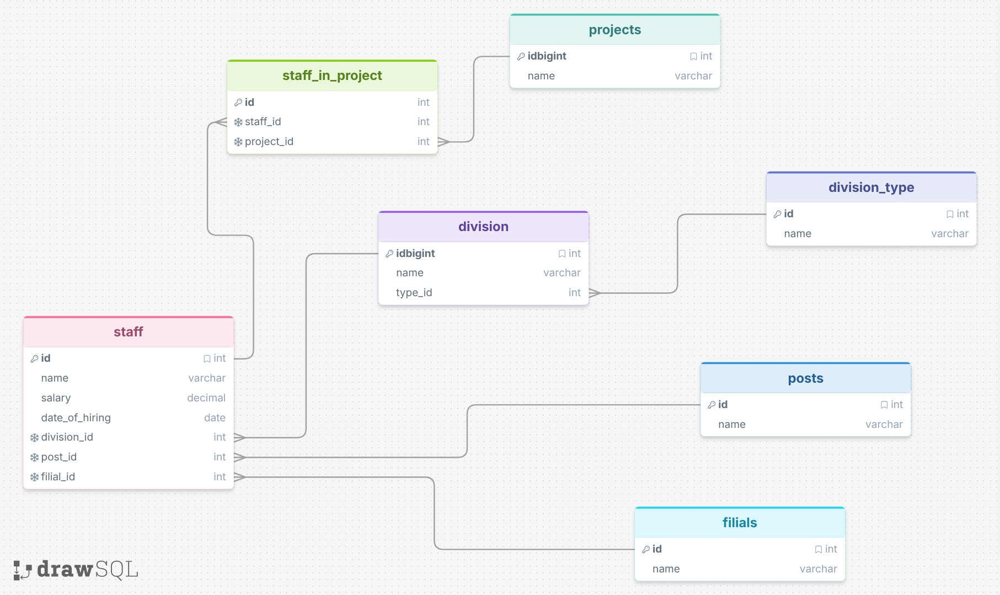
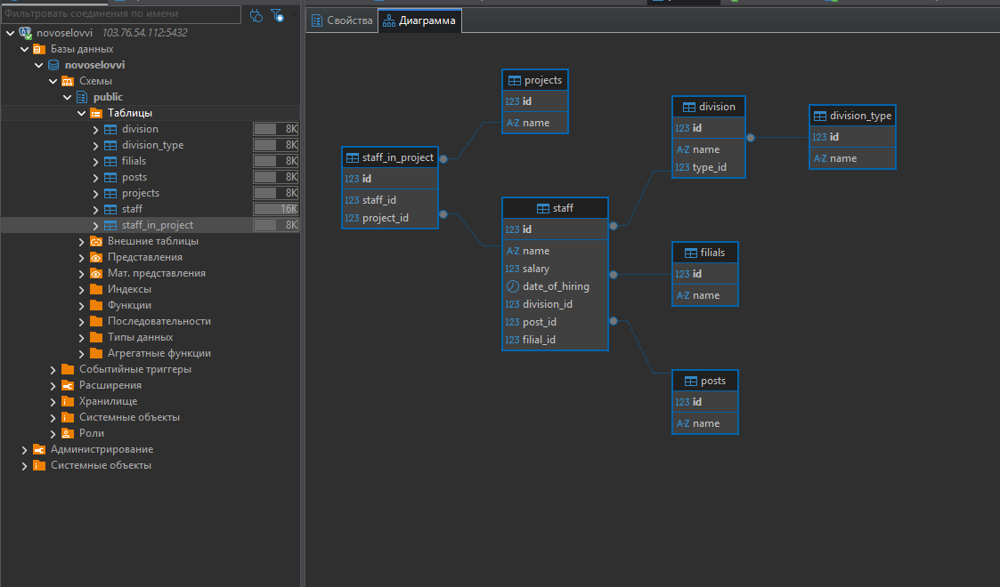

# Домашнее задание к занятию `Базы данных` - `Новоселов Виктор Иванович`

## Легенда

Заказчик передал вам файл в формате Excel, в котором сформирован отчёт.

На основе этого отчёта нужно выполнить следующие задания.

### Задание 1

#### Текст задания

Опишите не менее семи таблиц, из которых состоит база данных. Определите:

- какие данные хранятся в этих таблицах,
- какой тип данных у столбцов в этих таблицах, если данные хранятся в PostgreSQL.

#### Выполнение задания

В данном файле мне удалось обноружить 7 таблиц из которых состоит БД:

|staff (сотрудники)|
|-|
|id|
|name (ФИО)|
|salary (оклад)|
|datee_of_hiring (Дата найма)|
|division_id (id стуктурного подразделения)|
|post_id (id должности)|
|filial_id (id Адреса филиала)|

|division (Структурное подразделение)|
|---|
|id|
|name (Название)|
|type_id (id типа структурного подразделения)|

|division_type (тип структурного подразделения)|
|-|
|id|
|name (Название типа)|

|posts (Должности)|
|-|
|id|
|name (Название)|

|filials (Адреса филиалов)|
|-|
|id|
|name (Адрес)|

|projects (Проекты)|
|-|
|id|
|name (Название)|

|staff_in_project|
|-|
|id|
|staff_id (id сотрудника)|
|project_id (id проекта)|

Схема связи таблиц:



---

### Задание 2*

#### Текст задания

1. Разверните СУБД Postgres на своей хостовой машине, на виртуальной машине или в контейнере docker.
2. Опишите схему, полученную в предыдущем задании, с помощью скрипта SQL.
3. Создайте в вашей полученной СУБД новую базу данных и выполните полученный ранее скрипт для создания вашей модели данных.

В качестве решения приложите SQL скрипт и скриншот диаграммы.

#### Выполнение задания


SQL Скрипт

```sql
CREATE TABLE projects (
    id int PRIMARY KEY,
    name varchar(255) NOT NULL
);

CREATE TABLE division_type (
    id int PRIMARY KEY,
    name varchar(255) NOT NULL
);

CREATE TABLE division (
    id int PRIMARY KEY,
    name varchar(255) NOT NULL,
    type_id int NOT NULL,
    foreign key (type_id) references division_type(id)
);

CREATE TABLE posts (
    id int PRIMARY KEY,
    name varchar(255) NOT NULL
);

CREATE TABLE filials (
    id int PRIMARY KEY,
    name varchar(255) NOT NULL
);

CREATE TABLE staff (
    id int PRIMARY KEY,
    name varchar(255) NOT NULL,
    salary decimal NOT NULL,
    date_of_hiring date NOT NULL,
    division_id int NOT NULL,
    post_id int NOT NULL,
    filial_id int NOT NULL,
    foreign key (division_id) references division(id),
    foreign key (post_id) references posts(id),
    foreign key (filial_id) references filials(id)
);

CREATE TABLE staff_in_project (
    id int PRIMARY KEY,
    staff_id int NOT NULL,
    project_id int NOT NULL,
    foreign key (staff_id) references staff(id),
    foreign key (project_id) references projects(id)
);

```

Результат работы скрипта



---
