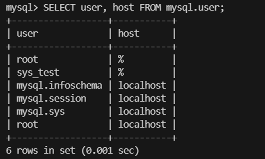
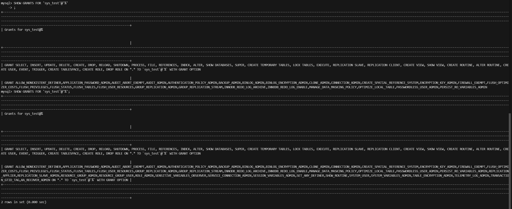
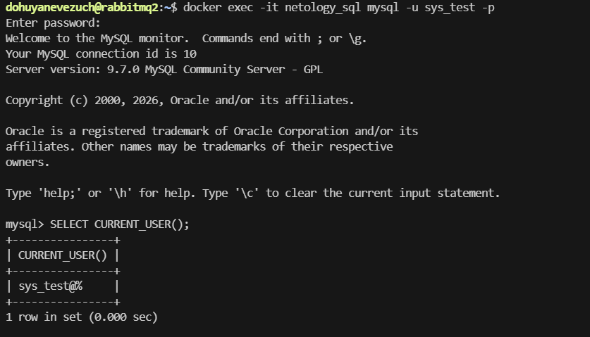
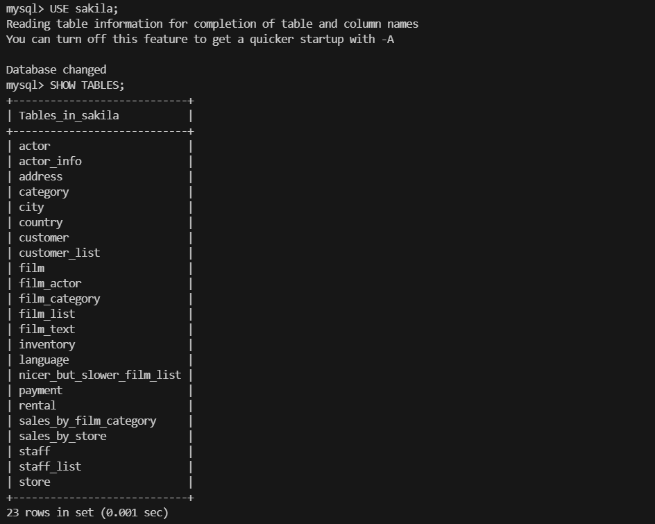
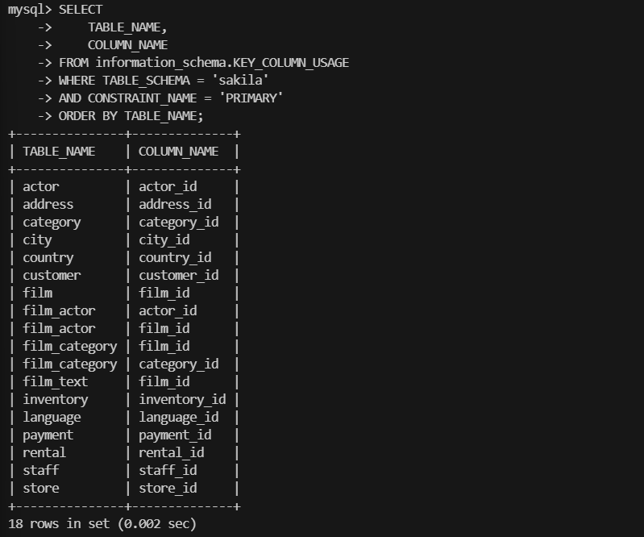

# Домашнее задание к занятию `Базы данных` - `Новоселов Виктор Иванович`

### Задание 1

#### Текст задания

1.1. Поднимите чистый инстанс MySQL версии 8.0+. Можно использовать локальный сервер или контейнер Docker.

1.2. Создайте учётную запись sys_temp.

1.3. Выполните запрос на получение списка пользователей в базе данных. (скриншот)

1.4. Дайте все права для пользователя sys_temp.

1.5. Выполните запрос на получение списка прав для пользователя sys_temp. (скриншот)

1.6. Переподключитесь к базе данных от имени sys_temp.

Для смены типа аутентификации с sha2 используйте запрос:

```sql
ALTER USER 'sys_test'@'localhost' IDENTIFIED WITH mysql_native_password BY 'password';
```

1.6. По ссылке https://downloads.mysql.com/docs/sakila-db.zip скачайте дамп базы данных.

1.7. Восстановите дамп в базу данных.

1.8. При работе в IDE сформируйте ER-диаграмму получившейся базы данных. При работе в командной строке используйте команду для получения всех таблиц базы данных. (скриншот)

Результатом работы должны быть скриншоты обозначенных заданий, а также простыня со всеми запросами.

#### Выполнение задания

Поднимим контейнер `mysql` и перейдем в cli mysql
```bash
docker pull mysql
docker run --name=netology_sql -e MYSQL_ROOT_PASSWORD=QAZwsx555 -d mysql
docker exec -it netology_sql mysql -u root -p
```

Выполним команды для создания пользователя `sys_test` и вывода списка пользователей
```sql
CREATE USER 'sys_test'@'%' IDENTIFIED BY 'QAZwsx555';
SELECT user, host FROM mysql.user;
```


Предоставим все права для пользователя

```sql
GRANT ALL PRIVILEGES ON *.* TO 'sys_test'@'%' WITH GRANT OPTION;
FLUSH PRIVILEGES;
SHOW GRANTS FOR 'sys_test'@'%';
```


Перезайдем от имени пользователя `sys_test`

```bash
docker exec -it netology_sql mysql -u sys_test -p
```



Создадим бд sakila

```sql
CREATE DATABASE sakila;
```

Восстановим домп в БД

```bash
docker exec -i netology_sql mysql -u sys_test -p'QAZwsx555' sakila < sakila-schema.sql
docker exec -i netology_sql mysql -u sys_test -p'QAZwsx555' sakila < sakila-data.sql
```

> [!NOTE]
> При вводе команд
> `docker exec -i netology_sql mysql -u sys_test -p sakila < sakila-schema.sql`
> `docker exec -i netology_sql mysql -u root -p sakila < sakila-schema.sql`
> Я получал ошибки
> `Enter password: ERROR 1045 (28000): Access denied for user 'sys_test'@'localhost' (using password: YES)`
> `Enter password: ERROR 1045 (28000): Access denied for user 'root'@'localhost' (using password: YES)`
> Пришлось явно задавать пароль (Можно было по другому, но я выбрал самый быстрый вариант)

```sql
USE sakila;
SHOW TABLES;
```

Выведем все таблицы в бд




---

### Задание 2

#### Текст задания

Составьте таблицу, используя любой текстовый редактор или Excel, в которой должно быть два столбца: в первом должны быть названия таблиц восстановленной базы, во втором названия первичных ключей этих таблиц. Пример: (скриншот/текст)

```
Название таблицы | Название первичного ключа
customer         | customer_id
```

#### Выполнение задания

Выполним команды

```sql
SELECT 
    TABLE_NAME,
    COLUMN_NAME
FROM information_schema.KEY_COLUMN_USAGE
WHERE TABLE_SCHEMA = 'sakila'
AND CONSTRAINT_NAME = 'PRIMARY'
ORDER BY TABLE_NAME;
```

Результат

```
+---------------+--------------+
| TABLE_NAME    | COLUMN_NAME  |
+---------------+--------------+
| actor         | actor_id     |
| address       | address_id   |
| category      | category_id  |
| city          | city_id      |
| country       | country_id   |
| customer      | customer_id  |
| film          | film_id      |
| film_actor    | actor_id     |
| film_actor    | film_id      |
| film_category | film_id      |
| film_category | category_id  |
| film_text     | film_id      |
| inventory     | inventory_id |
| language      | language_id  |
| payment       | payment_id   |
| rental        | rental_id    |
| staff         | staff_id     |
| store         | store_id     |
+---------------+--------------+
```



---
