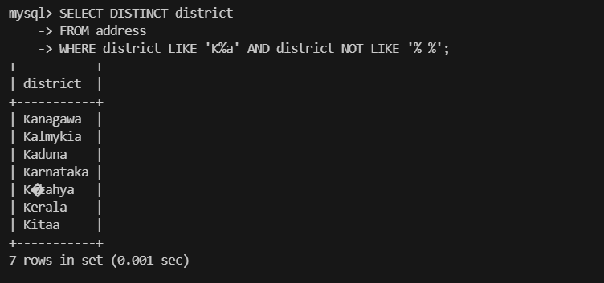
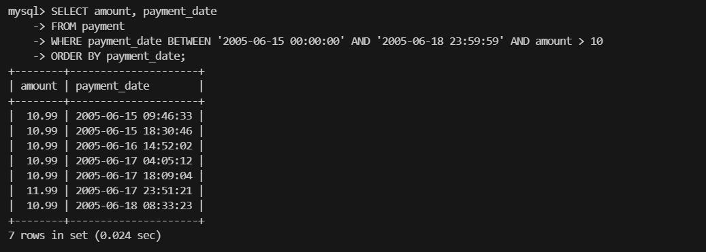
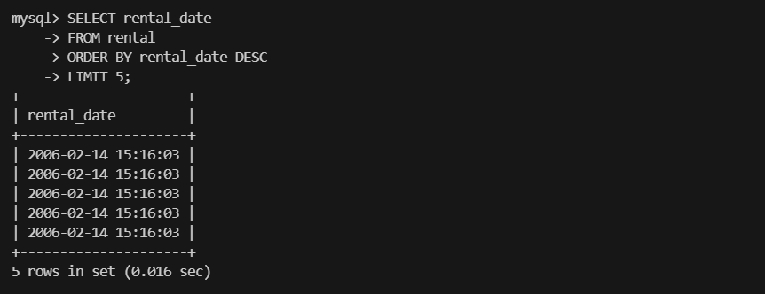
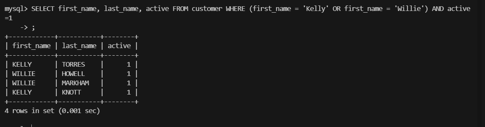
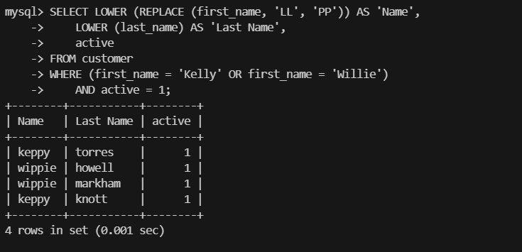
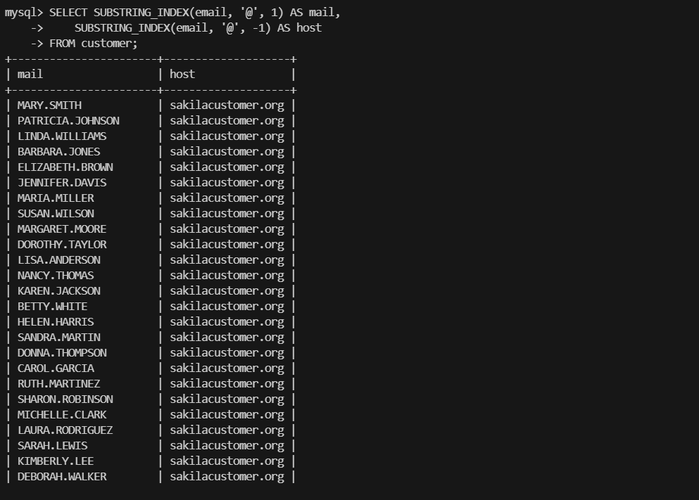
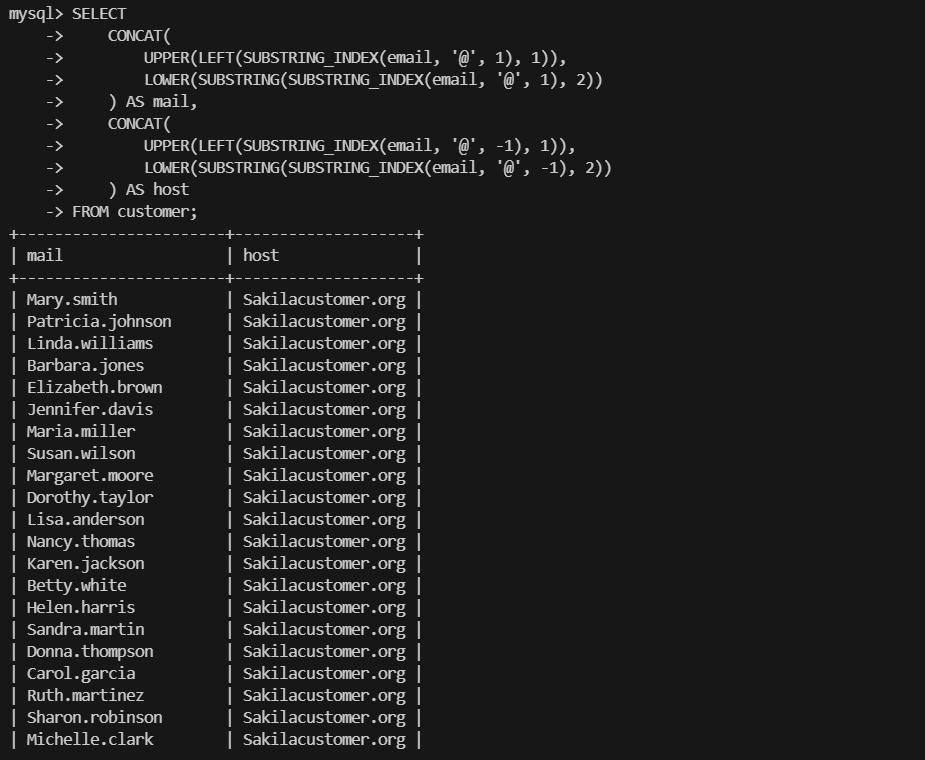

# Домашнее задание к занятию `SQL. Часть 1` - `Новоселов Виктор Иванович`

### Задание 1

#### Текст задания

Получите уникальные названия районов из таблицы с адресами, которые начинаются на “K” и заканчиваются на “a” и не содержат пробелов.

#### Выполнение задания

```sql
SELECT DISTINCT district 
FROM address
WHERE district LIKE 'K%a' 
    AND district NOT LIKE '% %';
```



---

### Задание 2

#### Текст задания

Получите из таблицы платежей за прокат фильмов информацию по платежам, которые выполнялись в промежуток с 15 июня 2005 года по 18 июня 2005 года включительно и стоимость которых превышает 10.00.

#### Выполнение задания

```sql
SELECT amount, payment_date
FROM payment
WHERE payment_date BETWEEN '2005-06-15 00:00:00' AND '2005-06-18 23:59:59' AND amount > 10
ORDER BY payment_date;
```


---

### Задание 3

#### Текст задания

Получите последние пять аренд фильмов.

#### Выполнение задания

```sql
SELECT rental_date
FROM rental
ORDER BY rental_date DESC
LIMIT 5;
```



---

### Задание 4

#### Текст задания

Одним запросом получите активных покупателей, имена которых Kelly или Willie.

Сформируйте вывод в результат таким образом:

- все буквы в фамилии и имени из верхнего регистра переведите в нижний регистр,
- замените буквы 'll' в именах на 'pp'.

#### Выполнение задания

Вывод простого запроса покупателей, имена которых Kelly или Willie:



Запрос с учетом всех пунктов:

```sql
SELECT LOWER (REPLACE (first_name, 'LL', 'PP')) AS 'Name',
    LOWER (last_name) AS 'Last Name',
    active
FROM customer 
WHERE (first_name = 'Kelly' OR first_name = 'Willie')
    AND active = 1;
```


---

### Задание 5*

#### Текст задания

Выведите Email каждого покупателя, разделив значение Email на две отдельных колонки: в первой колонке должно быть значение, указанное до @, во второй — значение, указанное после @.

#### Выполнение задания

```sql
SELECT SUBSTRING_INDEX(email, '@', 1) AS mail,
    SUBSTRING_INDEX(email, '@', -1) AS host
FROM customer;
```


---

### Задание 6*

#### Текст задания

Доработайте запрос из предыдущего задания, скорректируйте значения в новых колонках: первая буква должна быть заглавной, остальные — строчными.

#### Выполнение задания

```sql
SELECT 
    CONCAT(
        UPPER(LEFT(SUBSTRING_INDEX(email, '@', 1), 1)),
        LOWER(SUBSTRING(SUBSTRING_INDEX(email, '@', 1), 2))
    ) AS mail,
    CONCAT(
        UPPER(LEFT(SUBSTRING_INDEX(email, '@', -1), 1)),
        LOWER(SUBSTRING(SUBSTRING_INDEX(email, '@', -1), 2))        
    ) AS host
FROM customer;
```


---