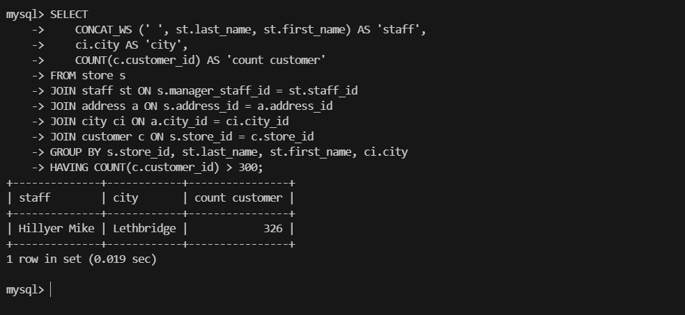
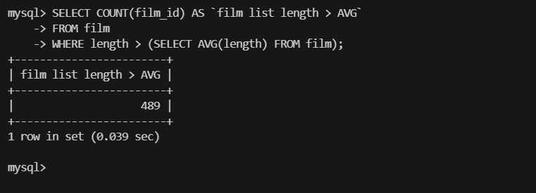
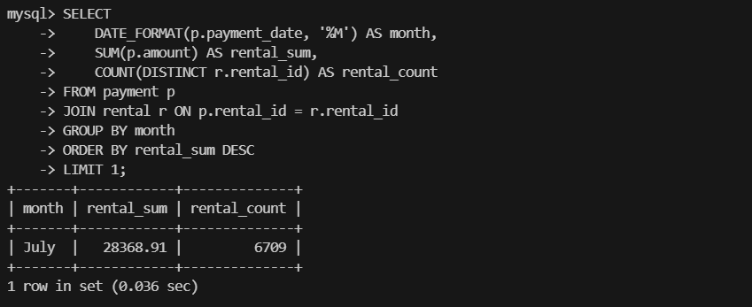
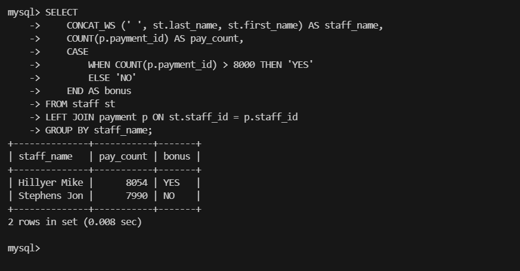
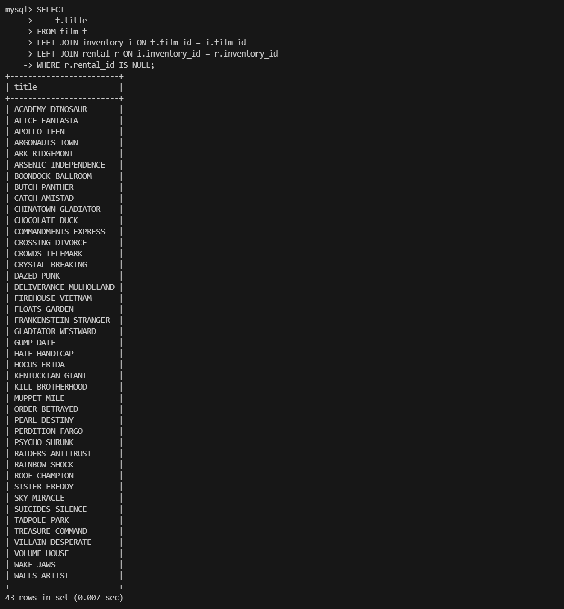

# Домашнее задание к занятию `SQL. Часть 2` - `Новоселов Виктор Иванович`

### Задание 1

#### Текст задания

Одним запросом получите информацию о магазине, в котором обслуживается более 300 покупателей, и выведите в результат следующую информацию:

- фамилия и имя сотрудника из этого магазина;
- город нахождения магазина;
- количество пользователей, закреплённых в этом магазине.

#### Выполнение задания

```sql
SELECT
    CONCAT_WS (' ', st.last_name, st.first_name) AS 'staff',
    ci.city AS 'city',
    COUNT(c.customer_id) AS 'count customer'
FROM store s
JOIN staff st ON s.manager_staff_id = st.staff_id
JOIN address a ON s.address_id = a.address_id
JOIN city ci ON a.city_id = ci.city_id
JOIN customer c ON s.store_id = c.store_id
GROUP BY s.store_id, st.last_name, st.first_name, ci.city
HAVING COUNT(c.customer_id) > 300;
```



---

### Задание 2

#### Текст задания

Получите количество фильмов, продолжительность которых больше средней продолжительности всех фильмов.

#### Выполнение задания

```sql
SELECT COUNT(film_id) AS `film list length > AVG`
FROM film
WHERE length > (SELECT AVG(length) FROM film);
```



---

### Задание 3

#### Текст задания

Получите информацию, за какой месяц была получена наибольшая сумма платежей, и добавьте информацию по количеству аренд за этот месяц.

#### Выполнение задания

```sql
SELECT 
    DATE_FORMAT(p.payment_date, '%M') AS month, 
    SUM(p.amount) AS rental_sum,
    COUNT(DISTINCT r.rental_id) AS rental_count
FROM payment p
JOIN rental r ON p.rental_id = r.rental_id
GROUP BY month
ORDER BY rental_sum DESC
LIMIT 1;
```



---

### Задание 4*

#### Текст задания

Посчитайте количество продаж, выполненных каждым продавцом. Добавьте вычисляемую колонку «Премия». Если количество продаж превышает 8000, то значение в колонке будет «Да», иначе должно быть значение «Нет».

#### Выполнение задания

```sql
SELECT
    CONCAT_WS (' ', st.last_name, st.first_name) AS staff_name,
    COUNT(p.payment_id) AS pay_count,
    CASE
        WHEN COUNT(p.payment_id) > 8000 THEN 'YES'
        ELSE 'NO'
    END AS bonus
FROM staff st
LEFT JOIN payment p ON st.staff_id = p.staff_id
GROUP BY staff_name;
```



---

### Задание 5*

#### Текст задания

Найдите фильмы, которые ни разу не брали в аренду.

#### Выполнение задания

```sql
SELECT 
    f.title
FROM film f
LEFT JOIN inventory i ON f.film_id = i.film_id
LEFT JOIN rental r ON i.inventory_id = r.inventory_id
WHERE r.rental_id IS NULL;
```

