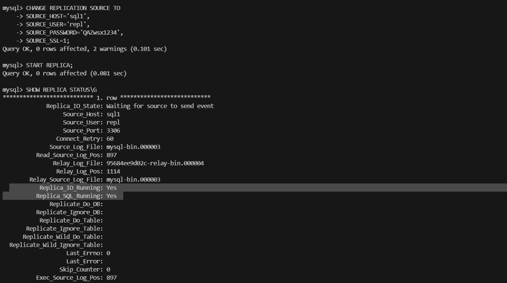
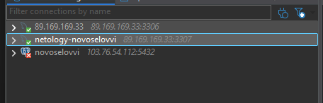
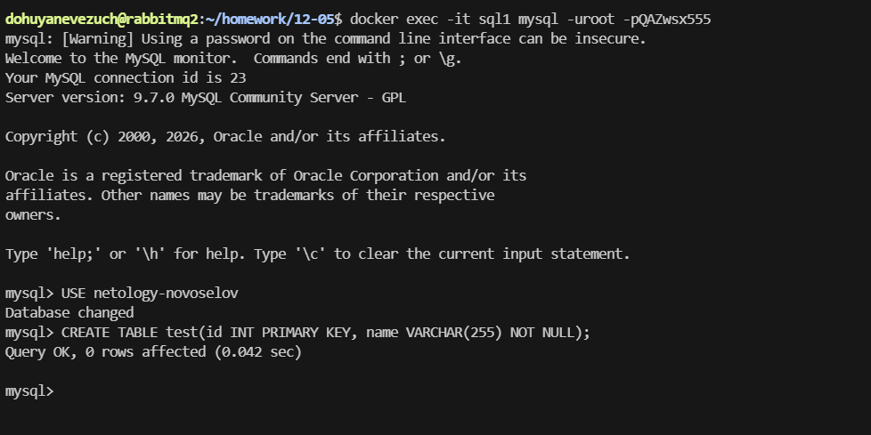
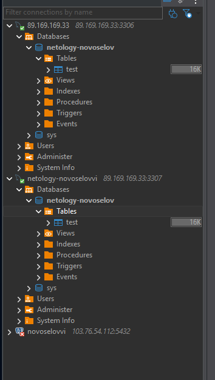

# Домашнее задание к занятию `Репликация и масштабирование. Часть 1` - `Новоселов Виктор Иванович`

### Задание 1

#### Текст задания

На лекции рассматривались режимы репликации master-slave, master-master, опишите их различия.

Ответить в свободной форме.

#### Выполнение задания

master-slave имеет возможность вносить изменения только в одностороннем порядке, только на master сервер, а чтение может происходить с любого, что упрощает архитектуру, но в случае отказа мастера запись будет не возможна до его восстановления.
| master | slave |
| --- | --- |
| Read | Read |
| Write  | - |

master-master же позволяет вносить изменения во все копии бд, что может спасти при отказах, так как все БД имеют возможности записи, но такая канструкция может приводить к конфликтам.
| master | master |
| --- | --- |
| Read | Read |
| Write  | Write |

---

### Задание 2

#### Текст задания

Выполните конфигурацию master-slave репликации, примером можно пользоваться из лекции.

Приложите скриншоты конфигурации, выполнения работы: состояния и режимы работы серверов.

#### Выполнение задания

Структура файлов:

```
├── docker-compose.yml
├── master.cnf
└── slave.cnf
```

docker-compose.yml
```yaml
version: '3.8'

services:
  sql1:
    image: mysql:latest
    container_name: sql1
    environment:
      MYSQL_ROOT_PASSWORD: QAZwsx555
      MYSQL_DATABASE: netology-novoselov
    ports:
      - 3306:3306
    volumes:
      - master_data:/var/lib/mysql
      - ./master.cnf:/etc/mysql/conf.d/master.cnf
    networks:
      - sql-net

  sql2:
    image: mysql:latest
    container_name: sql2
    environment:
      MYSQL_ROOT_PASSWORD: QAZwsx555
    ports:
      - 3307:3306
    volumes:
      - slave_data:/ver/lib/mysql
      - ./slave.cnf:/etc/mysql/conf.d/slave.cnf
    networks:
      - sql-net

volumes:
  master_data:
  slave_data:

networks:
  sql-net:
```

master.cnf
```cnf
[mysqld]
server-id=1
log-bin=mysql-bin
binlog_format=ROW
```

slave.cnf
```cnf
[mysqld]
server-id=2
read_only=1
```

На мастере выполним ряд команд:
```sql
CREATE USER 'repl'@'%' IDENTIFIED BY 'QAZwsx1234';
GRANT REPLICATION SLAVE ON *.* TO 'repl'@'%';
FLUSH PRIVILEGES;
```

На слейве выполним ряд команд:
```sql
CHANGE REPLICATION SOURCE TO
SOURCE_HOST='sql1',
SOURCE_USER='repl',
SOURCE_PASSWORD='QAZwsx1234',
SOURCE_SSL=1;
START REPLICA;
```

Выполним команду `SHOW REPLICA STATUS\G`



Далее подключим обе бд к DBeaver для наглядности



Добавим таблицу



Таблица появилась на обеих БД



---


