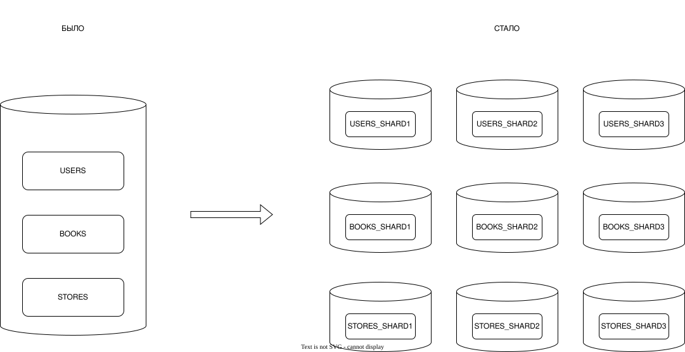

# Домашнее задание к занятию `Репликация и масштабирование. Часть 2` - `Новоселов Виктор Иванович`

### Задание 1

#### Текст задания

Опишите основные преимущества использования масштабирования методами:

- активный master-сервер и пассивный репликационный slave-сервер;
- master-сервер и несколько slave-серверов;

Дайте ответ в свободной форме

#### Выполнение задания

- maste - пассивый slave

Slave не принимает запросы от пользователей, а просто поддерживает актуальную копию БД и при падении master-сервера выступает временно в роли master

Простой в обслуживаении, так как никаких запросов от пользователей на slave не идет, можно проводить любые работы и это не будет мешать работе сервиса

Упращенная работа с бекапами, так как все бекапы можно делать в пассивного slave сервера

- master - несколько slave

Повышает производительность (Горизонтальное масштабирование), так как запросы на чтение можно раскидать на slave сервера

Снять часть нагрузки на мастер сервер, оставив ему более нужную задачу по записи

Повышение доступности к данным для пользователей, так как можно разместить slave сервера географически на обсолютно разных локациях, что ускорит доступ к данным у удаленных от master пользователей

---

### Задание 2

#### Текст задания

Разработайте план для выполнения горизонтального и вертикального шаринга базы данных. База данных состоит из трёх таблиц:

- пользователи,
- книги,
- магазины (столбцы произвольно).

Опишите принципы построения системы и их разграничение или разбивку между базами данных.

Пришлите блоксхему, где и что будет располагаться. Опишите, в каких режимах будут работать сервера.

#### Выполнение задания

Для начала в виде вертикального шардинга раскидаем таблицы по разным БД, в итоге получим 3 БД:

- USERS
- BOOKS
- STORE

После нужно будет произвести горизонтальный шардинг.

Для таблицы `USERS` сделам просто по `id` пользователя, например:

- USERS_SHARD1 - пользователи от 1 до 10000
- USERS_SHARD2 - пользователи от 10000 до 20000
- USERS_SHARD3 - пользователи от 20000 до 30000

и тд...

Для таблицы `BOOKS` уже можно выбрать, например шардинг по странам\жанрам\годам, возьмем за пример жанры:

- BOOKS_SHARD1 - Художественная литература
- BOOKS_SHARD2 - Техническая литература
- BOOKS_SHARD3 - Учебники

и тд...

Для таблицы `STORE` можно использовать шардинг по страннам, регионам или городам, за промер возьмем по регионам:

- STORES_SHARD1 - Москва и обл
- STORES_SHARD2 - СПБ и обл
- STORES_SHARD3 - Краснодарский край

и тд...

В конце концов схема будет выглядеть примерно так:

---