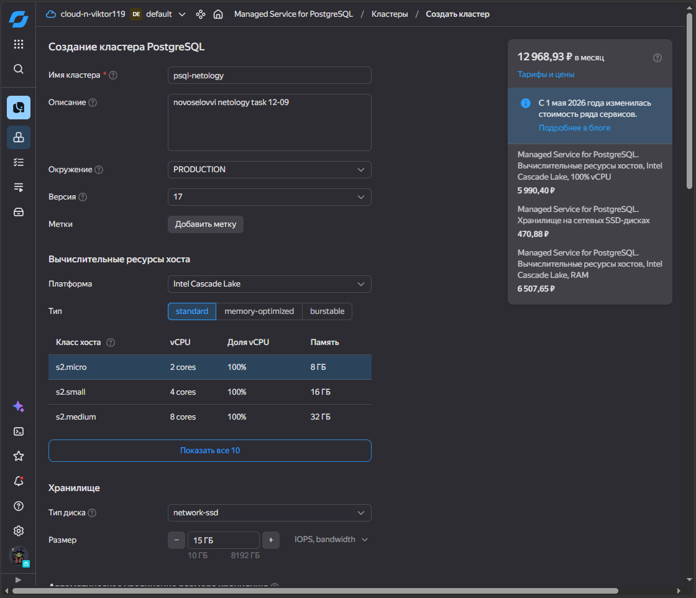
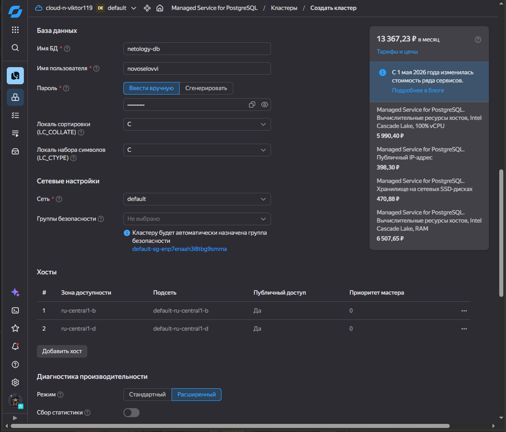
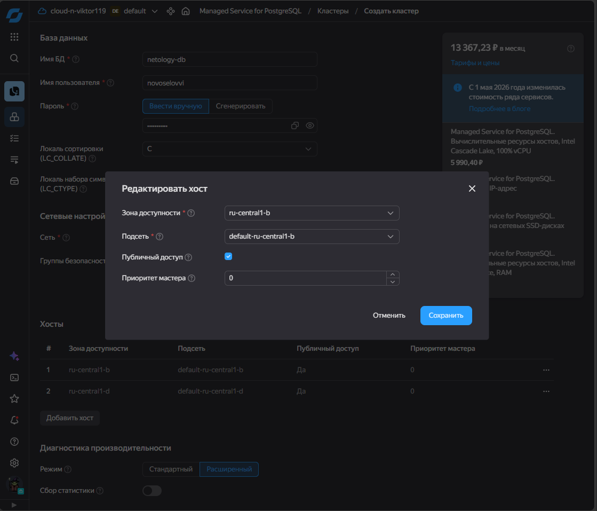
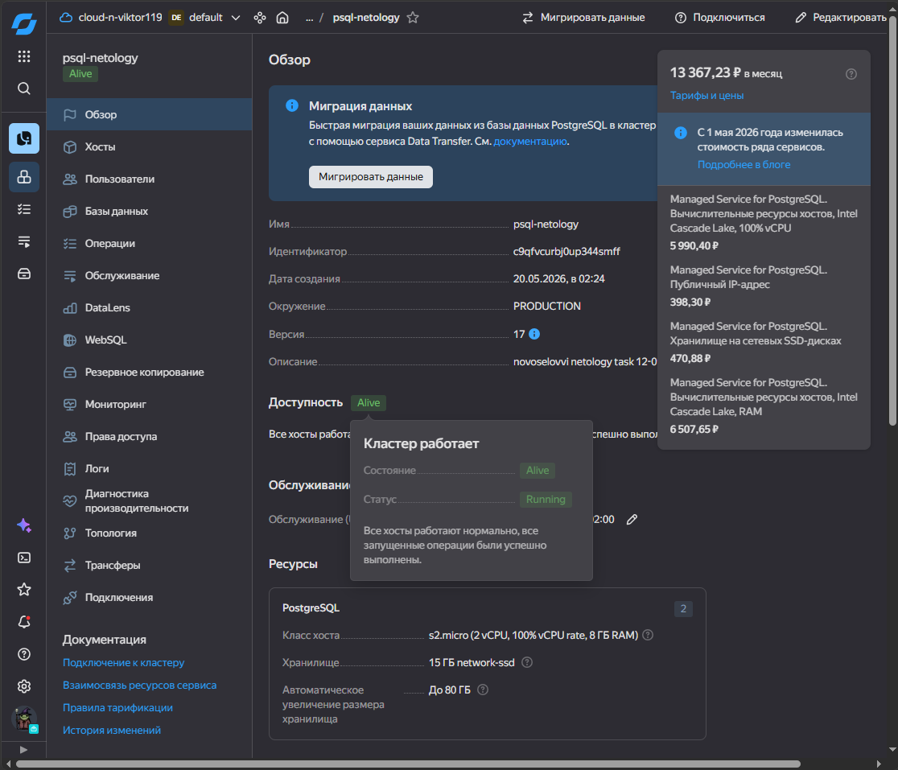
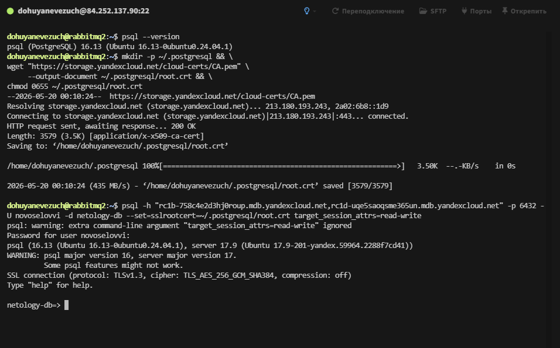
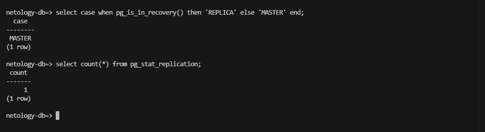
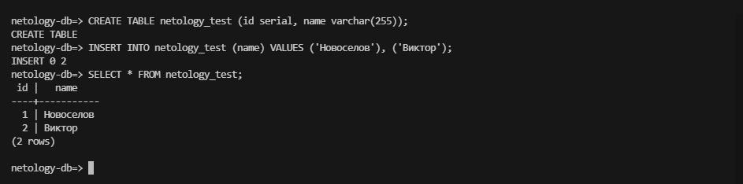
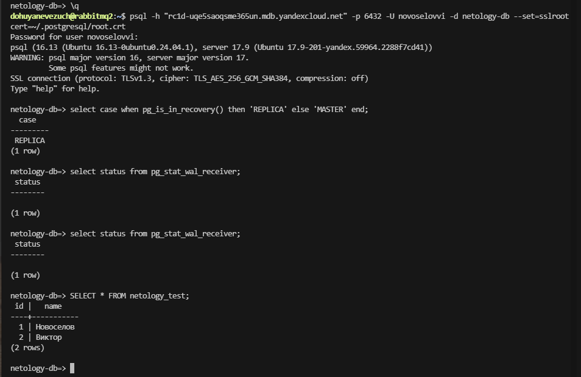

# Домашнее задание к занятию `Базы данных в облаке` - `Новоселов Виктор Иванович`

### Задание 1

#### Текст задания

**Создание кластера**
1. Перейдите на главную страницу сервиса Managed Service for PostgreSQL.
1. Создайте кластер PostgreSQL со следующими параметрами:
- класс хоста: s2.micro, диск network-ssd любого размера;
- хосты: нужно создать два хоста в двух разных зонах доступности и указать необходимость публичного доступа, то есть публичного IP адреса, для них;
- установите учётную запись для пользователя и базы.

Остальные параметры оставьте по умолчанию либо измените по своему усмотрению.

* Нажмите кнопку «Создать кластер» и дождитесь окончания процесса создания, статус кластера = RUNNING. Кластер создаётся от 5 до 10 минут.

**Подключение к мастеру и реплике **

* Используйте инструкцию по подключению к кластеру, доступную на вкладке «Обзор»: cкачайте SSL-сертификат и подключитесь к кластеру с помощью утилиты psql, указав hostname всех узлов и атрибут ```target_session_attrs=read-write```.

* Проверьте, что подключение прошло к master-узлу.
```
select case when pg_is_in_recovery() then 'REPLICA' else 'MASTER' end;
```
* Посмотрите количество подключенных реплик:
```
select count(*) from pg_stat_replication;
```

**Проверьте работоспособность репликации в кластере**

* Создайте таблицу и вставьте одну-две строки.
```
CREATE TABLE test_table(text varchar);
```
```
insert into test_table values('Строка 1');
```

* Выйдите из psql командой ```\q```.

* Теперь подключитесь к узлу-реплике. Для этого из команды подключения удалите атрибут ```target_session_attrs```  и в параметре атрибут ```host``` передайте только имя хоста-реплики. Роли хостов можно посмотреть на соответствующей вкладке UI консоли.

* Проверьте, что подключение прошло к узлу-реплике.
```
select case when pg_is_in_recovery() then 'REPLICA' else 'MASTER' end;
```
* Проверьте состояние репликации
```
select status from pg_stat_wal_receiver;
```

* Для проверки, что механизм репликации данных работает между зонами доступности облака, выполните запрос к таблице, созданной на предыдущем шаге:
```
select * from test_table;
```

*В качестве результата вашей работы пришлите скриншоты:*

*1) Созданной базы данных;*
*2) Результата вывода команды на реплике ```select * from test_table;```.*


#### Выполнение задания
Создадим кластер по заданию









Скачаем SSL сертификат и подключимся к БД

```bash
mkdir -p ~/.postgresql && \
wget "https://storage.yandexcloud.net/cloud-certs/CA.pem" \
     --output-document ~/.postgresql/root.crt && \
chmod 0655 ~/.postgresql/root.crt
```

```bash
psql -h "rc1b-758c4e2d3hj0roup.mdb.yandexcloud.net,rc1d-uqe5saoqsme365un.mdb.yandexcloud.net" -p 6432 -U novoselovvi -d netology-db --set=sslrootcert=~/.postgresql/root.crt target_session_attrs=read-write
```



Выполним проверки



Создадим таблицу и немного заполним ее



Зайдем на реплику



>[!NOTE]
> Почему-то ответ от команды `select status from pg_stat_wal_receiver`, для проверки состояния реплики, дает пустой ответ

---

