# Домашнее задание к занятию `Оркестрация группой Docker контейнеров на примере Docker Compose.` - `Новоселов Виктор Иванович`

### Задание 1

#### Текст задания

Сценарий выполнения задачи:

- Установите docker и docker compose plugin на свою linux рабочую станцию или ВМ.
- Если dockerhub недоступен создайте файл /etc/docker/daemon.json с содержимым: {"registry-mirrors": ["https://mirror.gcr.io", "https://daocloud.io", "https://c.163.com/", "https://registry.docker-cn.com"]}
- Зарегистрируйтесь и создайте публичный репозиторий с именем "custom-nginx" на https://hub.docker.com (ТОЛЬКО ЕСЛИ У ВАС ЕСТЬ ДОСТУП);
- скачайте образ nginx:1.29.0;
- Создайте Dockerfile и реализуйте в нем замену дефолтной индекс-страницы(/usr/share/nginx/html/index.html), на файл index.html с содержимым:

```html
<html>
<head>
Hey, Netology
</head>
<body>
<h1>I will be DevOps Engineer!</h1>
</body>
</html>
```
- Соберите и отправьте созданный образ в свой dockerhub-репозитории c tag 1.0.0 (ТОЛЬКО ЕСЛИ ЕСТЬ ДОСТУП).
- Предоставьте ответ в виде ссылки на https://hub.docker.com/<username_repo>/custom-nginx/general .

#### Выполнение задания

Создаем репозиторий `custom-nginx`

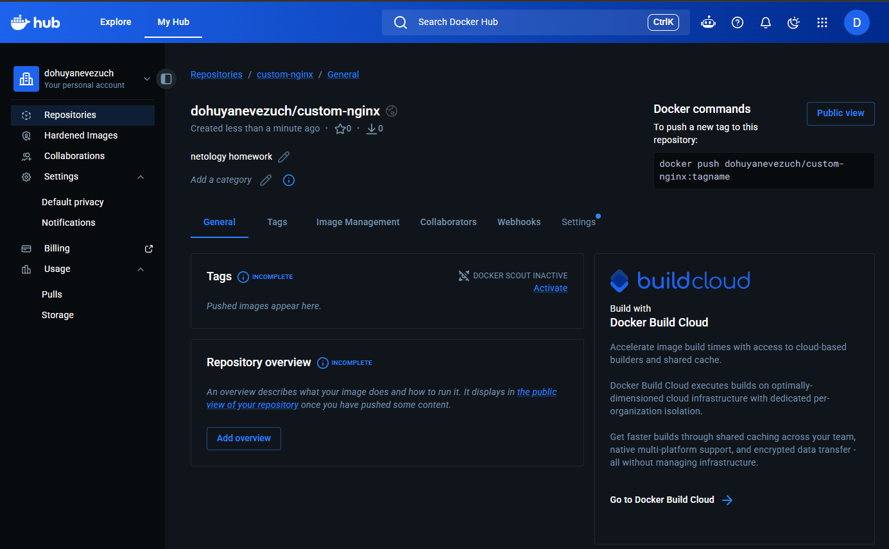

Качаем образ nginx:1.29.0

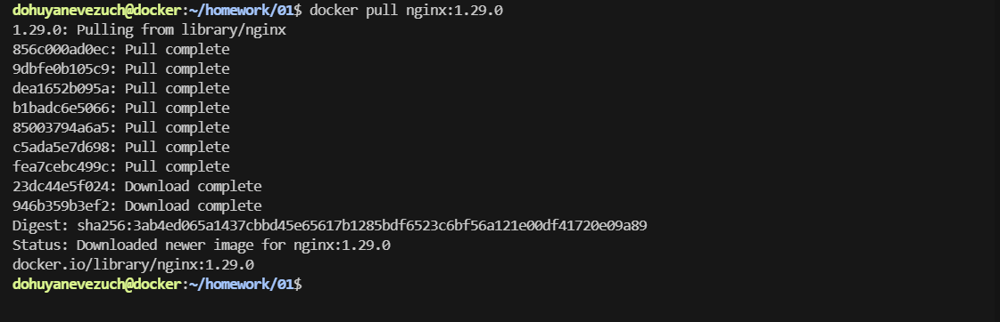

Создаем `index.html` файл с содержимым из задания

Создаем `Dockerfile` с содержимым

```dockerfile
FROM nginx:1.29.0

COPY index.html /usr/share/nginx/html/index/html
```

Далее

```bash

#собираем образ
docker build -t novoselov-nginx:1.0.0 .

#логинимся в docker

#тегируем образ
docker tag novoselov-nginx:1.0.0 dohuyanevezuch/custom-nginx:1.0.0

#отправляем образ
docker push dohuyanevezuch/custom-nginx:1.0.0

```

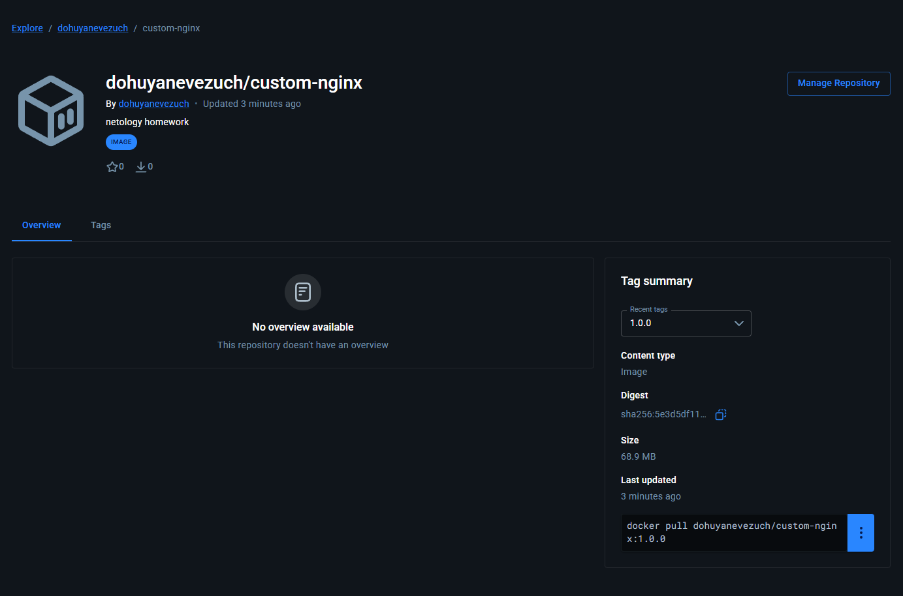

Для проверки запускаем образ `docker run -d --name custom-nginx -p 8080:80 dohuyanevezuch/custom-nginx:1.0.0`

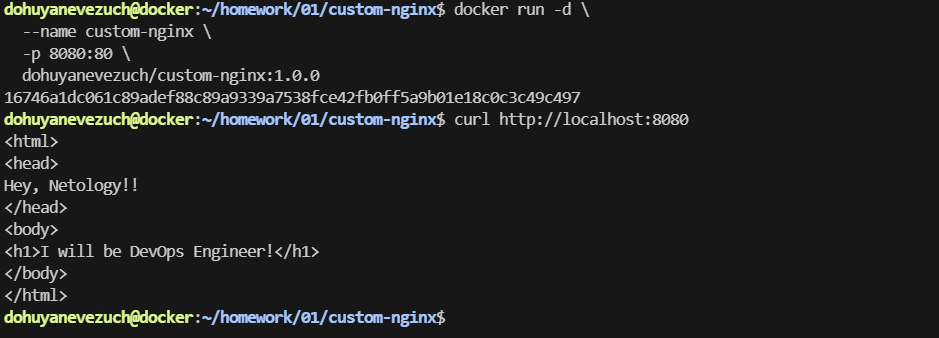


[Ссылка на репозиторий](https://hub.docker.com/r/dohuyanevezuch/custom-nginx)

---

### Задание 2

#### Текст задания

1. Запустите ваш образ custom-nginx:1.0.0 командой docker run в соответвии с требованиями:
- имя контейнера "ФИО-custom-nginx-t2"
- контейнер работает в фоне
- контейнер опубликован на порту хост системы 127.0.0.1:8080
2. Не удаляя, переименуйте контейнер в "custom-nginx-t2"
3. Выполните команду date +"%d-%m-%Y %T.%N %Z" ; sleep 0.150 ; docker ps ; ss -tlpn | grep 127.0.0.1:8080  ; docker logs custom-nginx-t2 -n1 ; docker exec -it custom-nginx-t2 base64 /usr/share/nginx/html/index.html
4. Убедитесь с помощью curl или веб браузера, что индекс-страница доступна.

В качестве ответа приложите скриншоты консоли, где видно все введенные команды и их вывод.

#### Выполнение задания

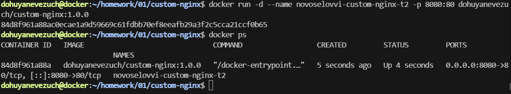

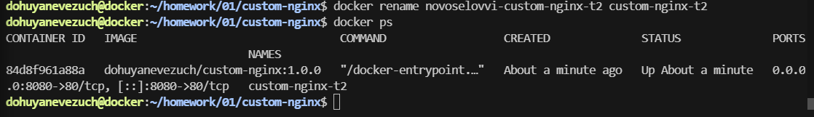

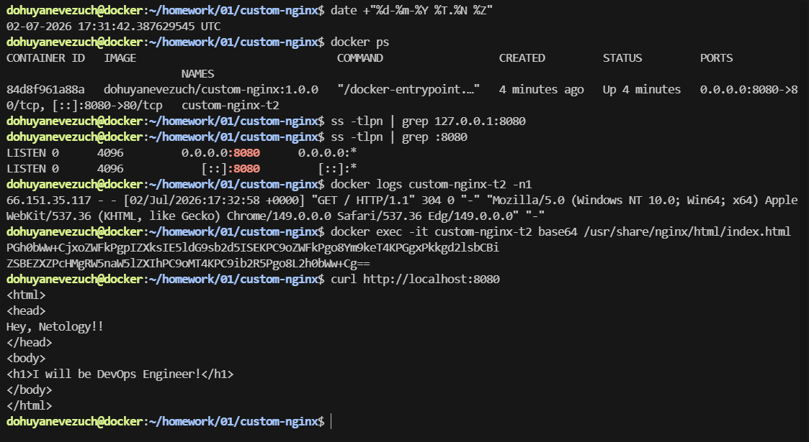
---

### Задание 3

#### Текст задания

1. Воспользуйтесь docker help или google, чтобы узнать как подключиться к стандартному потоку ввода/вывода/ошибок контейнера "custom-nginx-t2".
2. Подключитесь к контейнеру и нажмите комбинацию Ctrl-C.
3. Выполните docker ps -a и объясните своими словами почему контейнер остановился.
4. Перезапустите контейнер
5. Зайдите в интерактивный терминал контейнера "custom-nginx-t2" с оболочкой bash.
6. Установите любимый текстовый редактор(vim, nano итд) с помощью apt-get.
7. Отредактируйте файл "/etc/nginx/conf.d/default.conf", заменив порт "listen 80" на "listen 81".
8. Запомните(!) и выполните команду nginx -s reload, а затем внутри контейнера curl http://127.0.0.1:80 ; curl http://127.0.0.1:81.
9. Выйдите из контейнера, набрав в консоли exit или Ctrl-D.
10. Проверьте вывод команд: ss -tlpn | grep 127.0.0.1:8080 , docker port custom-nginx-t2, curl http://127.0.0.1:8080. Кратко объясните суть возникшей проблемы.
11. - Это дополнительное, необязательное задание. Попробуйте самостоятельно исправить конфигурацию контейнера, используя доступные источники в интернете. Не изменяйте конфигурацию nginx и не удаляйте контейнер. Останавливать контейнер можно. пример источника
12. Удалите запущенный контейнер "custom-nginx-t2", не останавливая его.(воспользуйтесь --help или google)
В качестве ответа приложите скриншоты консоли, где видно все введенные команды и их вывод.

#### Выполнение задания

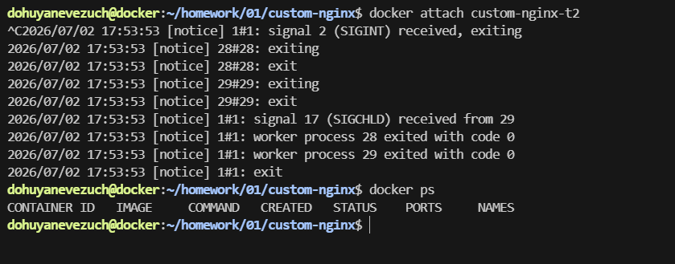

Контейнер заверщил свою работу, по причине того, что был направлен сигнал завершения `SIGINT`, что завершило родительский процесс контейнера, а когда родительский процесс завершается - контейнер останавливается.

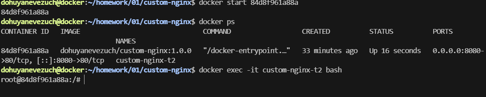

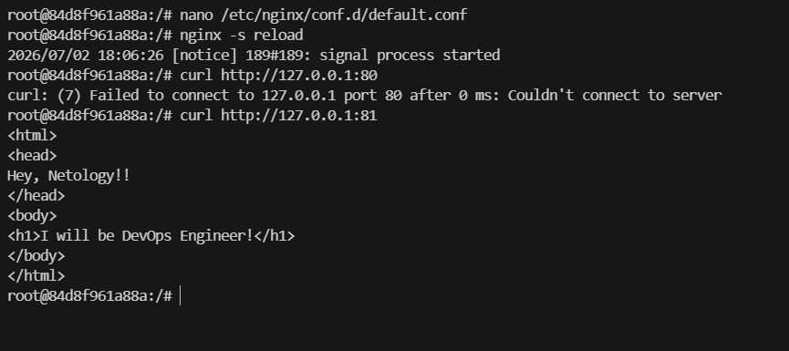

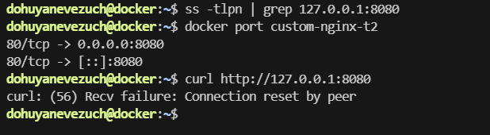

Во-первых, `ss -tlpn | grep 127.0.0.1:8080` не дал результатов, потому что docker слушает все IP, тоесть 0.0.0.0:8080, Во-вторых, `curl` отдал нам ошибку из-за того, что порт 8080 перенаправляется на 80 порт в контейнере, но так как мы поменяли конфигурацию nginx на прослушивание 81 порта - у нас ошибка.

Командой docker inspect узнаем пойный id контейнера. Остановим контейнер, остановим сервис docker. Перейдем по пути `/var/lib/docker/containers/ID_container` и отредактируем `PortBindings` в файле `hostconfig.json` и `ExposedPorts` в файле `config.v2.json`. Запустим сервис и контейнер и проведем проверку заново

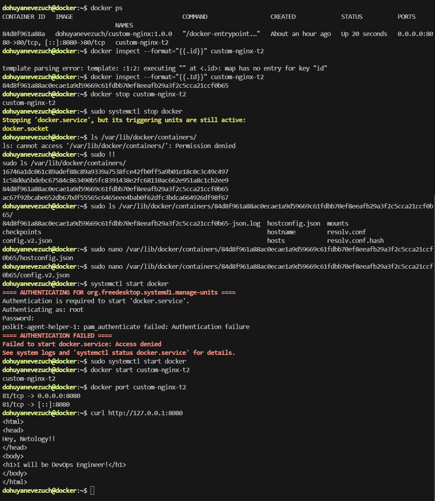

Удаляем контейнер без остановки

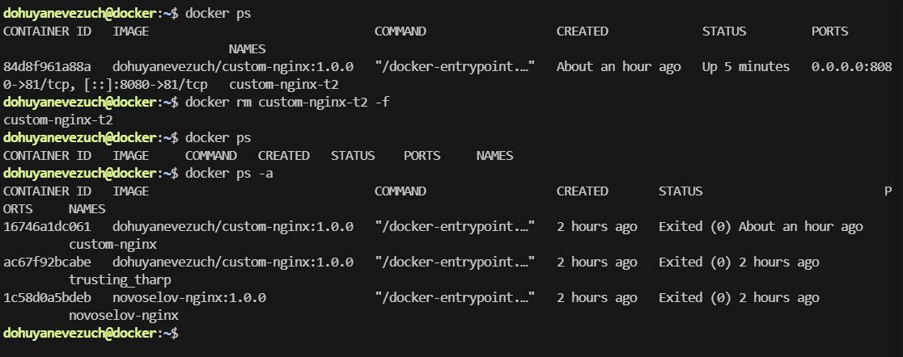

---

### Задание 4

#### Текст задания

- Запустите первый контейнер из образа centos c любым тегом в фоновом режиме, подключив папку текущий рабочий каталог $(pwd) на хостовой машине в /data контейнера, используя ключ -v.
- Запустите второй контейнер из образа debian в фоновом режиме, подключив текущий рабочий каталог $(pwd) в /data контейнера.
- Подключитесь к первому контейнеру с помощью docker exec и создайте текстовый файл любого содержания в /data.
- Добавьте ещё один файл в текущий каталог $(pwd) на хостовой машине.
- Подключитесь во второй контейнер и отобразите листинг и содержание файлов в /data контейнера.

В качестве ответа приложите скриншоты консоли, где видно все введенные команды и их вывод.

#### Выполнение задания

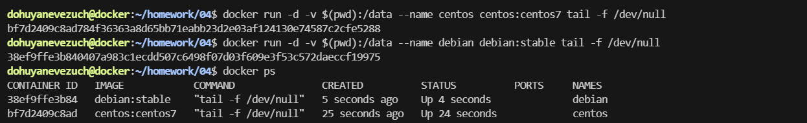

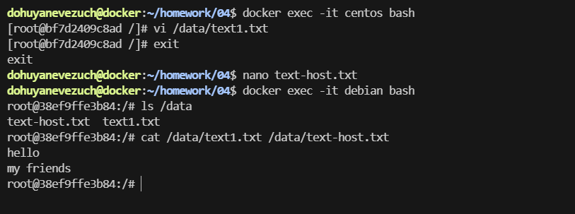

---

### Задание 5

#### Текст задания

1. Создайте отдельную директорию(например /tmp/netology/docker/task5) и 2 файла внутри него.
"compose.yaml" с содержимым:
```
version: "3"
services:
  portainer:
    network_mode: host
    image: portainer/portainer-ce:latest
    volumes:
      - /var/run/docker.sock:/var/run/docker.sock
```
"docker-compose.yaml" с содержимым:
```
version: "3"
services:
  registry:
    image: registry:2

    ports:
    - "5000:5000"
```

И выполните команду "docker compose up -d". Какой из файлов был запущен и почему? (подсказка: https://docs.docker.com/compose/compose-application-model/#the-compose-file )

2. Отредактируйте файл compose.yaml так, чтобы были запущенны оба файла. (подсказка: https://docs.docker.com/compose/compose-file/14-include/)

3. Выполните в консоли вашей хостовой ОС необходимые команды чтобы залить образ custom-nginx как custom-nginx:latest в запущенное вами, локальное registry. Дополнительная документация: https://distribution.github.io/distribution/about/deploying/
4. Откройте страницу "https://127.0.0.1:9000" и произведите начальную настройку portainer.(логин и пароль адмнистратора)
5. Откройте страницу "http://127.0.0.1:9000/#!/home", выберите ваше local  окружение. Перейдите на вкладку "stacks" и в "web editor" задеплойте следующий компоуз:

```
version: '3'

services:
  nginx:
    image: 127.0.0.1:5000/custom-nginx
    ports:
      - "9090:80"
```
6. Перейдите на страницу "http://127.0.0.1:9000/#!/2/docker/containers", выберите контейнер с nginx и нажмите на кнопку "inspect". В представлении <> Tree разверните поле "Config" и сделайте скриншот от поля "AppArmorProfile" до "Driver".

7. Удалите любой из манифестов компоуза(например compose.yaml).  Выполните команду "docker compose up -d". Прочитайте warning, объясните суть предупреждения и выполните предложенное действие. Погасите compose-проект ОДНОЙ(обязательно!!) командой.

В качестве ответа приложите скриншоты консоли, где видно все введенные команды и их вывод, файл compose.yaml , скриншот portainer c задеплоенным компоузом.

#### Выполнение задания

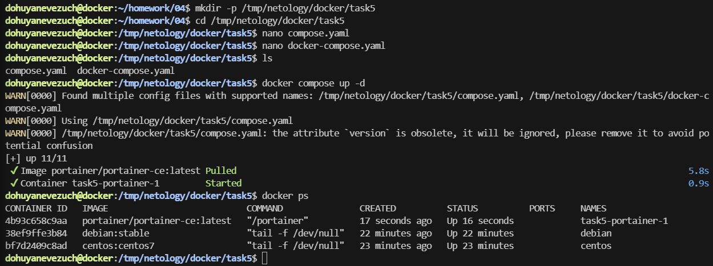

отработал именно файл `compose.yaml` так как по приоритету он выше

Отредактируем `compose.yaml`:

```diff
version: "3"
+ include:
+     - docker-compose.yaml
services:
  portainer:
    network_mode: host
    image: portainer/portainer-ce:latest
    volumes:
      - /var/run/docker.sock:/var/run/docker.sock
```

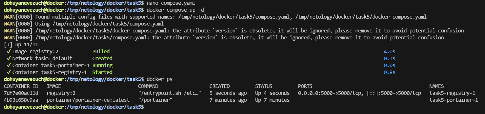

Далее добавляем custom-nginx в локальный registy

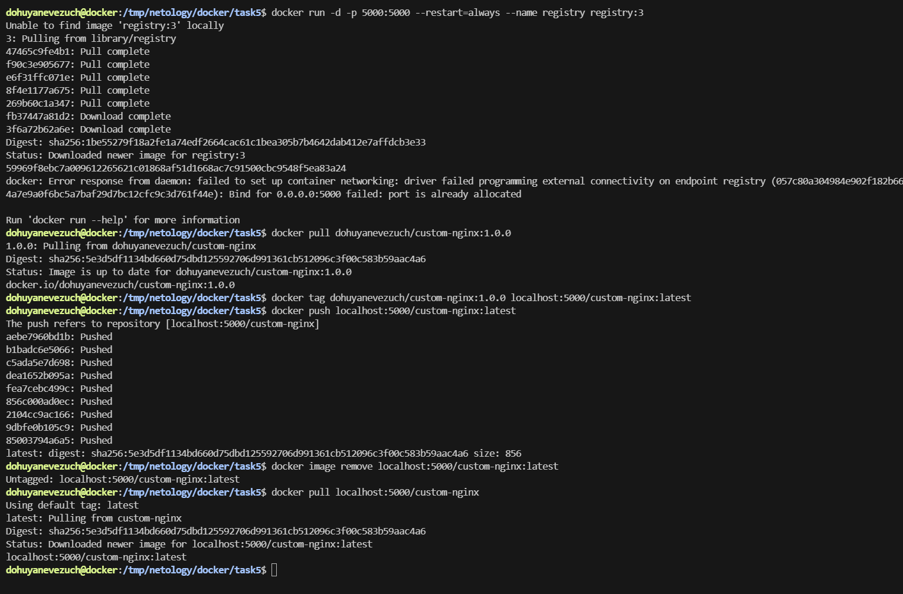

Проводим первичную настройку portainer

Деплоим compose из задания и открываем `inspect`

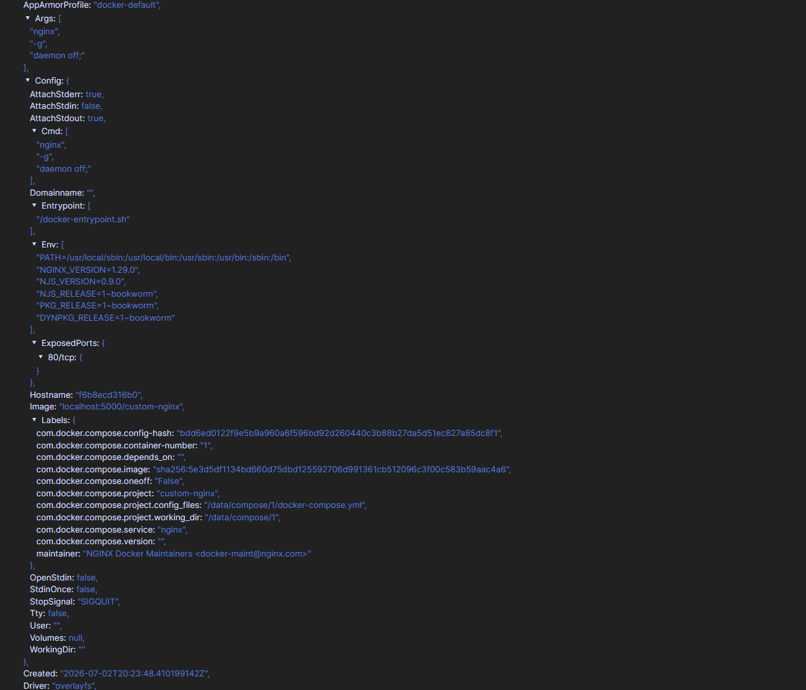

Удаляем файл `compose.yaml` и выполняем команду `docker compose up -d`

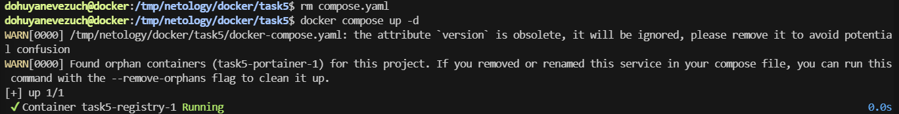

Тут докер нам говорит о том, что найдены контейнеры сироты, тоесть, он увидел, что в данной ситуации файл с portainer был удален, и предложил выполнить команду с доп ключом `--remove-orphans`

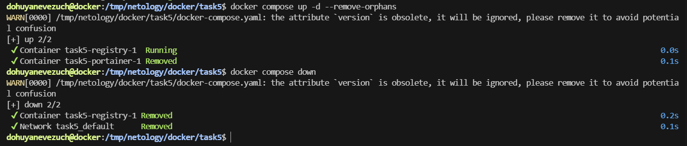

---