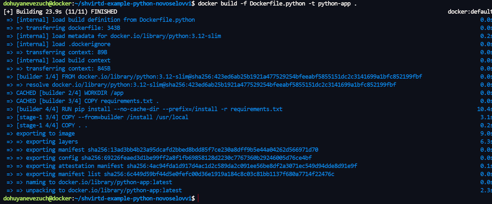
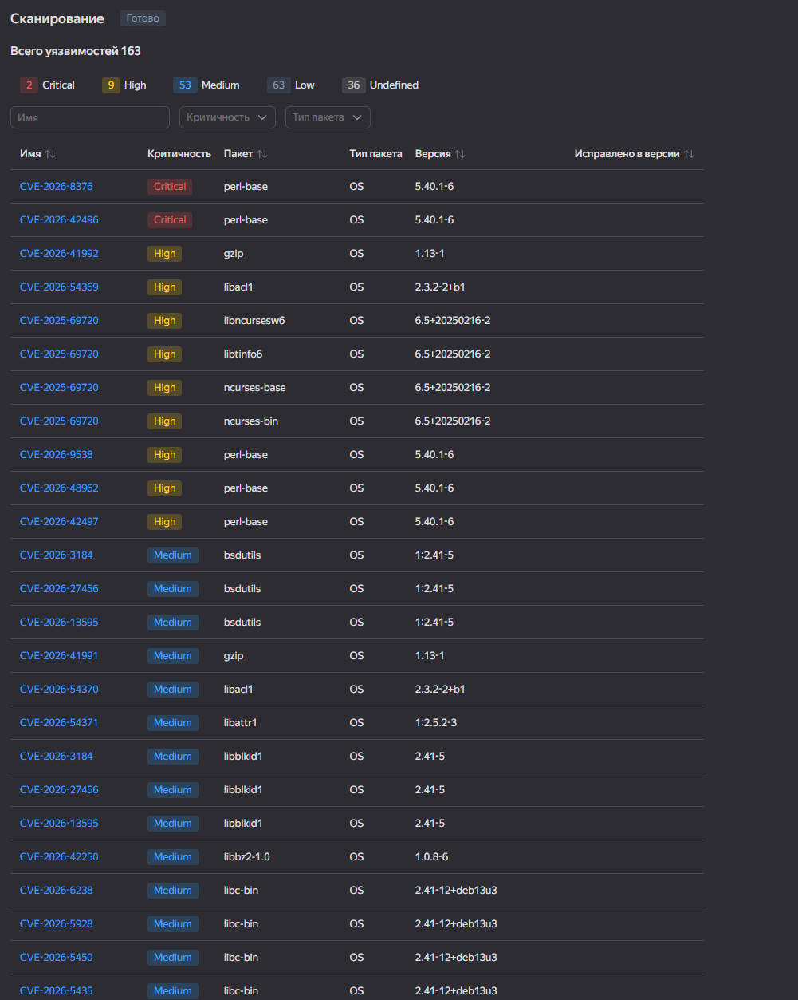
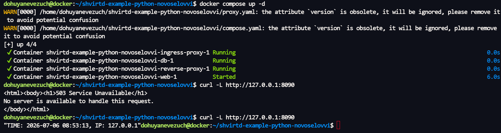
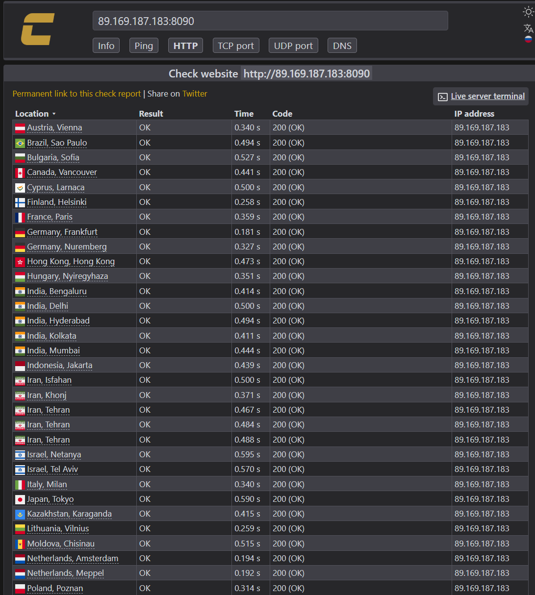
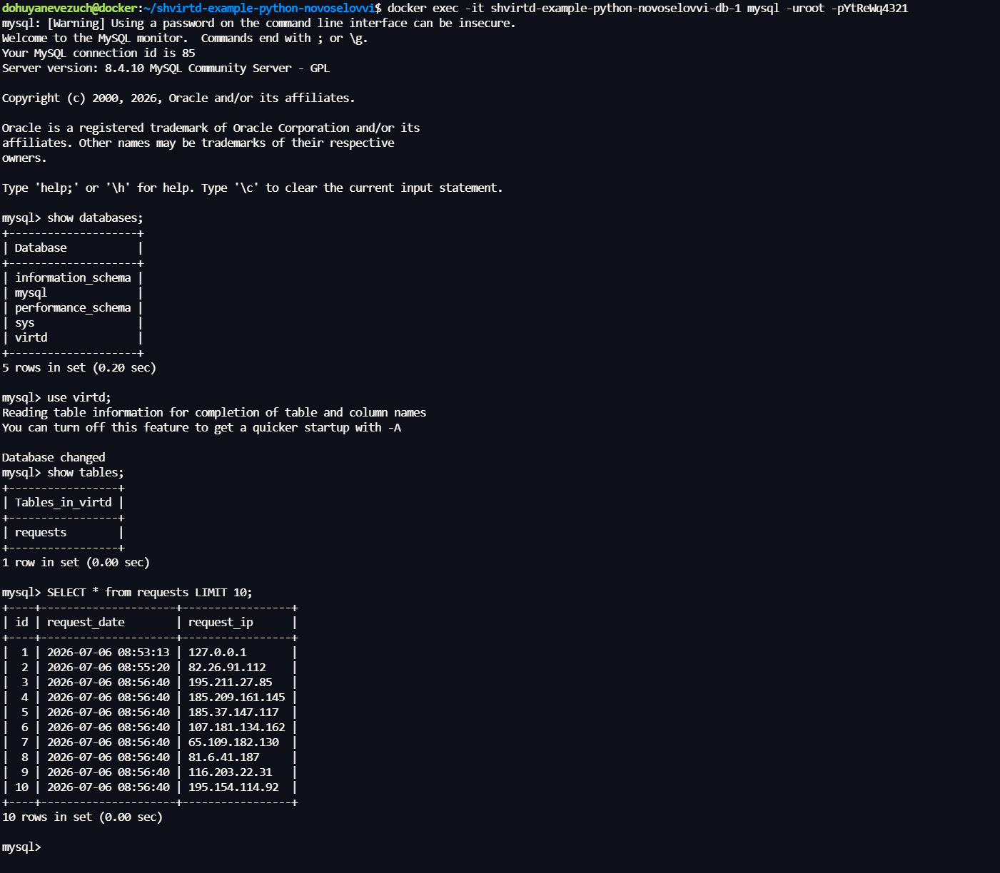
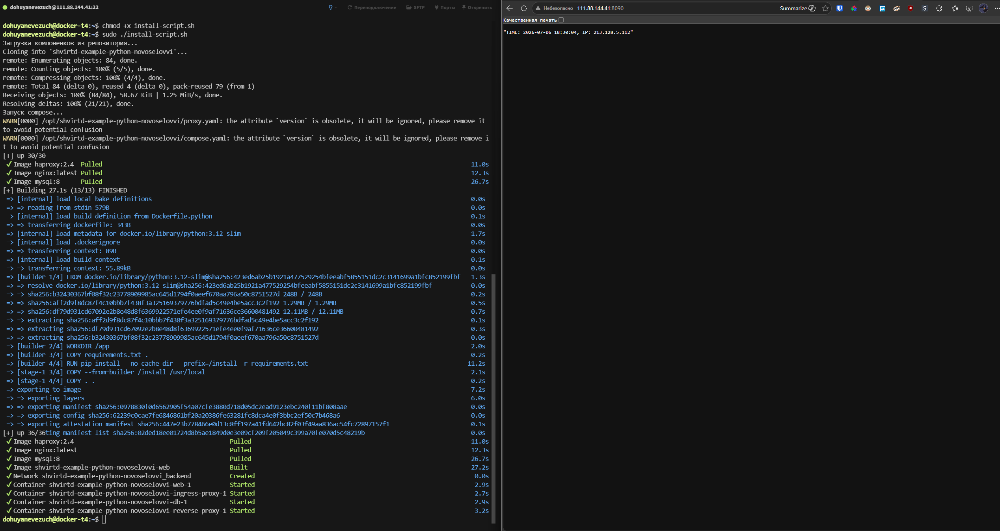
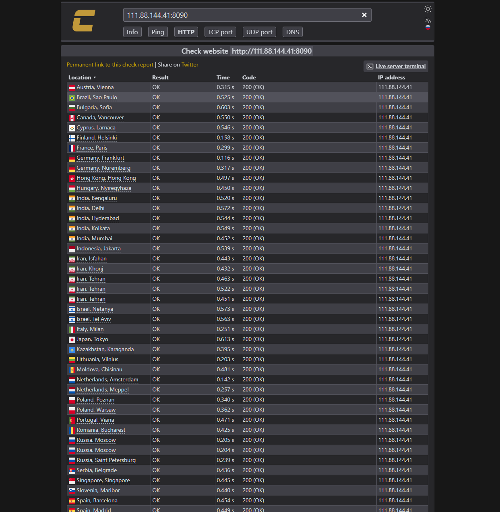
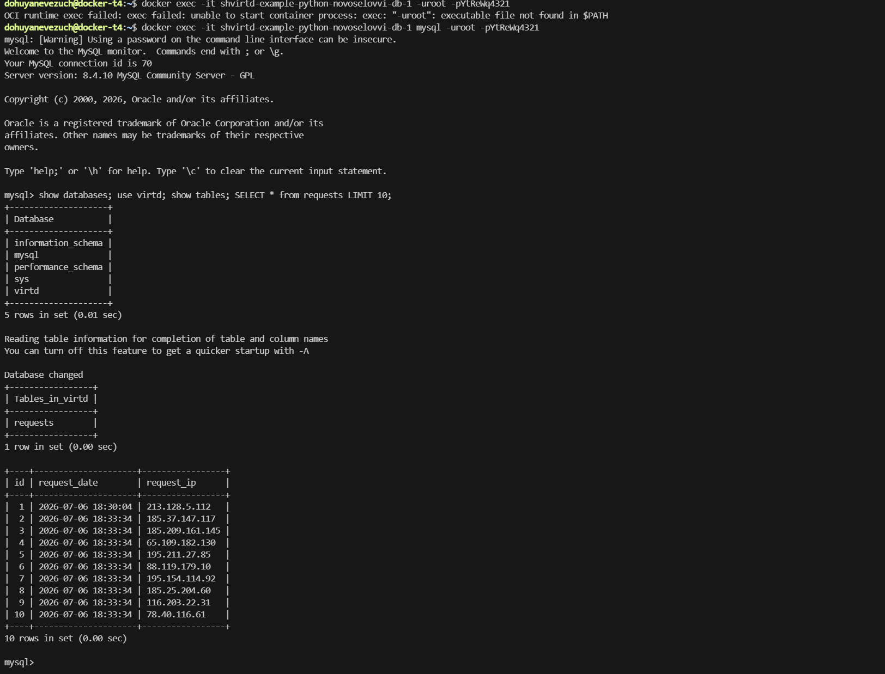

# Домашнее задание к занятию `Практическое применение Docker` - `Новоселов Виктор Иванович`

> [!IMPORTANT] 
> Ссылка на форк репозитория - https://github.com/dohuyanevezuch/shvirtd-example-python-novoselovvi/tree/main


### Задание 1

#### Текст задания

1. Сделайте в своем GitHub пространстве fork [репозитория](https://github.com/netology-code/shvirtd-example-python).

2. Создайте файл ```Dockerfile.python``` на основе существующего `Dockerfile`:
   - Используйте базовый образ ```python:3.12-slim```
   - Обязательно используйте конструкцию ```COPY . .``` в Dockerfile
   - Создайте `.dockerignore` файл для исключения ненужных файлов
   - Используйте ```CMD ["uvicorn", "main:app", "--host", "0.0.0.0", "--port", "5000"]``` для запуска
   - Протестируйте корректность сборки
2.1. Используйте multistage сборку вместо single stage.


#### Выполнение задания

**Dockerfile.python**

```dockerfile
FROM python:3.12-slim AS builder

WORKDIR /app

COPY requirements.txt .

RUN pip install --no-cache-dir --prefix=/install -r requirements.txt

FROM python:3.12-slim

WORKDIR /app

COPY --from=builder /install /usr/local
COPY . .

CMD ["uvicorn", "main:app", "--host", "0.0.0.0", "--port", "5000"]
```

Сборка докерфайла



---

### Задание 2

#### Текст задания

1. Создайте в yandex cloud container registry с именем "test" с помощью "yc tool" . [Инструкция](https://cloud.yandex.ru/ru/docs/container-registry/quickstart/?from=int-console-help)
2. Настройте аутентификацию вашего локального docker в yandex container registry.
3. Соберите и залейте в него образ с python приложением из задания №1.
4. Просканируйте образ на уязвимости.
5. В качестве ответа приложите отчет сканирования.

#### Выполнение задания

Результаты сканирования



---


### Задание 3

#### Текст задания

1. Изучите файл "proxy.yaml"
2. Создайте в репозитории с проектом файл ```compose.yaml```. С помощью директивы "include" подключите к нему файл "proxy.yaml".
3. Опишите в файле ```compose.yaml``` следующие сервисы: 

- ```web```. Образ приложения должен ИЛИ собираться при запуске compose из файла ```Dockerfile.python``` ИЛИ скачиваться из yandex cloud container registry(из задание №2 со *). Контейнер должен работать в bridge-сети с названием ```backend``` и иметь фиксированный ipv4-адрес ```172.20.0.5```. Сервис должен всегда перезапускаться в случае ошибок.
Передайте необходимые ENV-переменные для подключения к Mysql базе данных по сетевому имени сервиса ```web``` 

- ```db```. image=mysql:8. Контейнер должен работать в bridge-сети с названием ```backend``` и иметь фиксированный ipv4-адрес ```172.20.0.10```. Явно перезапуск сервиса в случае ошибок. Передайте необходимые ENV-переменные для создания: пароля root пользователя, создания базы данных, пользователя и пароля для web-приложения.Обязательно используйте уже существующий .env file для назначения секретных ENV-переменных!

2. Запустите проект локально с помощью docker compose , добейтесь его стабильной работы: команда ```curl -L http://127.0.0.1:8090``` должна возвращать в качестве ответа время и локальный IP-адрес. Если сервисы не стартуют воспользуйтесь командами: ```docker ps -a ``` и ```docker logs <container_name>``` . Если вместо IP-адреса вы получаете информационную ошибку --убедитесь, что вы шлете запрос на порт ```8090```, а не 5000.

5. Подключитесь к БД mysql с помощью команды ```docker exec -ti <имя_контейнера> mysql -uroot -p<пароль root-пользователя>```(обратите внимание что между ключем -u и логином root нет пробела. это важно!!! тоже самое с паролем) . Введите последовательно команды (не забываем в конце символ ; ): ```show databases; use <имя вашей базы данных(по-умолчанию virtd, как это указано в .env)>; show tables; SELECT * from requests LIMIT 10;```. Примечание: таблица в БД создается после первого поступившего запроса к приложению.

6. Остановите проект. В качестве ответа приложите скриншот sql-запроса.

#### Выполнение задания

**compose.yaml**

```yaml
version: '3.8'

include:
  - proxy.yaml

services:
  web:
    build:
      context: .
      dockerfile: Dockerfile.python
    restart: always
    env_file:
      - .env
    environment:
      DB_HOST: db
      DB_NAME: ${MYSQL_DATABASE}
      DB_USER: ${MYSQL_USER}
      DB_PASSWORD: ${MYSQL_PASSWORD}
    networks:
      backend:
        ipv4_address: 172.20.0.5
  db:
    image: mysql:8
    restart: always
    env_file:
      - .env
    environment:
      MYSQL_ROOT_PASSWORD: ${MYSQL_ROOT_PASSWORD}
      MYSQL_DATABASE: ${MYSQL_DATABASE}
      MYSQL_USER: ${MYSQL_USER}
      MYSQL_PASSWORD: ${MYSQL_PASSWORD}
    networks:
      backend:
        ipv4_address: 172.20.0.10
```

Запуск проекта и проверка работы:





Подключение к БД и запрос записанной информации




---

### Задание 4

#### Текст задания

1. Запустите в Yandex Cloud ВМ (вам хватит 2 Гб Ram).
2. Подключитесь к Вм по ssh и установите docker.
3. Напишите bash-скрипт, который скачает ваш fork-репозиторий в каталог /opt и запустит проект целиком.
4. Зайдите на сайт проверки http подключений, например(или аналогичный): ```https://check-host.net/check-http``` и запустите проверку вашего сервиса ```http://<внешний_IP-адрес_вашей_ВМ>:8090```. Таким образом трафик будет направлен в ingress-proxy. Трафик должен пройти через цепочки: Пользователь → Internet → Nginx → HAProxy → FastAPI(запись в БД) → HAProxy → Nginx → Internet → Пользователь
5. (Необязательная часть) Дополнительно настройте remote ssh context к вашему серверу. Отобразите список контекстов и результат удаленного выполнения ```docker ps -a```
6. Повторите SQL-запрос на сервере и приложите скриншот и ссылку на fork.

#### Выполнение задания

Создание ВМ, установка докер, написание простого скрипта

```bash
#!/bin/bash

set -e

WORK_DIR="shvirtd-example-python-novoselovvi"
REPO_URL="https://github.com/dohuyanevezuch/${WORK_DIR}.git"

cd /opt

echo "Загрузка компоненков из репозитория..."
git clone "$REPO_URL"

cd "$WORK_DIR"

echo "Запуск compose..."
docker compose up -d
```

Запуск скрипта и проверка работы (аналогично заданию 3)







так же естировал командой

```bash
curl -Ls https://raw.githubusercontent.com/dohuyanevezuch/shvirtd-example-python-novoselovvi/main/install-script.sh | sudo bash
```
---

