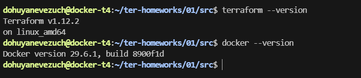
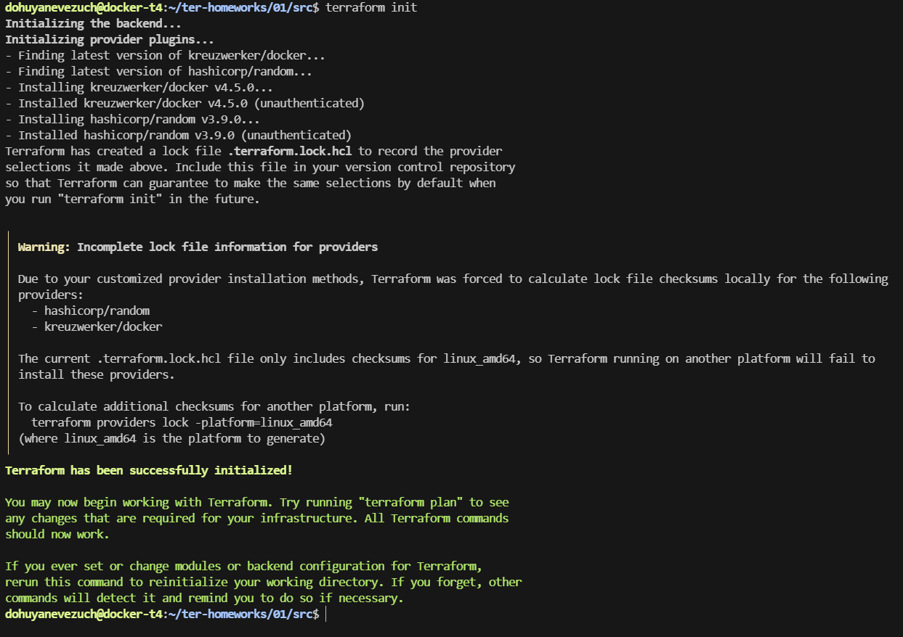
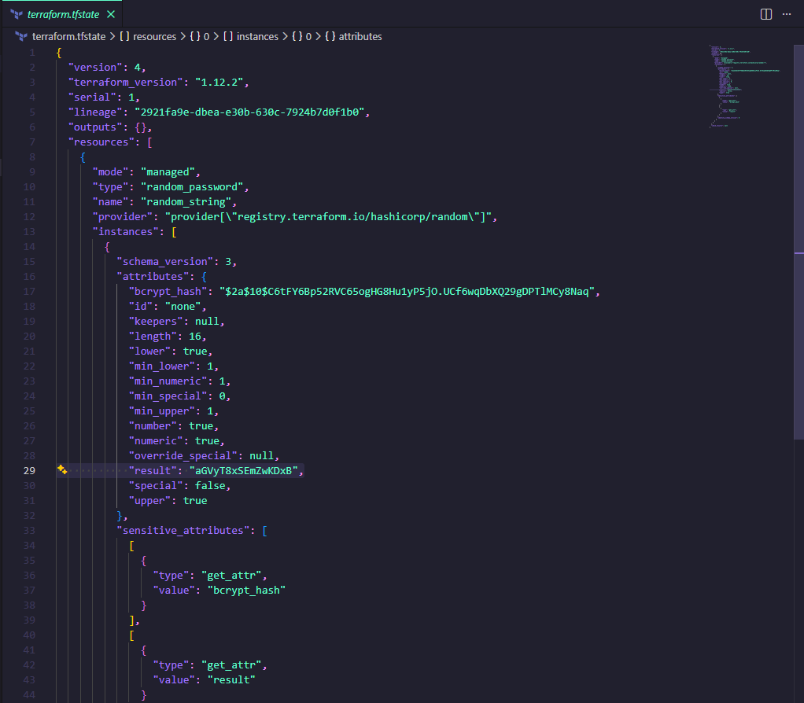
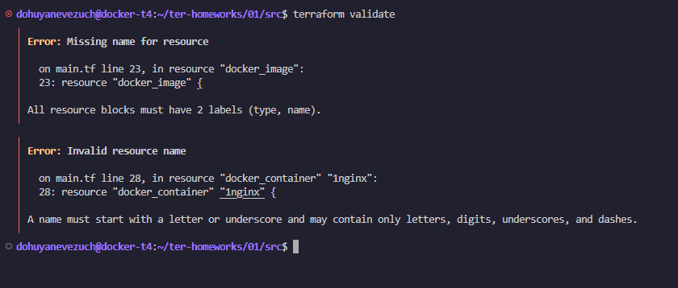
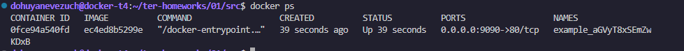
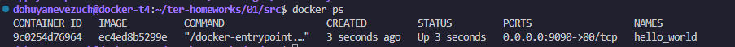
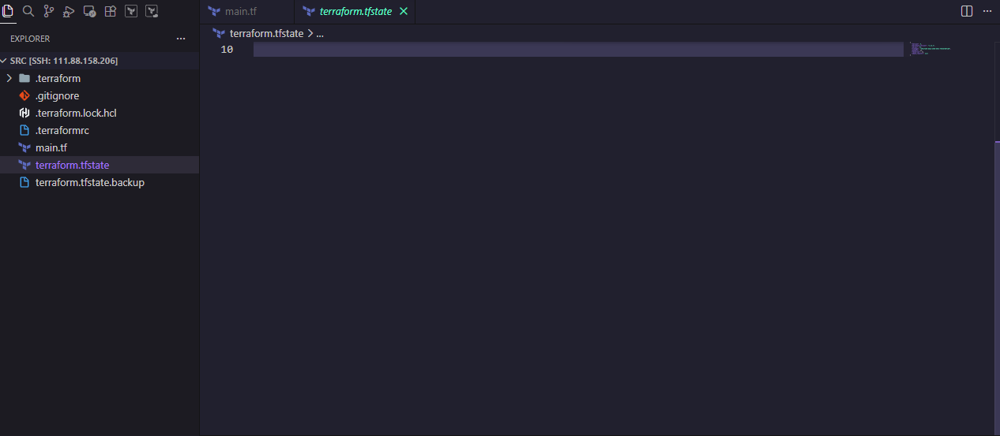
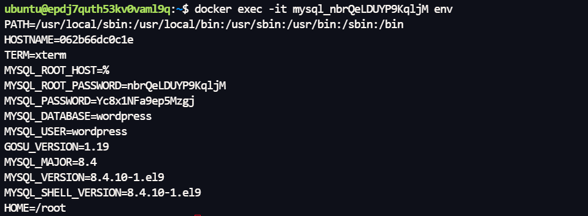

# Домашнее задание к занятию `Введение в Terraform` - `Новоселов Виктор Иванович`

### Чек-лист




> [!TIP]
> Файлы задания - [ТУТ](https://github.com/dohuyanevezuch/homework_novoselovvi_netology/tree/terraform-01)

### Задание 1

#### Текст задания

1. Перейдите в каталог src. Скачайте все необходимые зависимости, использованные в проекте.
2. Изучите файл .gitignore. В каком terraform-файле, согласно этому .gitignore, допустимо сохранить личную, секретную информацию?(логины,пароли,ключи,токены итд)
3. Выполните код проекта. Найдите в state-файле секретное содержимое созданного ресурса random_password, пришлите в качестве ответа конкретный ключ и его значение.
4. Раскомментируйте блок кода, примерно расположенный на строчках 29–42 файла main.tf. Выполните команду terraform validate. Объясните, в чём заключаются намеренно допущенные ошибки. Исправьте их.
5. Выполните код. В качестве ответа приложите: исправленный фрагмент кода и вывод команды docker ps.
6. Замените имя docker-контейнера в блоке кода на hello_world. Не перепутайте имя контейнера и имя образа. Мы всё ещё продолжаем использовать name = "nginx:latest". Выполните команду terraform apply -auto-approve. Объясните своими словами, в чём может быть опасность применения ключа -auto-approve. Догадайтесь или нагуглите зачем может пригодиться данный ключ? В качестве ответа дополнительно приложите вывод команды docker ps.
7. Уничтожьте созданные ресурсы с помощью terraform. Убедитесь, что все ресурсы удалены. Приложите содержимое файла terraform.tfstate.
8. Объясните, почему при этом не был удалён docker-образ nginx:latest. Ответ ОБЯЗАТЕЛЬНО НАЙДИТЕ В ПРЕДОСТАВЛЕННОМ КОДЕ, а затем ОБЯЗАТЕЛЬНО ПОДКРЕПИТЕ строчкой из документации terraform провайдера docker. (ищите в классификаторе resource docker_image )

#### Выполнение задания

1. 

2. `personal.auto.tfvars` является файлом в котором допустимо сохранять личную информацию

3. Ключ `result` является ключом (результатом😅) выполнения генерации пароля



4. Терраформ ругается на:
    - то что у ресурса с типом `docker_image` нет имени
    - на имя ресурса `docker_container`, так как имя ресурса не может начинаться с цифры
    - и вообще еще должен ругаться на переменную, к которой обращаемся, в имени ресурса `docker_container`



5. Исправленный фрагмент кода:

```diff
-resource "docker_image" {
+resource "docker_image" "nginx" {
  name         = "nginx:latest"
  keep_locally = true
}

-resource "docker_container" "1nginx" {
+resource "docker_container" "nginx_1" {
  image = docker_image.nginx.image_id
-  name  = "example_${random_password.random_string_FAKE.resulT}"
+  name  = "example_${random_password.random_string.result}"

  ports {
    internal = 80
    external = 9090
  }
}
```
Результат запуска



6. Смена имени контейнера

```diff
resource "docker_container" "nginx_1" {
  image = docker_image.nginx.image_id
-  name  = "example_${random_password.random_string.result}"
+  name  = "hello_world"

  ports {
    internal = 80
    external = 9090
  }
}
```

Результат команды `terraform apply -auto-approve`



Опасность использования `-auto-approve` это пропуск подтверждения изменений с возможностью посмотреть выполняемые шаги, как в `terraform plan`, которые показываеются при каждом выполнении без этого ключа. А это может положить весь проект, так как если допущена критическая ошибка - код все равно выполниться.

Полезен же этот ключ для автоматизации, так как скрипты\пайплайны и тд не будут вставать ожидая подтверждения операции

7. Выполнение `terraform destroy`



8. Докер образ не был удален, так как ресурс `docker_image` в коде не имеет параметра `keep_locally = false`. Без явного описания параметра keep_locally будет true

---

### Задание 2*

#### Текст задания

1. Создайте в облаке ВМ. Сделайте это через web-консоль, чтобы не слить по незнанию токен от облака в github(это тема следующей лекции). Если хотите - попробуйте сделать это через terraform, прочитав документацию yandex cloud. Используйте файл personal.auto.tfvars и гитигнор или иной, безопасный способ передачи токена!
2. Подключитесь к ВМ по ssh и установите стек docker.
3. Найдите в документации docker provider способ настроить подключение terraform на вашей рабочей станции к remote docker context вашей ВМ через ssh.
4. Используя terraform и remote docker context, скачайте и запустите на вашей ВМ контейнер mysql:8 на порту 127.0.0.1:3306, передайте ENV-переменные. Сгенерируйте разные пароли через random_password и передайте их в контейнер, используя интерполяцию из примера с nginx.(name  = "example_${random_password.random_string.result}" , двойные кавычки и фигурные скобки обязательны!)

```env
environment:
  - "MYSQL_ROOT_PASSWORD=${...}"
  - MYSQL_DATABASE=wordpress
  - MYSQL_USER=wordpress
  - "MYSQL_PASSWORD=${...}"
  - MYSQL_ROOT_HOST="%"
```

5. Зайдите на вашу ВМ , подключитесь к контейнеру и проверьте наличие секретных env-переменных с помощью команды env. Запишите ваш финальный код в репозиторий.

#### Выполнение задания

1. Создадим ВМ в yandex cloud с помощью terraform

> [!NOTE]
> Передача токена осуществлялась через YC CLI

```terraform
terraform {
  required_providers {
    yandex = {
      source = "yandex-cloud/yandex"
      version = "0.213.0"
    }
  }
}

provider yandex {
    zone = var.yc-zone
}

variable "yc-zone" {
  type = string
  default = "ru-central1-b"
}

resource "yandex_compute_instance" "vm-task2"{
    name = "novoselovi-terraform"
    zone = var.yc-zone
    platform_id = "standard-v3"
    scheduling_policy {
        preemptible = true
    }
    resources {
        cores = 2
        memory = 2
    }

    boot_disk {
        disk_id = yandex_compute_disk.disk1.id
    }

    network_interface {
        subnet_id = data.yandex_vpc_subnet.default.id
        nat = true
    }

    metadata = {
        ssh-keys = "ubuntu:${file("~/.ssh/id_ed25519_YC.pub")}"
    }
}

resource "yandex_compute_disk" "disk1" {
    image_id = "fd83esfomhq25p2ono90"
    zone = var.yc-zone
    type = "network-hdd"
    size = 20
}

data "yandex_vpc_network" "default" {
  name = "default"
}

data "yandex_vpc_subnet" "default" {
  name = "default-ru-central1-b"
}
```

2. Подключились и установили Docker

3. Дополним `main.tf`

```diff
terraform {
  required_providers {
    yandex = {
      source = "yandex-cloud/yandex"
      version = "0.213.0"
    }

+    docker = {
+      source = "kreuzwerker/docker"
+      version = "4.5.0"
+    }
  }
}

+provider docker {
+  host = "ssh://ubuntu@${yandex_compute_instance.vm-task2.network_interface[0].nat_ip_address}:22"
+  ssh_opts = ["-i", "~/.ssh/id_ed25519_YC"]
}
```

4. Дополним код, только уже и немного наведя порядок в файлах

В крации:

- Добавили провайдера рандом
- добавили 2 ресурса `random_password`, ресурс `docker_image` и ресурс `docker_container`

```hcl
...

    random = {
      source = "hashicorp/random"
      version = "3.6"
    }
  }
}

resource "random_password" "sql_pass_root" {
  length = 16
  special = false
}

resource "random_password" "sql_pass_user" { 
  length = 16
  special = false
}

resource "docker_image" "mysql" {
  name = "mysql:8"
}

resource "docker_container" "mysql" {
  image = docker_image.mysql.name
  name = "mysql_${random_password.sql_pass_root.result}"
  restart = "always"

  env = [
    "MYSQL_ROOT_PASSWORD=${random_password.sql_pass_root.result}",
    "MYSQL_DATABASE=wordpress",
    "MYSQL_USER=wordpress",
    "MYSQL_PASSWORD=${random_password.sql_pass_user.result}",
    "MYSQL_ROOT_HOST=%"
  ]
  
  ports {
    internal = 3306
    external = 3306
    ip = "127.0.0.1"
  }
}
```

5. Подключились и выполнили команду `env`



---
