# Домашнее задание к занятию `Основы Terraform. Yandex Cloud` - `Новоселов Виктор Иванович`

> [!TIP]
> Я до конца не понял, можно ли кидать все файлы в отдельный каталог или нужно прям в отдельный репозиторий
> Пока оставил [ТУТ](./files/), но если так не правильно, то я быстро поменяю или на следующие разы буду делать отдельный репо, спасибо!

## Задание 1

### Текст задания

В качестве ответа всегда полностью прикладывайте ваш terraform-код в git.
Убедитесь что ваша версия **Terraform** ~>1.12.0

1. Изучите проект. В файле variables.tf объявлены переменные для Yandex provider.
2. Создайте сервисный аккаунт и ключ. [service_account_key_file](https://terraform-provider.yandexcloud.net).
4. Сгенерируйте новый или используйте свой текущий ssh-ключ. Запишите его открытую(public) часть в переменную **vms_ssh_public_root_key**.
5. Инициализируйте проект, выполните код. Исправьте намеренно допущенные синтаксические ошибки. Ищите внимательно, посимвольно. Ответьте, в чём заключается их суть.
6. Подключитесь к консоли ВМ через ssh и выполните команду ``` curl ifconfig.me```.
Примечание: К OS ubuntu "out of a box, те из коробки" необходимо подключаться под пользователем ubuntu: ```"ssh ubuntu@vm_ip_address"```. Предварительно убедитесь, что ваш ключ добавлен в ssh-агент: ```eval $(ssh-agent) && ssh-add``` Вы познакомитесь с тем как при создании ВМ создать своего пользователя в блоке metadata в следующей лекции.;
8. Ответьте, как в процессе обучения могут пригодиться параметры ```preemptible = true``` и ```core_fraction=5``` в параметрах ВМ.

В качестве решения приложите:

- скриншот ЛК Yandex Cloud с созданной ВМ, где видно внешний ip-адрес;
- скриншот консоли, curl должен отобразить тот же внешний ip-адрес;
- ответы на вопросы.

### Выполнение задания

Изучение проекта, указание значения переменных в personal.auto.tfvars, поиск ошибок
Ошибки в основном в описании ресурса `yandex_compute_cloud` не правильное описание значения платформы `standart-v4` исправленно на `standatd-v3`, так ка 4ого не существует, есть только 4a, так же минимальное количество ядер не может быть меньше 2, как и именно в стандарте 3 не может быть уровень производительности vCPU меньше 20 процентов

Выполнили запуск кода и подключились к ВМ


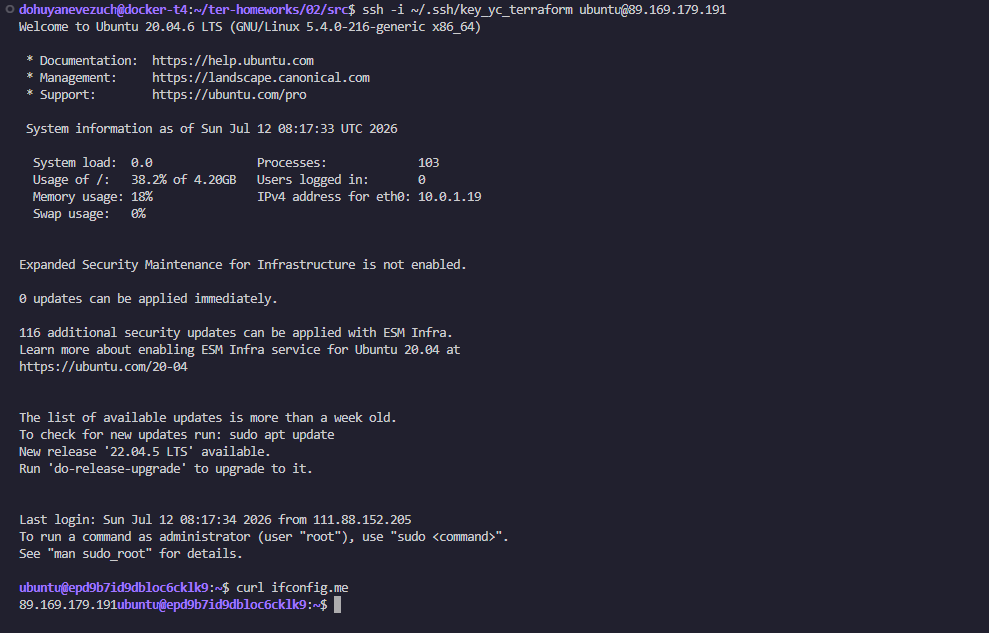

`preemptible` и `core_fraction` в процессе обучения помогут экономить грант.

---

## Задание 2

### Текст задания

1. Замените все хардкод-**значения** для ресурсов **yandex_compute_image** и **yandex_compute_instance** на **отдельные** переменные. К названиям переменных ВМ добавьте в начало префикс **vm_web_** .  Пример: **vm_web_name**.
2. Объявите нужные переменные в файле variables.tf, обязательно указывайте тип переменной. Заполните их **default** прежними значениями из main.tf. 
3. Проверьте terraform plan. Изменений быть не должно. 

### Выполнение задания

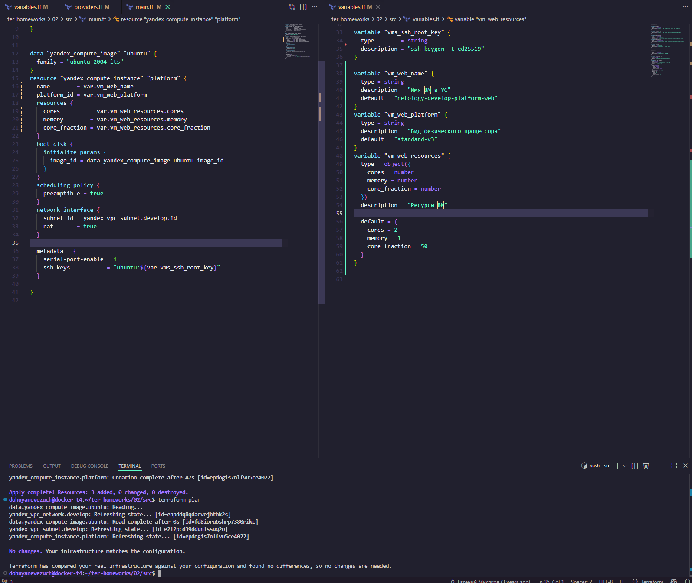

---

## Задание 3

### Текст задания

1. Создайте в корне проекта файл 'vms_platform.tf' . Перенесите в него все переменные первой ВМ.
2. Скопируйте блок ресурса и создайте с его помощью вторую ВМ в файле main.tf: **"netology-develop-platform-db"** ,  ```cores  = 2, memory = 2, core_fraction = 20```. Объявите её переменные с префиксом **vm_db_** в том же файле ('vms_platform.tf').  ВМ должна работать в зоне "ru-central1-b"
3. Примените изменения.

### Выполнение задания

Добавили код в `main.tf`

```hcl
resource "yandex_vpc_subnet" "develop_b" {
  name           = "${var.vpc_name}-b"
  zone           = "ru-central1-b"
  network_id     = yandex_vpc_network.develop.id
  v4_cidr_blocks = ["10.0.2.0/24"]
}

resource "yandex_compute_instance" "db" {
  name        = var.vm_db_name
  platform_id = var.vm_db_platform
  zone = "ru-central1-b"
  resources {
    cores         = var.vm_db_resources.cores
    memory        = var.vm_db_resources.memory
    core_fraction = var.vm_db_resources.core_fraction
  }
  boot_disk {
    initialize_params {
      image_id = data.yandex_compute_image.ubuntu.image_id
    }
  }
  scheduling_policy {
    preemptible = true
  }
  network_interface {
    subnet_id = yandex_vpc_subnet.develop_b.id
    nat       = true
  }

  metadata = {
    serial-port-enable = 1
    ssh-keys           = "ubuntu:${var.vms_ssh_root_key}"
  }

}
```

Добавили переменные в `vms_platform.tf`

```hcl
#vm_web
variable "vm_web_name" {
  type = string
  description = "Имя ВМ в YC"
  default = "netology-develop-platform-web"
}
variable "vm_web_platform" {
  type = string
  description = "Вид физического процессора"
  default = "standard-v3"
}
variable "vm_web_resources" {
  type = object({
    cores = number
    memory = number
    core_fraction = number
  })
  description = "Ресурсы ВМ"

  default = {
    cores = 2
    memory = 1
    core_fraction = 50
  }
}

# vm_db
variable "vm_db_name" {
  type = string
  description = "Имя ВМ в YC"
  default = "netology-develop-platform-db"
}
variable "vm_db_platform" {
  type = string
  description = "Вид физического процессора"
  default = "standard-v3"
}
variable "vm_db_resources" {
  type = object({
    cores = number
    memory = number
    core_fraction = number
  })
  description = "Ресурсы ВМ"

  default = {
    cores = 2
    memory = 2
    core_fraction = 20
  }
}
```

результат работы

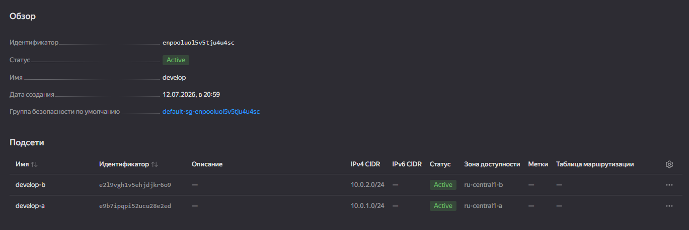

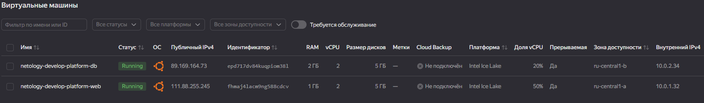

---

## Задание 4

### Текст задания

1. Объявите в файле outputs.tf **один** output , содержащий: instance_name, external_ip, fqdn для каждой из ВМ в удобном лично для вас формате.(без хардкода!!!)
2. Примените изменения.

В качестве решения приложите вывод значений ip-адресов команды ```terraform output```.

### Выполнение задания

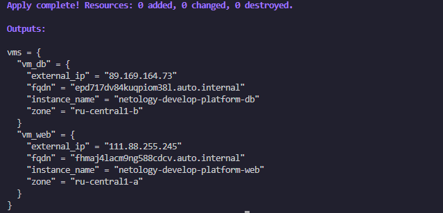

---

## Задание 5

### Текст задания

1. В файле locals.tf опишите в **одном** local-блоке имя каждой ВМ, используйте интерполяцию ${..} с НЕСКОЛЬКИМИ переменными по примеру из лекции.
2. Замените переменные внутри ресурса ВМ на созданные вами local-переменные.
3. Примените изменения.

### Выполнение задания

Редактируем `vms_platform.tf`

```hcl
#vm_all
variable "school_name" {
  type = string
  default = "netology"
}
variable "platform_name" {
  type    = string
  default = "platform"
}


#vm_web
variable "id_name_web" {
    type    = string
    default = "web"
}

# vm_db
variable "id_name_db" {
    type    = string
    default = "db"
}
```

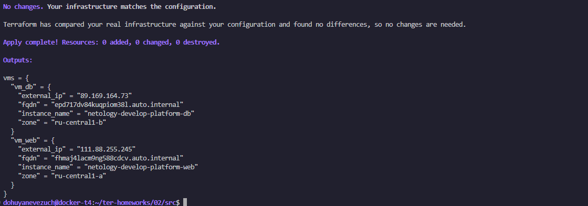

---

## Задание 6

### Текст задания


1. Вместо использования трёх переменных  ".._cores",".._memory",".._core_fraction" в блоке  resources {...}, объедините их в единую map-переменную **vms_resources** и  внутри неё конфиги обеих ВМ в виде вложенного map(object).  
   ```
   пример из terraform.tfvars:
   vms_resources = {
     web={
       cores=2
       memory=2
       core_fraction=5
       hdd_size=10
       hdd_type="network-hdd"
       ...
     },
     db= {
       cores=2
       memory=4
       core_fraction=20
       hdd_size=10
       hdd_type="network-ssd"
       ...
     }
   }
   ```
3. Создайте и используйте отдельную map(object) переменную для блока metadata, она должна быть общая для всех ваших ВМ.
   ```
   пример из terraform.tfvars:
   metadata = {
     serial-port-enable = 1
     ssh-keys           = "ubuntu:ssh-ed25519 AAAAC..."
   }
   ```  
  
5. Найдите и закоментируйте все, более не используемые переменные проекта.
6. Проверьте terraform plan. Изменений быть не должно.

### Выполнение задания

Создали переменную `metadata` с типом map(string)

В `personal.auto.tfvars` опсали значение переменной и заменили блоки `metadata` в `main.tf`

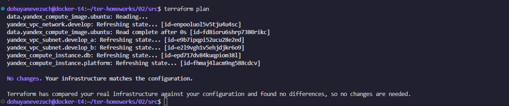

---

## Задание 7*

### Текст задания

Изучите содержимое файла console.tf. Откройте terraform console, выполните следующие задания: 

1. Напишите, какой командой можно отобразить **второй** элемент списка test_list.
2. Найдите длину списка test_list с помощью функции length(<имя переменной>).
3. Напишите, какой командой можно отобразить значение ключа admin из map test_map.
4. Напишите interpolation-выражение, результатом которого будет: "John is admin for production server based on OS ubuntu-20-04 with X vcpu, Y ram and Z virtual disks", используйте данные из переменных test_list, test_map, servers и функцию length() для подстановки значений.

**Примечание**: если не догадаетесь как вычленить слово "admin", погуглите: "terraform get keys of map"

В качестве решения предоставьте необходимые команды и их вывод.

### Выполнение задания

```hcl
local.test_list[1]

length(local.test_list)

local.test_map["admin"]

"${local.test_map.admin} is ${keys(local.test_map)[0]} for ${local.test_list[2]} server based on OS ${local.servers.production.image} with ${local.servers.production.cpu} vCPU, ${local.servers.production.ram} RAM and ${length(local.servers.production.disks)} virtual disks"
```

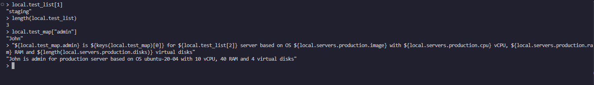

---

## Задание 8*

### Текст задания

1. Напишите и проверьте переменную test и полное описание ее type в соответствии со значением из terraform.tfvars:
```
test = [
  {
    "dev1" = [
      "ssh -o 'StrictHostKeyChecking=no' ubuntu@62.84.124.117",
      "10.0.1.7",
    ]
  },
  {
    "dev2" = [
      "ssh -o 'StrictHostKeyChecking=no' ubuntu@84.252.140.88",
      "10.0.2.29",
    ]
  },
  {
    "prod1" = [
      "ssh -o 'StrictHostKeyChecking=no' ubuntu@51.250.2.101",
      "10.0.1.30",
    ]
  },
]
```
2. Напишите выражение в terraform console, которое позволит вычленить строку "ssh -o 'StrictHostKeyChecking=no' ubuntu@62.84.124.117" из этой переменной.

### Выполнение задания

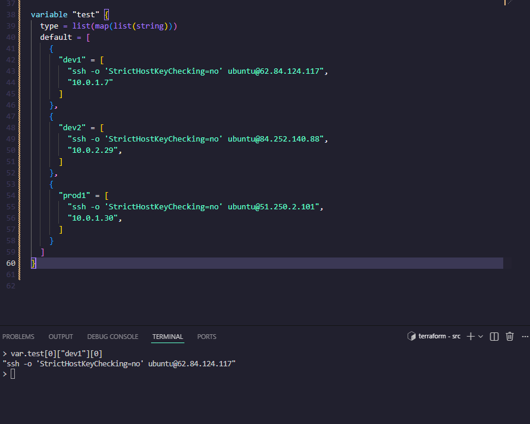

---

## Задание 9*

### Текст задания

Используя инструкцию https://cloud.yandex.ru/ru/docs/vpc/operations/create-nat-gateway#tf_1, настройте для ваших ВМ nat_gateway. Для проверки уберите внешний IP адрес (nat=false) у ваших ВМ и проверьте доступ в интернет с ВМ, подключившись к ней через serial console. Для подключения предварительно через ssh измените пароль пользователя: ```sudo passwd ubuntu```

### Правила приёма работы 
В качестве результата прикрепите ссылку на MD файл с описанием выполненой работы в вашем репозитории. Так же в репозитории должен присутсвовать ваш финальный код проекта.

**Важно. Удалите все созданные ресурсы**.

### Выполнение задания

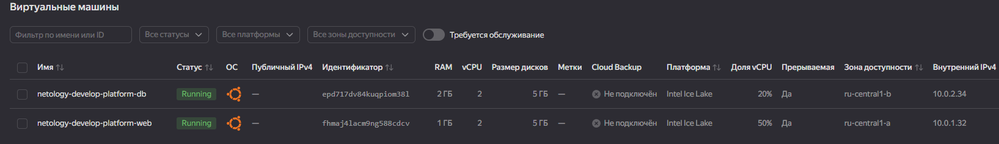

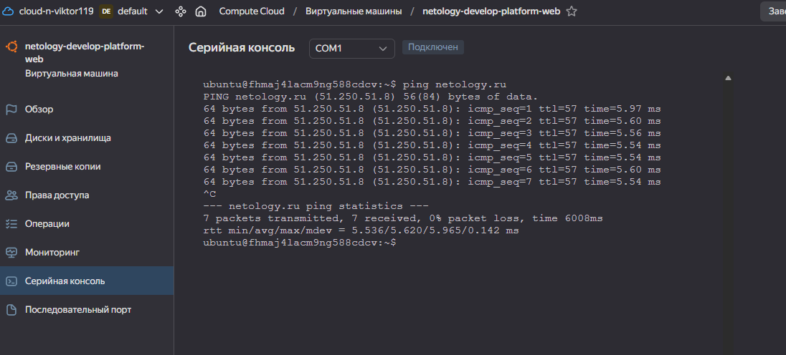

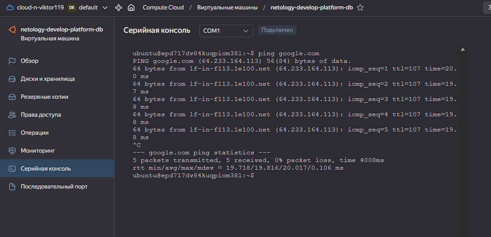


---