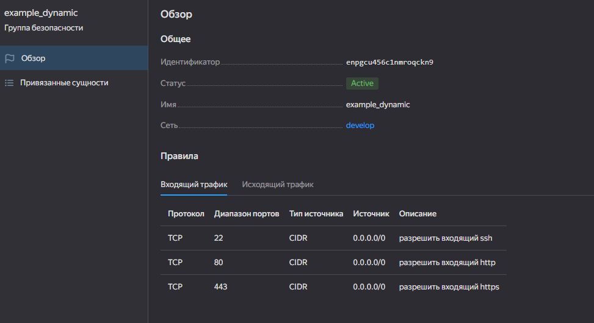
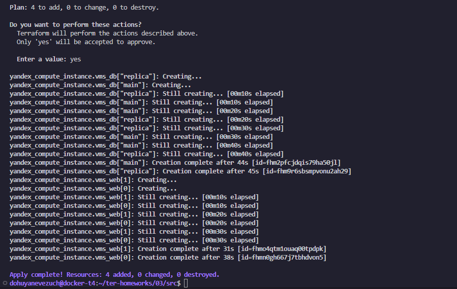
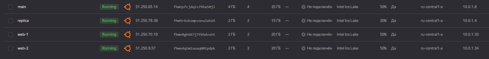
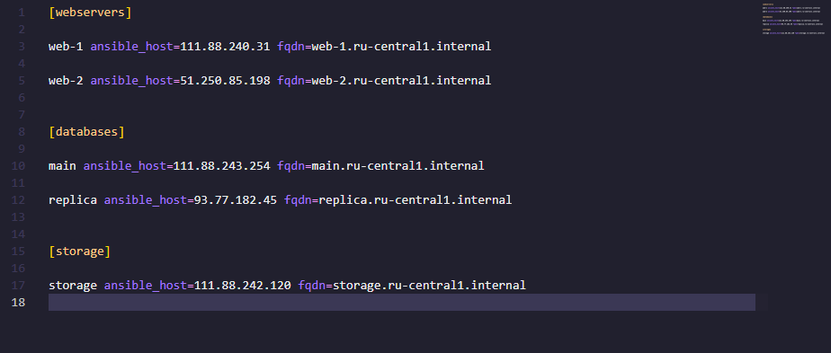
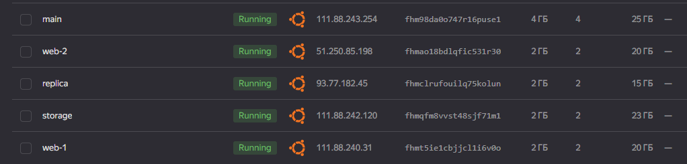
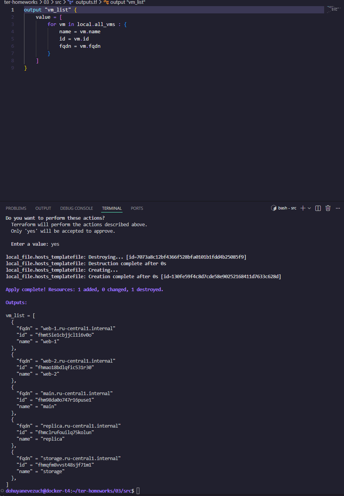

# Домашнее задание к занятию `Управляющие конструкции в коде Terraform` - `Новоселов Виктор Иванович`

> [!TIP]
> Файлы задания - [ТУТ](https://github.com/dohuyanevezuch/homework_novoselovvi_netology/tree/terraform-03)

## Задание 1

### Текст задания

1. Изучите проект.
2. Инициализируйте проект, выполните код. 

Приложите скриншот входящих правил «Группы безопасности» в ЛК Yandex Cloud .

### Выполнение задания



---

## Задание 2

### Текст задания

1. Создайте файл count-vm.tf. Опишите в нём создание двух **одинаковых** ВМ  web-1 и web-2 (не web-0 и web-1) с минимальными параметрами, используя мета-аргумент **count loop**. Назначьте ВМ созданную в первом задании группу безопасности.(как это сделать узнайте в документации провайдера yandex/compute_instance )
2. Создайте файл for_each-vm.tf. Опишите в нём создание двух ВМ для баз данных с именами "main" и "replica" **разных** по cpu/ram/disk_volume , используя мета-аргумент **for_each loop**. Используйте для обеих ВМ одну общую переменную типа:
```
variable "each_vm" {
  type = list(object({  vm_name=string, cpu=number, ram=number, disk_volume=number }))
}
```  
При желании внесите в переменную все возможные параметры.
3. ВМ, описанные в файле count-vm.tf, должны создаваться после ВМ, описанных в файле for_each-vm.tf.
4. Используйте функцию file в local-переменной для считывания ключа ~/.ssh/id_rsa.pub и его последующего использования в блоке metadata, взятому из ДЗ 2.
5. Инициализируйте проект, выполните код.

### Выполнение задания






---

## Задание 3

### Текст задания

1. Создайте 3 одинаковых виртуальных диска размером 1 Гб с помощью ресурса yandex_compute_disk и мета-аргумента count в файле **disk_vm.tf** .
2. Создайте в том же файле **одиночную**(использовать count или for_each запрещено из-за задания №4) ВМ c именем "storage"  . Используйте блок **dynamic secondary_disk{..}** и мета-аргумент for_each для подключения созданных вами дополнительных дисков.

### Выполнение задания

```hcl
#veriables
variable "default_disk" {
  type = object({
    name = string
    type = string
    size = number
  })
  default = {
    name = "vm_disk"
    type = "network-hdd"
    size = 1
  }
}

#disks
resource "yandex_compute_disk" "vms_disk" {
  count = 3
  name = "${var.default_disk.name}_${count.index+1}"
  type = var.default_disk.type
  size = var.default_disk.size

  labels = {
    environment = "${var.default_disk.name}_label-${count.index+1}"
  }

}

# vm storage (решил переиспользовать параметры count виртуальных машин, вместо создания доп переменной, для уменьшения кода)
resource "yandex_compute_instance" "storage" {
  name = "storage"
  hostname = "storage"
  zone = var.default_zone
  platform_id = var.default_platform
  resources {
    cores = var.count_vm.resources.cores
    memory = var.count_vm.resources.memory
    core_fraction = var.count_vm.resources.core_fraction
  }
  boot_disk {
    initialize_params {
      image_id = local.default_os
      size = var.count_vm.disk.size
      type = var.count_vm.disk.type
    }
  }
  dynamic "secondary_disk" {
    for_each = yandex_compute_disk.vms_disk

    content {
      disk_id = secondary_disk.value.id
    }
  }

  network_interface {
    subnet_id = yandex_vpc_subnet.develop.id
    nat = var.count_vm.net.nat
  }
  metadata = {
    ssh-keys = "${var.default_user}:${local.ssh_pub}"
  }
}

```

---

## Задание 4

### Текст задания

1. В файле ansible.tf создайте inventory-файл для ansible.
Используйте функцию tepmplatefile и файл-шаблон для создания ansible inventory-файла из лекции.
Готовый код возьмите из демонстрации к лекции [**demonstration2**](https://github.com/netology-code/ter-homeworks/tree/main/03/demo).
Передайте в него в качестве переменных группы виртуальных машин из задания 2.1, 2.2 и 3.2, т. е. 5 ВМ.
2. Инвентарь должен содержать 3 группы и быть динамическим, т. е. обработать как группу из 2-х ВМ, так и 999 ВМ.
3. Добавьте в инвентарь переменную  [**fqdn**](https://cloud.yandex.ru/docs/compute/concepts/network#hostname).
``` 
[webservers]
web-1 ansible_host=<внешний ip-адрес> fqdn=<полное доменное имя виртуальной машины>
web-2 ansible_host=<внешний ip-адрес> fqdn=<полное доменное имя виртуальной машины>

[databases]
main ansible_host=<внешний ip-адрес> fqdn=<полное доменное имя виртуальной машины>
replica ansible_host<внешний ip-адрес> fqdn=<полное доменное имя виртуальной машины>

[storage]
storage ansible_host=<внешний ip-адрес> fqdn=<полное доменное имя виртуальной машины>
```
Пример fqdn: ```web1.ru-central1.internal```(в случае указания переменной hostname(не путать с переменной name)); ```fhm8k1oojmm5lie8i22a.auto.internal```(в случае отсутвия перменной hostname - автоматическая генерация имени,  зона изменяется на auto). нужную вам переменную найдите в документации провайдера или terraform console.
4. Выполните код. Приложите скриншот получившегося файла. 

Для общего зачёта создайте в вашем GitHub-репозитории новую ветку terraform-03. Закоммитьте в эту ветку свой финальный код проекта, пришлите ссылку на коммит.   
**Удалите все созданные ресурсы**.

### Выполнение задания






---

## Задание 5*

### Текст задания

1. Напишите output, который отобразит ВМ из ваших ресурсов count и for_each в виде списка словарей :
``` 
[
 {
  "name" = 'имя ВМ1'
  "id"   = 'идентификатор ВМ1'
  "fqdn" = 'Внутренний FQDN ВМ1'
 },
 {
  "name" = 'имя ВМ2'
  "id"   = 'идентификатор ВМ2'
  "fqdn" = 'Внутренний FQDN ВМ2'
 },
 ....
...итд любое количество ВМ в ресурсе(те требуется итерация по ресурсам, а не хардкод) !!!!!!!!!!!!!!!!!!!!!
]
```
Приложите скриншот вывода команды ```terrafrom output```.

### Выполнение задания



---
