# Домашнее задание к занятию `Продвинутые методы работы с Terraform` - `Новоселов Виктор Иванович`

> [!TIP]
> Файлы задания - [ТУТ](https://github.com/dohuyanevezuch/homework_novoselovvi_netology/tree/terraform-03)

## Задание 1

### Текст задания

1. Возьмите из [демонстрации к лекции готовый код](https://github.com/netology-code/ter-homeworks/tree/main/04/demonstration1) для создания с помощью двух вызовов remote-модуля -> двух ВМ, относящихся к разным проектам(marketing и analytics) используйте labels для обозначения принадлежности.  В файле cloud-init.yml необходимо использовать переменную для ssh-ключа вместо хардкода. Передайте ssh-ключ в функцию template_file в блоке vars ={} .
Воспользуйтесь [**примером**](https://grantorchard.com/dynamic-cloudinit-content-with-terraform-file-templates/). Обратите внимание, что ssh-authorized-keys принимает в себя список, а не строку.
3. Добавьте в файл cloud-init.yml установку nginx.
4. Предоставьте скриншот подключения к консоли и вывод команды ```sudo nginx -t```, скриншот консоли ВМ yandex cloud с их метками. Откройте terraform console и предоставьте скриншот содержимого модуля. Пример: > module.marketing_vm

### Выполнение задания

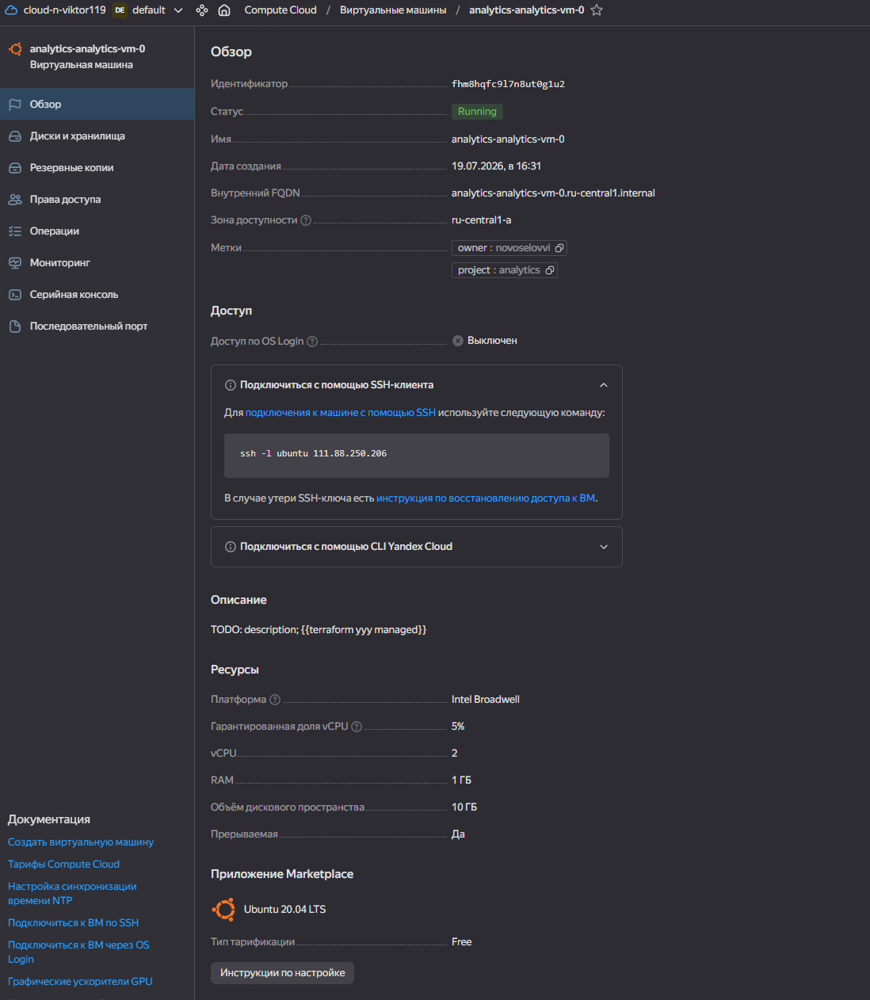

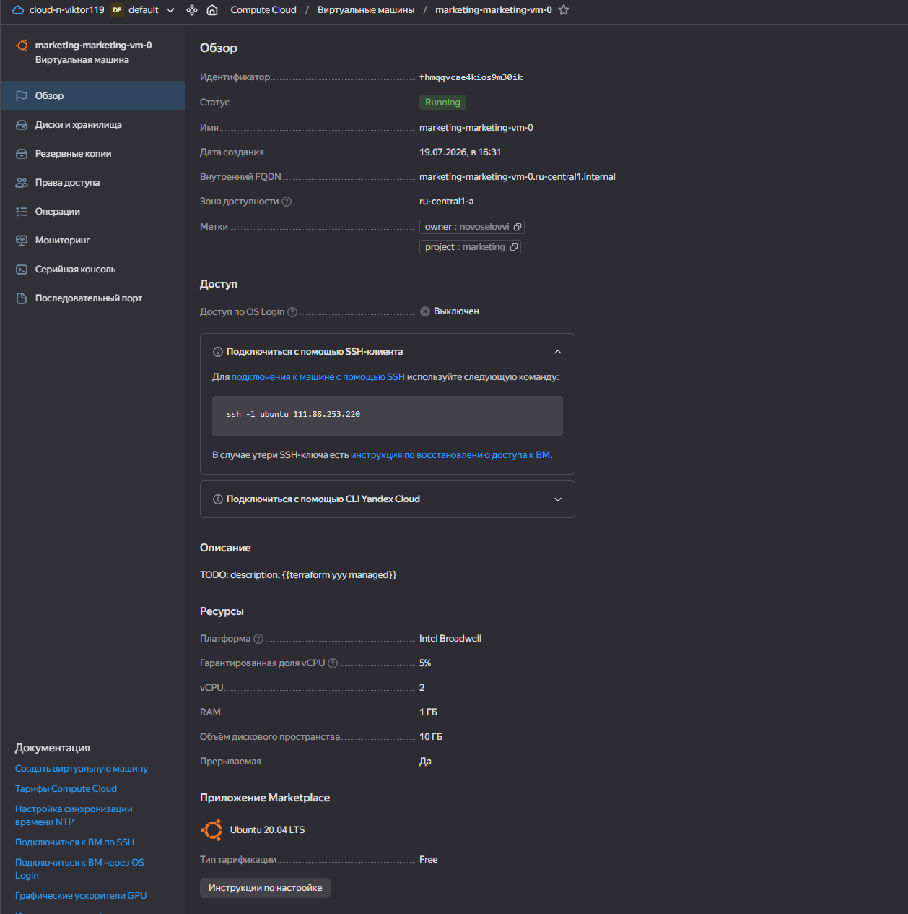

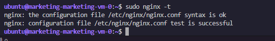

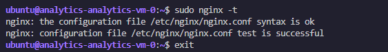

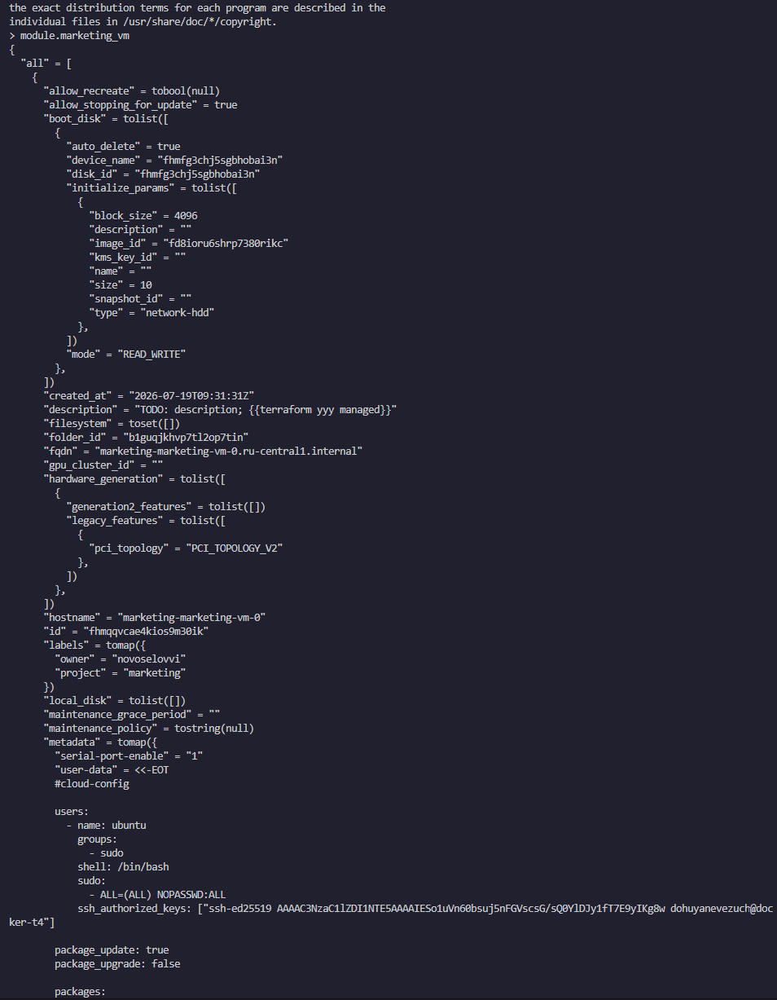


---

## Задание 2

### Текст задания

1. Напишите локальный модуль vpc, который будет создавать 2 ресурса: **одну** сеть и **одну** подсеть в зоне, объявленной при вызове модуля, например: ```ru-central1-a```.
2. Вы должны передать в модуль переменные с названием сети, zone и v4_cidr_blocks.
3. Модуль должен возвращать в root module с помощью output информацию о yandex_vpc_subnet. Пришлите скриншот информации из terraform console о своем модуле. Пример: > module.vpc_dev  
4. Замените ресурсы yandex_vpc_network и yandex_vpc_subnet созданным модулем. Не забудьте передать необходимые параметры сети из модуля vpc в модуль с виртуальной машиной.
5. Сгенерируйте документацию к модулю с помощью terraform-docs.
 
Пример вызова

```
module "vpc_dev" {
  source       = "./vpc"
  env_name     = "develop"
  zone = "ru-central1-a"
  cidr = "10.0.1.0/24"
}
```

### Выполнение задания

Добавили модуль, применили его в создании ВМ

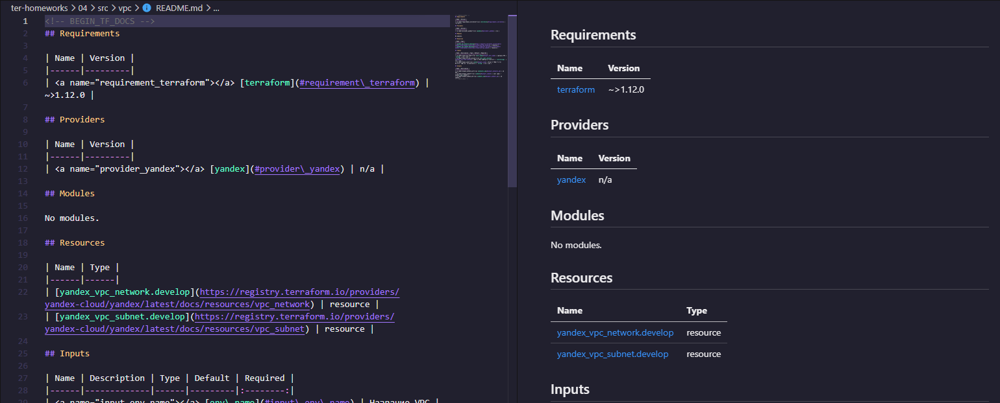

---

## Задание 3

### Текст задания

1. Выведите список ресурсов в стейте.
2. Полностью удалите из стейта модуль vpc.
3. Полностью удалите из стейта модуль vm.
4. Импортируйте всё обратно. Проверьте terraform plan. Значимых(!!) изменений быть не должно.
Приложите список выполненных команд и скриншоты процессы.

### Выполнение задания

```hcl
terraform state list
terraform state show 'module.vpc.yandex_vpc_network.develop' #Сохраняем id
terraform state show 'module.vpc.yandex_vpc_subnet.develop' #Сохраняем id
terraform state show 'module.marketing_vm.yandex_compute_instance.vm[0]' #Сохраняем id
terraform state show 'module.analytics_vm.yandex_compute_instance.vm[0]' #Сохраняем id
terraform state rm 'module.vpc' # Удалим модуль
terraform state rm 'module.marketing_vm' # Удалим модуль
terraform state rm 'module.analytics_vm' # Удалим модуль
terraform state list #Убедились в удалении
terraform import 'module.vpc.yandex_vpc_network.develop' 'enpl6uuuomirb81r1bau' # Импортируем
terraform import 'module.vpc.yandex_vpc_subnet.develop' 'e9bhasl1jrivdvvkfg47' # Импортируем
terraform import 'module.marketing_vm.yandex_compute_instance.vm[0]' 'fhmlfudl13s3bcukt551' # Импортируем
terraform import 'module.analytics_vm.yandex_compute_instance.vm[0]' 'fhm0q7jtkjs96r8pm07f' # Импортируем
terraform state list # Убедились в добавлении
terraform plan # Проверка
```

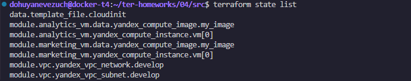

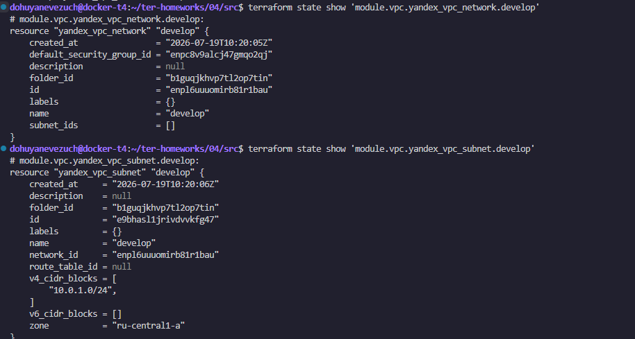

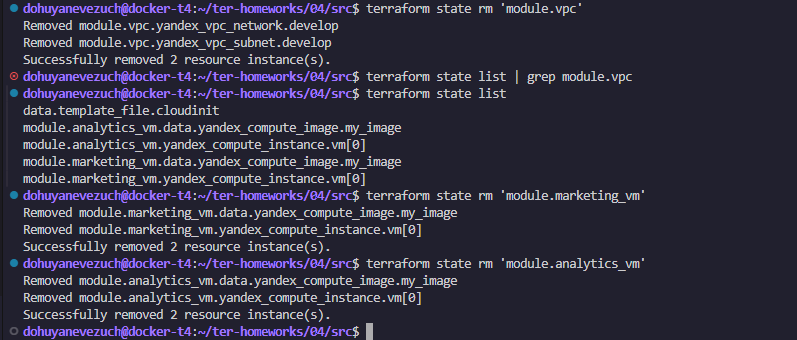


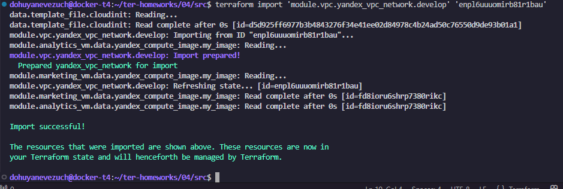

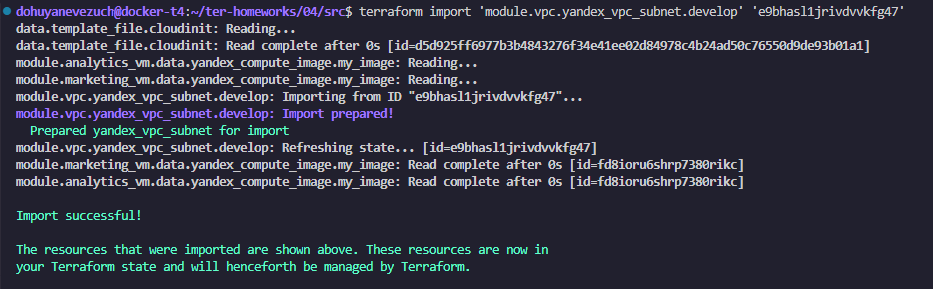

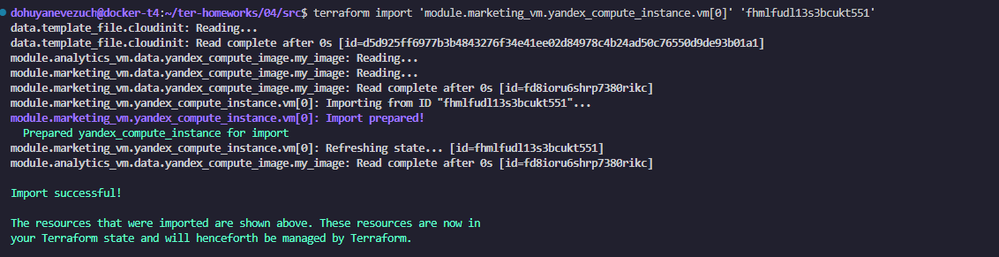

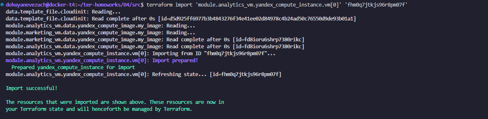

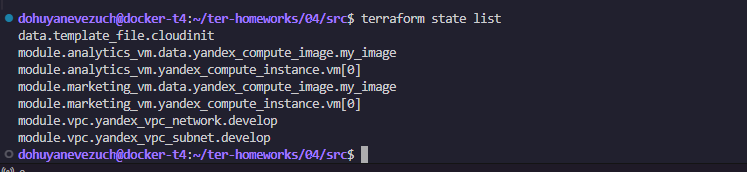

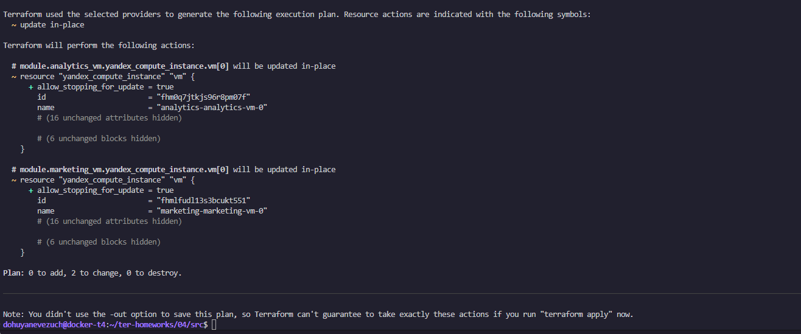


---
