# Итоговый проект модуля `Облачная инфраструктура. Terraform` - `Новоселов Виктор Иванович`

## Задание 1

### Текст задания
Развертывание инфраструктуры в Yandex Cloud.

- Создайте Virtual Private Cloud (VPC).
- Создайте подсети.
- Создайте виртуальные машины (VM):
  - Настройте группы безопасности (порты 22, 80, 443).
  - Привяжите группу безопасности к VM.
- Опишите создание БД MySQL в Yandex Cloud.
- Опишите создание Container Registry.

### Выполнение задания

Развертываение инфраструктуры

Структура проекта:

```
terraform-finish/
├── main.tf
├── variables.tf
├── outputs.tf
├── providers.tf
├── terraform.tfvars
├── personal.auto.tfvars
├── .gitignore
│
└── modules/
    ├── vpc/
    │   ├── main.tf
    │   ├── variables.tf
    │   ├── outputs.tf
    │   └── providers.tf
    │
    ├── vm/
    │   ├── main.tf
    │   ├── variables.tf
    │   ├── outputs.tf
    │   └── providers.tf
    │
    ├── mysql/
    │   ├── main.tf
    │   ├── variables.tf
    │   ├── outputs.tf
    │   └── providers.tf
    │
    └── registry/
        ├── main.tf
        ├── variables.tf
        ├── outputs.tf
        └── providers.tf
```

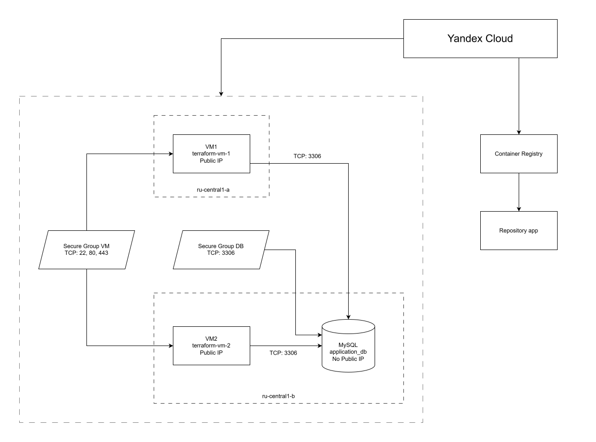

Ход выполнения:

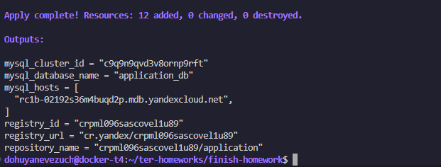

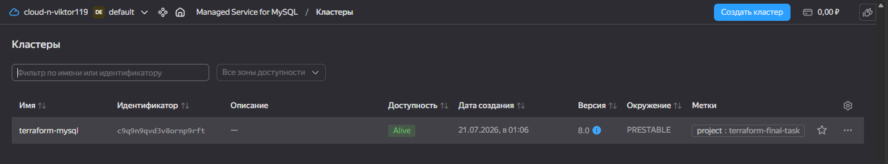

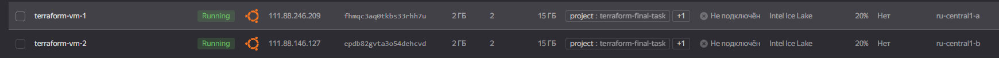

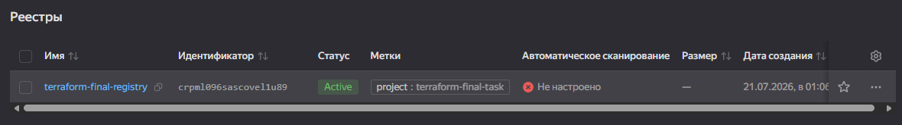


---

## Задание 2

### Текст задания

Используя user-data (cloud-init), установите Docker и Docker Compose (см. Задания 5 модуля «Виртуализация и контейнеризация»).

### Выполнение задания

Добавил `cloud-init.yaml` и задействовал его вызов в коде

cloud-init.yaml:
```yaml
#cloud-config

package_update: true
package_upgrade: false

packages:
  - ca-certificates
  - curl

runcmd:
  - install -m 0755 -d /etc/apt/keyrings
  - curl -fsSL https://download.docker.com/linux/ubuntu/gpg -o /etc/apt/keyrings/docker.asc
  - chmod a+r /etc/apt/keyrings/docker.asc

  - |
    tee /etc/apt/sources.list.d/docker.sources <<EOF
    Types: deb
    URIs: https://download.docker.com/linux/ubuntu
    Suites: $(. /etc/os-release && echo "${UBUNTU_CODENAME:-$VERSION_CODENAME}")
    Components: stable
    Architectures: $(dpkg --print-architecture)
    Signed-By: /etc/apt/keyrings/docker.asc
    EOF
  
  - apt update
  - apt install -y docker-ce docker-ce-cli containerd.io docker-buildx-plugin docker-compose-plugin
  
  - groupadd -f docker
  - usermod -aG docker ubuntu
  - systemctl enable --now docker
```

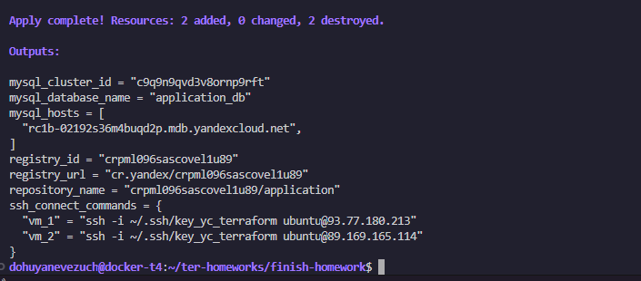

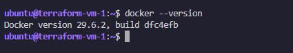

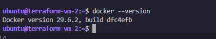


---

## Задание 3

### Текст задания

Опишите Docker файл (см. Задания 5 «Виртуализация и контейнеризация») c web-приложением и сохраните контейнер в Container Registry.

### Выполнение задания

За основу взял готовое ПО - `WordPress`

Добавлен каталог `application`

Добавленны файлы `application/Dockerfile`, `application/uploads.ini`, `application/.dockerignore`, `application/build-and-push.sh`

Образ передан в Registry командами:

```bash
terraform output -raw application_image
printf '%s' "$TF_VAR_token"  | docker login --username iam --password-stdin cr.yandex
cd application/
docker build -t "$(terraform -chdir=.. output -raw application_image)" .
docker push "$(terraform -chdir=.. output -raw application_image)"
```

Результат выполнения команд

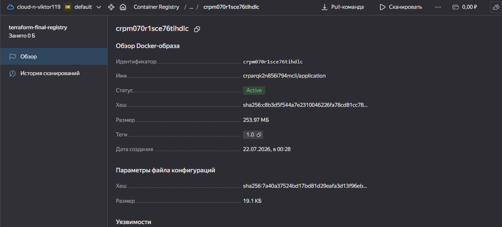

---

## Задание 4

### Текст задания

Завяжите работу приложения в контейнере на БД в Yandex Cloud.

### Выполнение задания

Замена явного `cloud-init.yaml` на template `cloud-init.yaml.tftpl` для использования переменных и запуска wordpress

Добавление файла `application/compose.yaml`

Добавление логики создания сервисного акаунта и использования его на ВМ и запуска образа docker

Выполнение команды apply с реплейсом Виртуальных машин

```bash
terraform apply -replace='module.vm.yandex_compute_instance.vms["vm_1"]' -replace='module.vm.yandex_compute_instance.vms["vm_2"]'
```

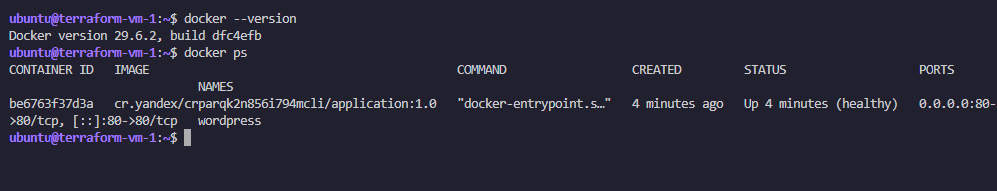

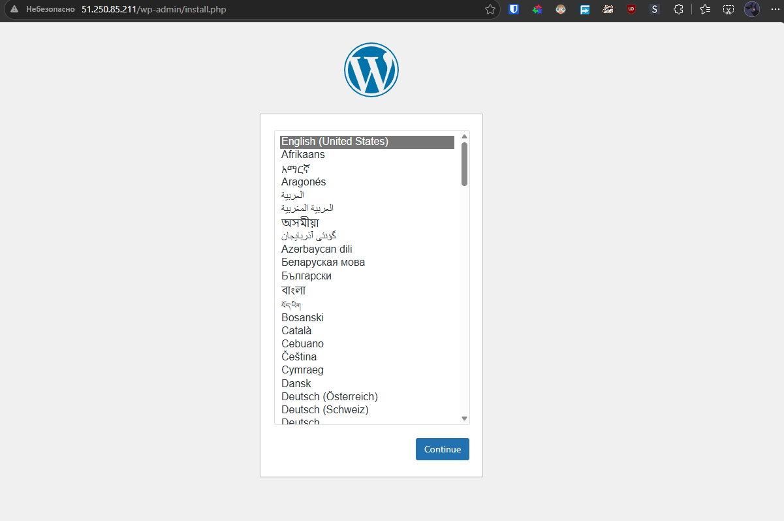

---
