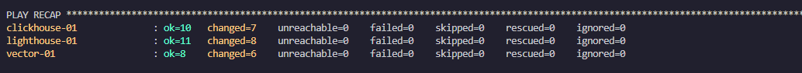
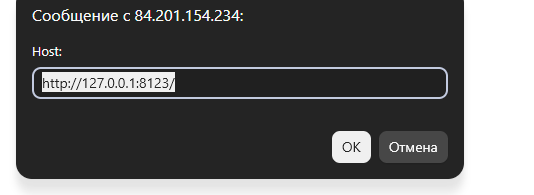

# Домашнее задание к занятию `Использование Ansible` - `Новоселов Виктор Иванович`

## Подготовка к выполнению

1. Подготовьте в Yandex Cloud три хоста: для `clickhouse`, для `vector` и для `lighthouse`.
2. Репозиторий LightHouse находится [по ссылке](https://github.com/VKCOM/lighthouse).

## Задание 1

### Текст задания

1. Допишите playbook: нужно сделать ещё один play, который устанавливает и настраивает LightHouse.
2. При создании tasks рекомендую использовать модули: `get_url`, `template`, `yum`, `apt`.
3. Tasks должны: скачать статику LightHouse, установить Nginx или любой другой веб-сервер, настроить его конфиг для открытия LightHouse, запустить веб-сервер.
4. Подготовьте свой inventory-файл `prod.yml`.
5. Запустите `ansible-lint site.yml` и исправьте ошибки, если они есть.
6. Попробуйте запустить playbook на этом окружении с флагом `--check`.
7. Запустите playbook на `prod.yml` окружении с флагом `--diff`. Убедитесь, что изменения на системе произведены.
8. Повторно запустите playbook с флагом `--diff` и убедитесь, что playbook идемпотентен.
9. Подготовьте README.md-файл по своему playbook. В нём должно быть описано: что делает playbook, какие у него есть параметры и теги.
10. Готовый playbook выложите в свой репозиторий, поставьте тег `08-ansible-03-yandex` на фиксирующий коммит, в ответ предоставьте ссылку на него.

### Выполнение задания

Создание 3 ролей для установки и настройки: `clickhouse`, `vector`, `lighthouse`
Создание inventory файла
создание плея для запуска ролей

Структуа проекта:
```text
.
├── inventory
│   └── prod.yml
├── roles
│   ├── clickhouse
│   │   ├── defaults
│   │   │   └── main.yml
│   │   ├── handlers
│   │   │   └── main.yml
│   │   ├── tasks
│   │   │   └── main.yml
│   │   └── templates
│   │       └── listen.xml.j2
│   ├── lighthouse
│   │   ├── defaults
│   │   │   └── main.yml
│   │   ├── handlers
│   │   │   └── main.yml
│   │   ├── tasks
│   │   │   └── main.yml
│   │   └── templates
│   │       └── lighthouse.conf.j2
│   └── vector
│       ├── defaults
│       │   └── main.yml
│       ├── handlers
│       │   └── main.yml
│       ├── tasks
│       │   └── main.yml
│       └── templates
│           └── vector.yaml.j2
└── site.yml
```

### Роли 

роль `clickhouse`:
- Устанавливает зависимости
- Скачивает GPG ключи
- Добавляет репозиторий clickhouse в apt
- Устанавливает пакеты clickhouse
- Настраивает сеть
- Переводит сервис в Enabled и перезапускает его
- Проверяет существование таблицы для vector
- Если таблицы нет то создает ее

роль `vector`:
- Устанавливает зависимости
- Скачивает скрипт для установки
- Добавляет репозиторий vector в apt через скрипт
- Установливает vector
- Запускает конфига
- Активирует и перезапускает сервис

роль `lighthouse`:
- Устанавливает nginx и tar архиватора
- Скачивает lighthouse с репозитория
- Создает директорию для lighthouse
- Извлекает архив в высезозданную папку
- Задает nginx конфигурацию
- Устанавливает lighthouse в сайты nginx
- Удаляет дефолтный сайт nginx
- Проверяет конфогурацию nginx на наличие ошибок
- Активирует и перезапускает сервис

### Теги
- clickhouse — все задачи ClickHouse;
- vector — все задачи Vector;
- lighthouse — все задачи LightHouse;
- packages — установка пакетов;
- repository — настройка репозиториев;
- download — загрузка LightHouse;
- config — конфигурационные файлы;
- service — управление сервисами;
- database — создание таблицы ClickHouse.

Результат выполнения плейбука:





---
