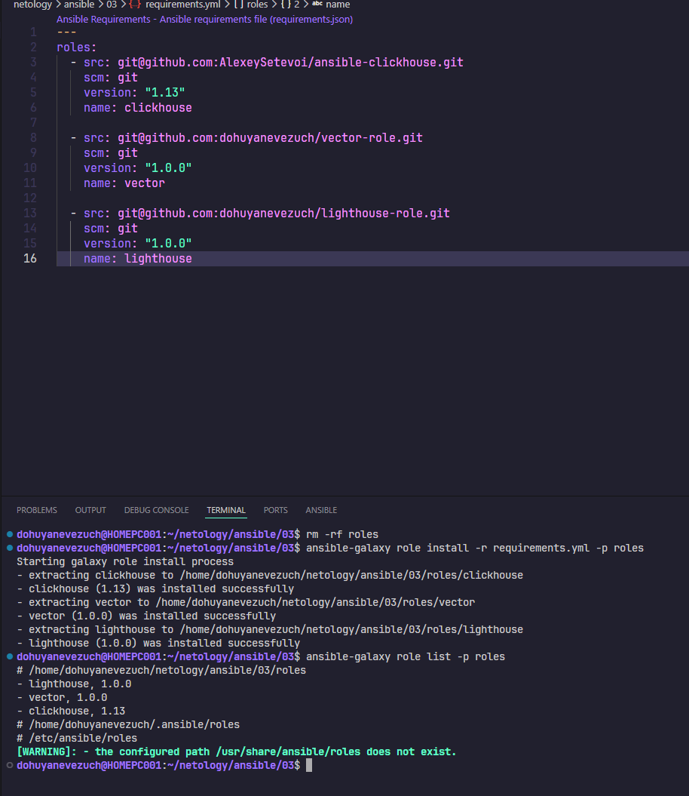
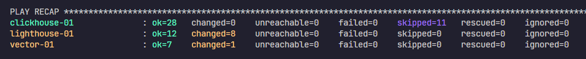

# Домашнее задание к занятию `Работа с roles` - `Новоселов Виктор Иванович`

## Подготовка к выполнению

1. * Необязательно. Познакомьтесь с [LightHouse](https://youtu.be/ymlrNlaHzIY?t=929).
2. Создайте два пустых публичных репозитория в любом своём проекте: vector-role и lighthouse-role.
3. Добавьте публичную часть своего ключа к своему профилю на GitHub.

## Задание 1

### Текст задания

Ваша цель — разбить ваш playbook на отдельные roles. 

Задача — сделать roles для ClickHouse, Vector и LightHouse и написать playbook для использования этих ролей. 

Ожидаемый результат — существуют три ваших репозитория: два с roles и один с playbook.

**Что нужно сделать**

1. Создайте в старой версии playbook файл `requirements.yml` и заполните его содержимым:

   ```yaml
   ---
     - src: git@github.com:AlexeySetevoi/ansible-clickhouse.git
       scm: git
       version: "1.13"
       name: clickhouse 
   ```

2. При помощи `ansible-galaxy` скачайте себе эту роль.
3. Создайте новый каталог с ролью при помощи `ansible-galaxy role init vector-role`.
4. На основе tasks из старого playbook заполните новую role. Разнесите переменные между `vars` и `default`. 
5. Перенести нужные шаблоны конфигов в `templates`.
6. Опишите в `README.md` обе роли и их параметры. Пример качественной документации ansible role [по ссылке](https://github.com/cloudalchemy/ansible-prometheus).
7. Повторите шаги 3–6 для LightHouse. Помните, что одна роль должна настраивать один продукт.
8. Выложите все roles в репозитории. Проставьте теги, используя семантическую нумерацию. Добавьте roles в `requirements.yml` в playbook.
9. Переработайте playbook на использование roles. Не забудьте про зависимости LightHouse и возможности совмещения `roles` с `tasks`.
10. Выложите playbook в репозиторий.
11. В ответе дайте ссылки на оба репозитория с roles и одну ссылку на репозиторий с playbook.

### Выполнение задания

**Ссылки**:
- [playbook репозиторий](https://github.com/dohuyanevezuch/homework_novoselovvi_netology/tree/08-ansible-04-role)
- [lighthouse-role репозиторий](https://github.com/dohuyanevezuch/lighthouse-role/tree/1.0.0)
- [vector-role репозиторий](https://github.com/dohuyanevezuch/vector-role/tree/1.0.0)

Результат выполнения:






---
