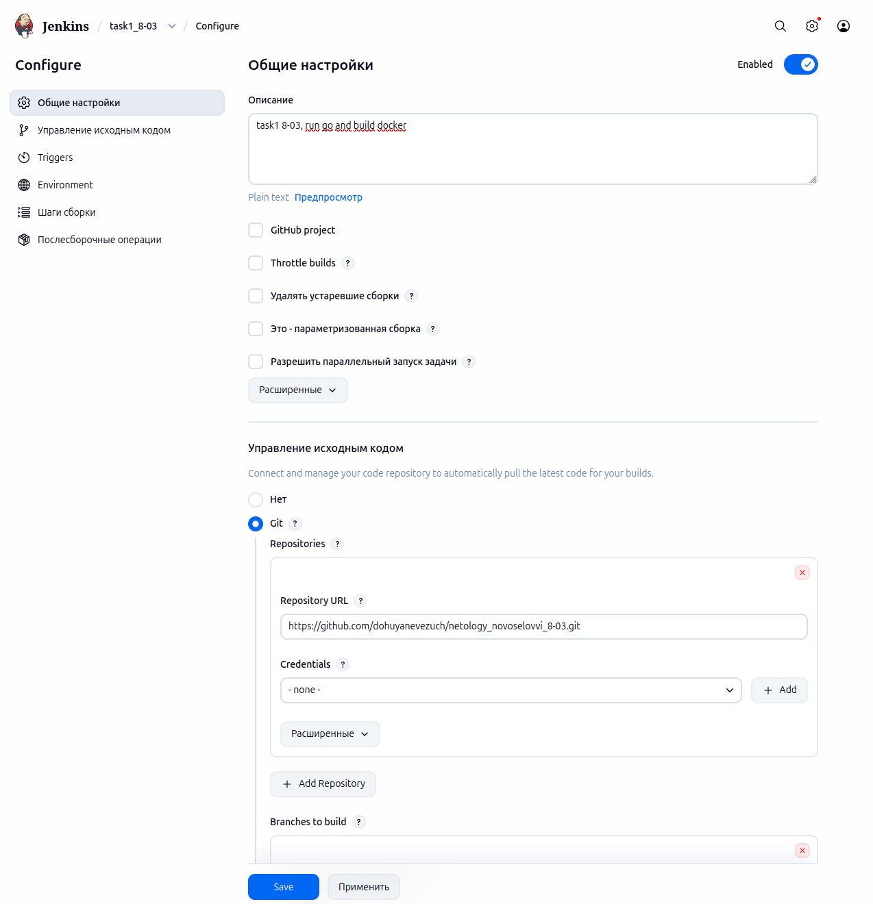
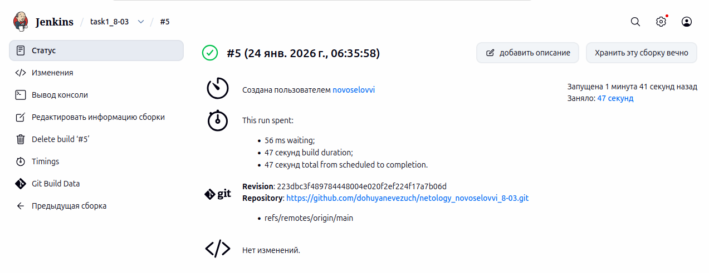
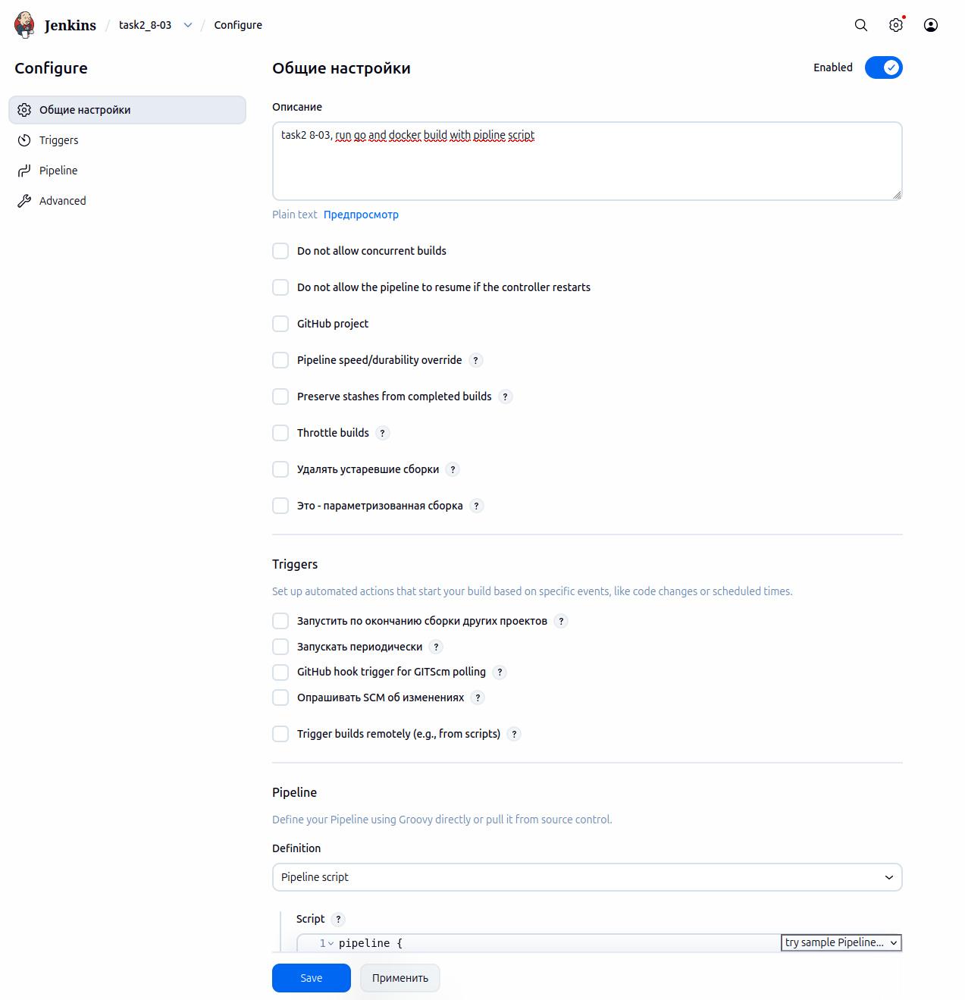
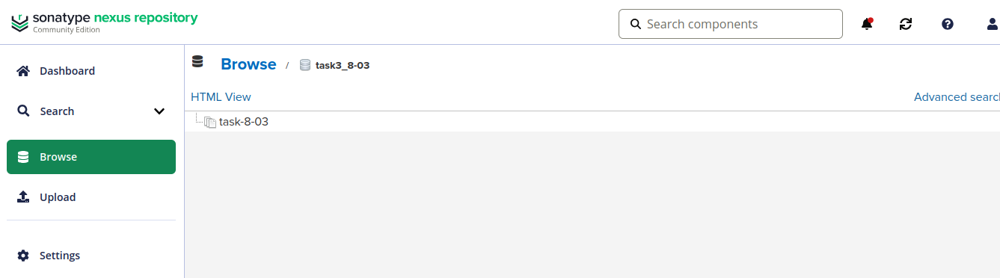
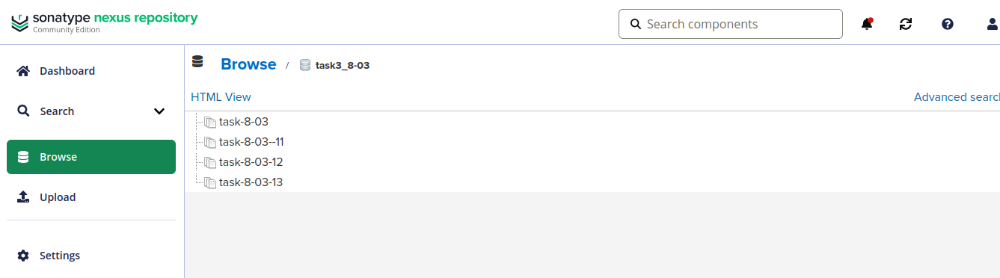

# Домашнее задание к занятию "`Что такое DevOps. CI/CD`" - `Новоселов Виктор Иванович`

> [!DANGER]
> На протяжении всего выполнения, думал, что это 8-03, но это 8-02, прошу прощения, может немного запутать

### Задание 1

#### Текст задания

1. Установите себе jenkins по инструкции из лекции или любым другим способом из официальной документации.Использовать Docker в этом задании нежелательно.
2. Установите на машину с jenkins golang.
3. Используя свой аккаунт на GitHub, сделайте себе форк репозитория. В этом же репозитории находится дополнительный материал для выполнения ДЗ.
4. Создайте в jenkins Freestyle Project, подключите получившийся репозиторий к нему и произведите запуск тестов и сборку проекта go test . и docker build ..

В качестве ответа пришлите скриншоты с настройками проекта и результатами выполнения сборки.

#### Выполнение задания

Установим `go`, `jenkins` и `docker` на ВМ


Сделаем форк репозитория с задания и создадим job в jenkins с типом freestyle project и запустим тесты и сборку командами `go test .` и `docker build .`






---

### Задание 2

#### Текст задания

1. Создайте новый проект pipeline.
2. Перепишите сборку из задания 1 на declarative в виде кода.

В качестве ответа пришлите скриншоты с настройками проекта и результатами выполнения сборки.

#### Выполнение задания

Создадим новую job\`у с типом pipline и добьемся аналогичного результата, но через pipline scripts




```Groovy
pipeline {
 agent any
 stages {
  stage('Git') {
   steps {git branch: 'main', url: 'https://github.com/dohuyanevezuch/netology_novoselovvi_8-03.git'}
  }
  stage('Test') {
   steps {
    sh 'go test .'
   }
  }
  stage('Build') {
   steps {
    sh 'docker build . '
   }
  }
}
}
```


---

### Задание 3

#### Текст задания

1. Установите на машину Nexus.
2. Создайте raw-hosted репозиторий.
3. Измените pipeline так, чтобы вместо Docker-образа собирался бинарный go-файл. Команду можно скопировать из Dockerfile.
4. Загрузите файл в репозиторий с помощью jenkins.

В качестве ответа пришлите скриншоты с настройками проекта и результатами выполнения сборки.

#### Выполнение задания

> [!TIP]
> Не расчитал мощностей арендуемой ВМ, так что ВМ, на которую поставили nexus, будет отдельно.

Устанавливаем nexus, создаем raw (hosted) репозиторий, редактируем pipline для сборки бинарника go и проверяем работу

```Groovy
pipeline {
 agent any
 stages {
  stage('Git') {
   steps {git branch: 'main', url: 'https://github.com/dohuyanevezuch/netology_novoselovvi_8-03.git'}
  }
  stage('Build') {
   steps {
    sh 'GOOS=linux GOARCH=amd64 go build -a -installsuffix nocgo -ldflags="-s -w" -o task3-8-03 .'
   }
  }
  stage('Upload') {
   steps {
     sh '''
         curl -v -u admin:QAZwsx555\
              --upload-file task3-8-03 \
              http://158.160.70.220:8081/repository/task3_8-03/task-8-03
     '''
    }
  }
}
}
```

Результат работы:



---

### Задание 4

#### Текст задания

Придумайте способ версионировать приложение, чтобы каждый следующий запуск сборки присваивал имени файла новую версию. Таким образом, в репозитории Nexus будет храниться история релизов.

Подсказка: используйте переменную BUILD_NUMBER.

В качестве ответа пришлите скриншоты с настройками проекта и результатами выполнения сборки.

#### Выполнение задания

Дополним pipline переменной `BUILD_NUMBER` и проверка работы

> [!TIP]
> Сборку №11 пытался сделать в формате `task-8-03-${TAG_DATA}-${BUILD_NUMBER}`, но дата не отработала, оставил только номер сборки



