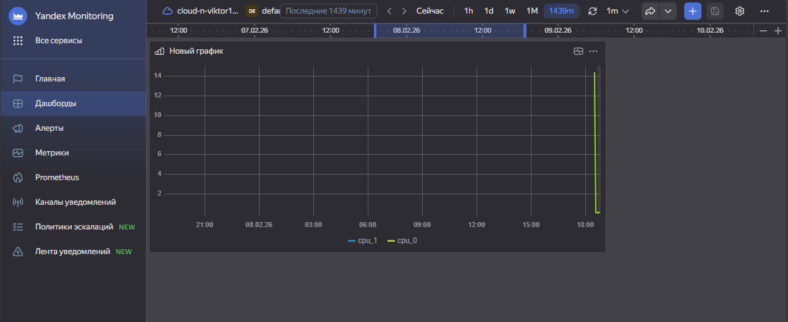
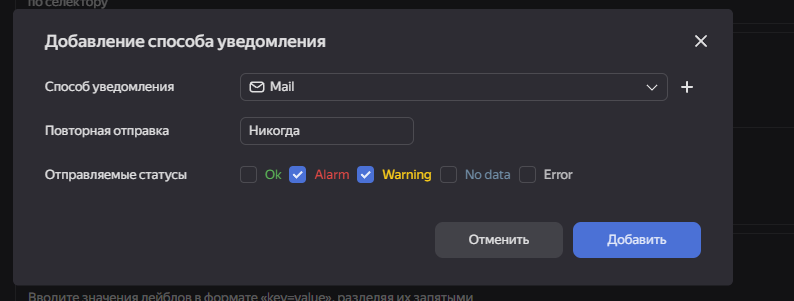

# Домашнее задание к занятию `Обзор систем ИТ-мониторинга` - `Новоселов Виктор Иванович`

### Задание 1

#### Текст задания

Создайте виртуальную машину в Yandex Compute Cloud и с помощью Yandex Monitoring создайте дашборд, на котором будет видно загрузку процессора.

#### Выполнение задания

Создадим ВМ

Перейдем в раздел мониторинга и создадим новый дашборд

Выполним настройку для отображения загрузки процессора на графике

Созраняем, переходм в дашборды и видем наш график

---

### Задание 2

#### Текст задания

С помощью Yandex Monitoring сделайте 2 алерта на загрузку процессора: WARN и ALARM. Создайте уведомление по e-mail.

#### Выполнение задания

Создадим канал Уведомлений и укажем свой аккаунт

Создадим Алерт с порогом срабатывания `cpu_utilization >= 30` - WARN, `cpu_utilization >= 50` - ALARM (для наглядности пороги очень низкие)

Добавим созданный ранее способ уведомлений

Для теста запустим команду `dd if=/dev/urandom | bzip2 -9 > /dev/null` чтоб загрузить процессор

Как мы видим письмо "счастья" пришло на почту

