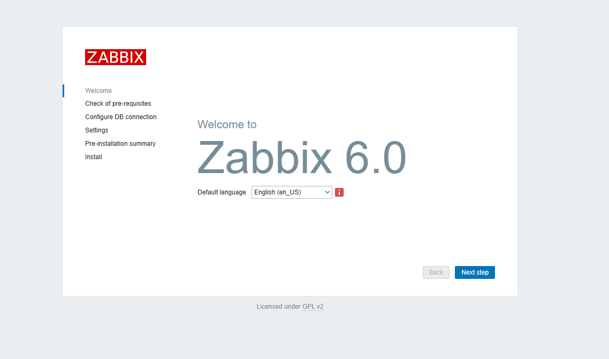
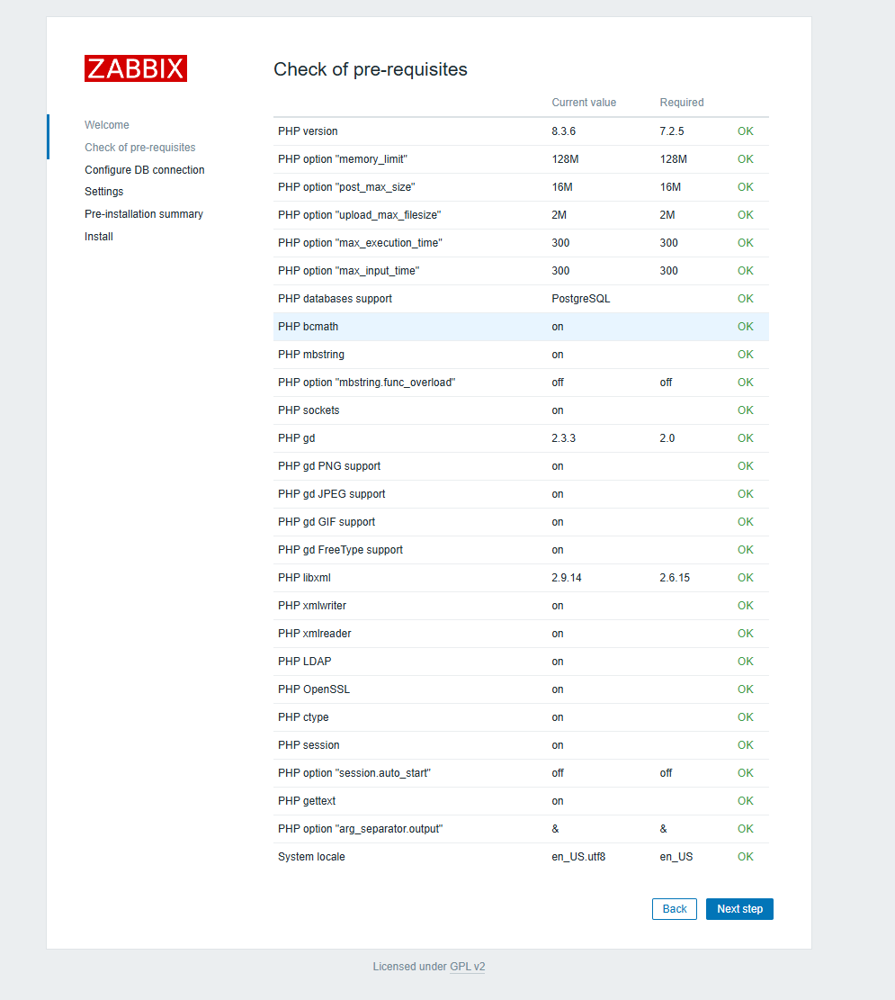
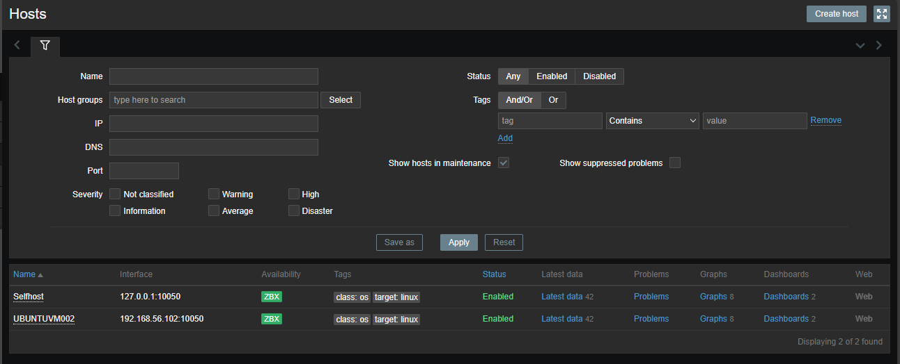
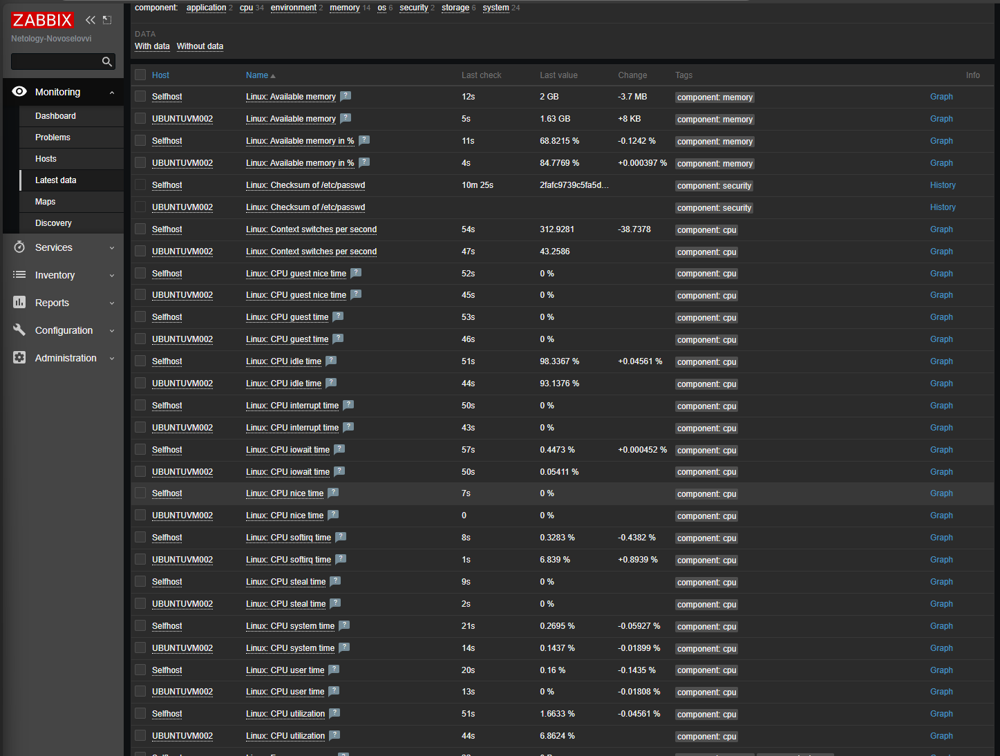
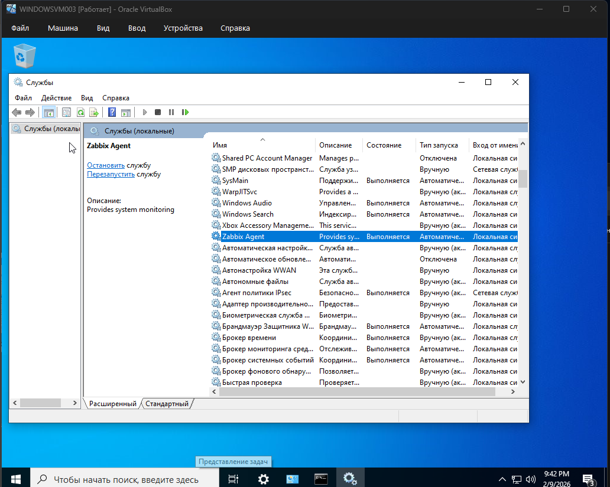
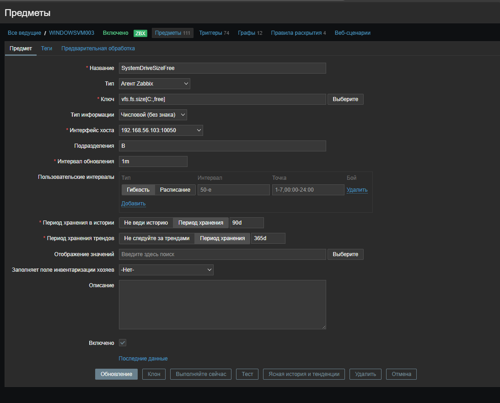

# Домашнее задание к занятию `Система мониторинга Zabbix` - `Новоселов Виктор Иванович`

### Задание 1

#### Текст задания

Установите Zabbix Server с веб-интерфейсом.

Процесс выполнения
1. Выполняя ДЗ, сверяйтесь с процессом отражённым в записи лекции.
2. Установите PostgreSQL. Для установки достаточна та версия, что есть в системном репозитороии Debian 11.
3. Пользуясь конфигуратором команд с официального сайта, составьте набор команд для установки последней версии Zabbix с поддержкой PostgreSQL и Apache.
4. Выполните все необходимые команды для установки Zabbix Server и Zabbix Web Server.

Требования к результатам
1. Прикрепите в файл README.md скриншот авторизации в админке.
2. Приложите в файл README.md текст использованных команд в GitHub.

#### Выполнение задания

```diff
+Установка postgresql
sudo apt install postgresql

+Добавление репозитория Zabbix
wget https://repo.zabbix.com/zabbix/6.0/ubuntu/pool/main/z/zabbix-release/zabbix-release_latest_6.0+ubuntu24.04_all.deb
dpkg -i zabbix-release_latest_6.0+ubuntu24.04_all.deb

+Установка Zabbix сервера
apt update
apt install zabbix-server-pgsql zabbix-frontend-php php8.3-pgsql zabbix-apache-conf zabbix-sql-scripts

+Создание и настройка DB
sudo -u postgres createuser --pwprompt zabbix
sudo -u postgres createdb -O zabbix zabbix
zcat /usr/share/zabbix-sql-scripts/postgresql/server.sql.gz | sudo -u zabbix psql zabbix
DBPassword=PASSWORD

+Перезапуск и активация сервисов Zabbix
systemctl restart zabbix-server apache2
systemctl enable zabbix-server apache2
```

```bash
# Установка postgresql
sudo apt install postgresql

# Добавление репозитория Zabbix
wget https://repo.zabbix.com/zabbix/6.0/ubuntu/pool/main/z/zabbix-release/zabbix-release_latest_6.0+ubuntu24.04_all.deb
dpkg -i zabbix-release_latest_6.0+ubuntu24.04_all.deb

# Установка Zabbix сервера
apt update
apt install zabbix-server-pgsql zabbix-frontend-php php8.3-pgsql zabbix-apache-conf zabbix-sql-scripts

# Создание и настройка DB
sudo -u postgres createuser --pwprompt zabbix
sudo -u postgres createdb -O zabbix zabbix
zcat /usr/share/zabbix-sql-scripts/postgresql/server.sql.gz | sudo -u zabbix psql zabbix
DBPassword=PASSWORD

# Перезапуск и активация сервисов Zabbix
systemctl restart zabbix-server apache2
systemctl enable zabbix-server apache2
```


Переходим по адресу `http://VM_IP/zabbix` и поподаем на начальную страницу Zabbix веб интерфейса




---

### Задание 2

#### Текст задания

Установите Zabbix Agent на два хоста.

Процесс выполнения
1. Выполняя ДЗ, сверяйтесь с процессом отражённым в записи лекции.
2. Установите Zabbix Agent на 2 вирт.машины, одной из них может быть ваш Zabbix Server.
3. Добавьте Zabbix Server в список разрешенных серверов ваших Zabbix Agentов.
4. Добавьте Zabbix Agentов в раздел Configuration > Hosts вашего Zabbix Servera.
5. Проверьте, что в разделе Latest Data начали появляться данные с добавленных агентов.

Требования к результатам
1. Приложите в файл README.md скриншот раздела Configuration > Hosts, где видно, что агенты подключены к серверу
2. Приложите в файл README.md скриншот лога zabbix agent, где видно, что он работает с сервером
3. Приложите в файл README.md скриншот раздела Monitoring > Latest data для обоих хостов, где видны поступающие от агентов данные.
4. Приложите в файл README.md текст использованных команд в GitHub

#### Выполнение задания

На второй ВМ подключаем репозиторий (как в задании 1)

Устанавливаем Агент на сервере и на второй ВМ

```bash
apt install zabbix-agent
systemctl restart zabbix-agent
systemctl enable zabbix-agent
```

На второй ВМ редактируем конфиг `/ect/zabbix/zabbix-agentd.conf`

```diff
- Server=127.0.0.1
+ Server=192.268.56.101
```

Добавили хосты в Zabbix Веб



Проверка работы



---

### Задание 3

#### Текст задания

Установите Zabbix Agent на Windows (компьютер) и подключите его к серверу Zabbix.

Требования к результатам
1. Приложите в файл README.md скриншот раздела Latest Data, где видно свободное место на диске C:

#### Выполнение задания

Создаем новую VM с Windows

Устанавливаем Zabbix Agent 

Проверяем, работает ли служба



Добавяем новый Хост в Zabbix 


Переходим в Configuration -> Hosts -> WINDOWSVM003(Items) и создадим новый итем `SystemDriveSizeFree`



Сохраним, отфильтруем, принудительно запросим


Перейдем в Monitoring -> Lasted Data -> SystemDriveSizeFree(Graph) 

