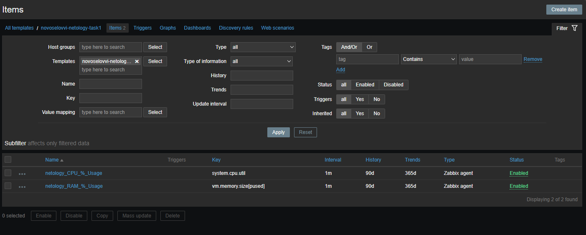
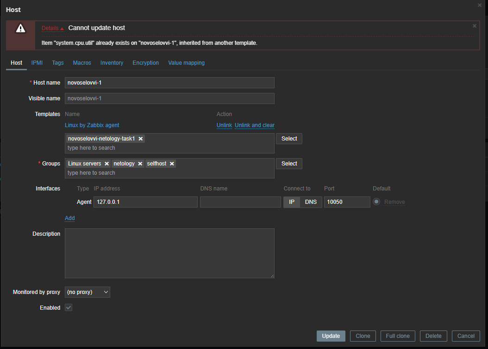
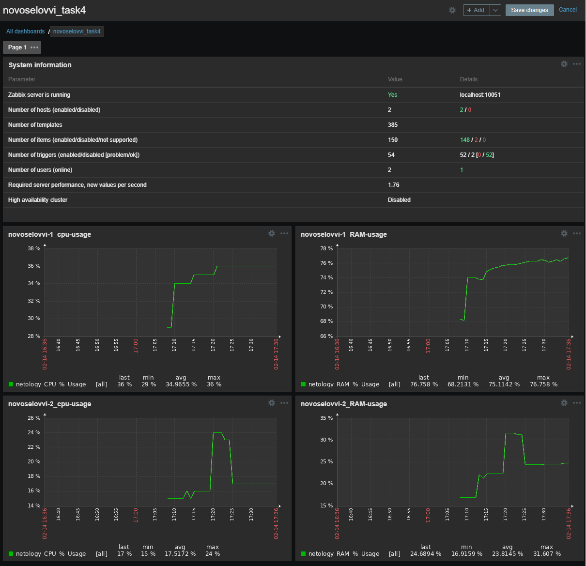
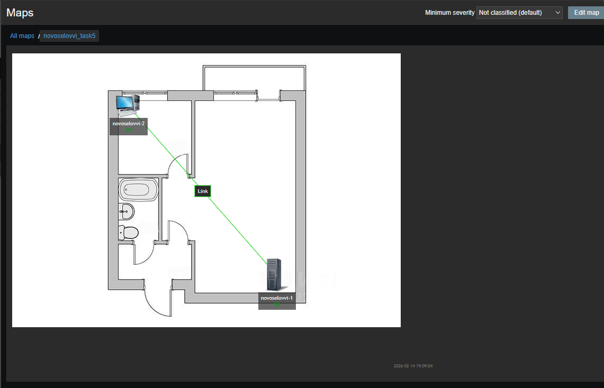
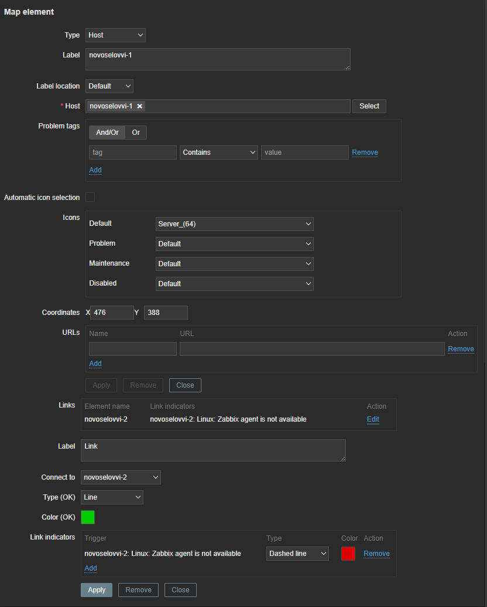
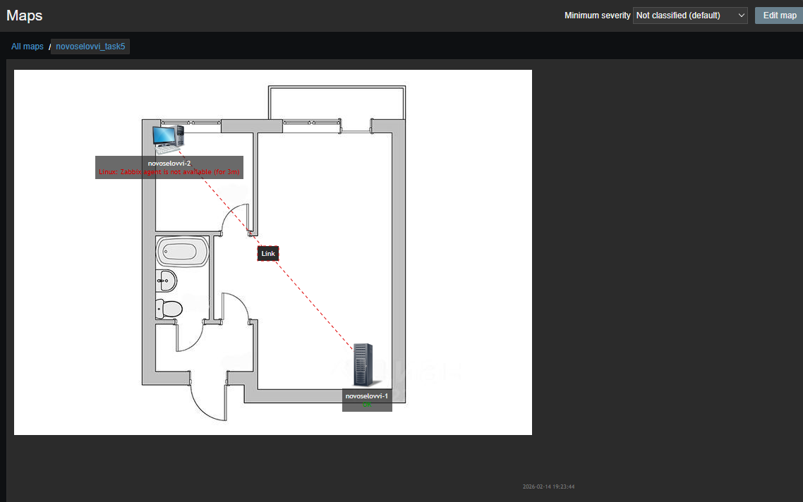
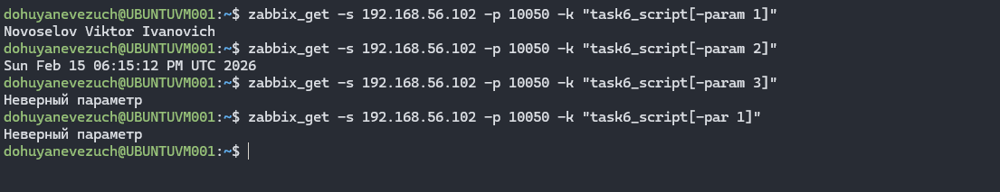

# Домашнее задание к занятию `Система мониторинга Zabbix. Часть 2` - `Новоселов Виктор Иванович`

### Задание 1

#### Текст задания

Создайте свой шаблон, в котором будут элементы данных, мониторящие загрузку CPU и RAM хоста.

Процесс выполнения
1. Выполняя ДЗ сверяйтесь с процессом отражённым в записи лекции.
2. В веб-интерфейсе Zabbix Servera в разделе Templates создайте новый шаблон
3. Создайте Item который будет собирать информацию об загрузке CPU в процентах
4. Создайте Item который будет собирать информацию об загрузке RAM в процентах

#### Выполнение задания

Создание нового шаблона, добавление 2х итемов: на инфо о загруженности CPU и на инфо по загруженности RAM




---

### Задание 2

#### Текст задания

Добавьте в Zabbix два хоста и задайте им имена <фамилия и инициалы-1> и <фамилия и инициалы-2>. Например: ivanovii-1 и ivanovii-2.

Процесс выполнения
1. Выполняя ДЗ сверяйтесь с процессом отражённым в записи лекции.
2. Установите Zabbix Agent на 2 виртмашины, одной из них может быть ваш Zabbix Server
3. Добавьте Zabbix Server в список разрешенных серверов ваших Zabbix Agentов
4. Добавьте Zabbix Agentов в раздел Configuration > Hosts вашего Zabbix Servera
5. Прикрепите за каждым хостом шаблон Linux by Zabbix Agent
6. Проверьте что в разделе Latest Data начали появляться данные с добавленных агентов

#### Выполнение задания

Установка Zabbix агента на 2 машины, подключение их к Zabbix серверу


---

### Задание 3

#### Текст задания

Привяжите созданный шаблон к двум хостам. Также привяжите к обоим хостам шаблон Linux by Zabbix Agent.

Процесс выполнения
1. Выполняя ДЗ сверяйтесь с процессом отражённым в записи лекции.
2. Зайдите в настройки каждого хоста и в разделе Templates прикрепите к этому хосту ваш шаблон
3. Так же к каждому хосту привяжите шаблон Linux by Zabbix Agent
4. Проверьте что в раздел Latest Data начали поступать необходимые данные из вашего шаблона

#### Выполнение задания

Прикрипление Созданного шаблона и шаблона Linux by Zabbix Agent



Как видим, В встроенном шаблоне уже используется указанная нами метрика, пойдем по пути замены нашей метрики на создание новой через UserParameter

Изменим метрику для сбора статистики загруженности CPU.

Создадим ключ novoselovvi.cpu.usage


Как видим, теперь все добавилось


Далее добавляем в `/etc/zabbix/zabbix_agentd.conf` содержимое параметра пользователя `UserParameter=novoselovvi.cpu.usage,free | grep Mem | awk '{printf "%.0f\n", $3/$2 * 100.0}'` для своей реализации загруженности процессора в процентах.

Перезагружаем службу агента и смотрим в Latest Data


---

### Задание 4

#### Текст задания

Создайте свой кастомный дашборд.

Процесс выполнения
1. Выполняя ДЗ сверяйтесь с процессом отражённым в записи лекции.
2. В разделе Dashboards создайте новый дашборд
3. Разместите на нём несколько графиков на ваше усмотрение.

#### Выполнение задания

Создание своего дашборда



---

### Задание 5*

#### Текст задания

Создайте карту и расположите на ней два своих хоста.

Процесс выполнения
1. Настройте между хостами линк.
2. Привяжите к линку триггер, связанный с agent.ping одного из хостов, и установите индикатором сработавшего триггера красную пунктирную линию.
3. Выключите хост, чей триггер добавлен в линк. Дождитесь срабатывания триггера.

#### Выполнение задания

Создание Карты, добавление хостов на карту, создание линка



Добавление тригера при недоступности хоста novoselovvi-2



Выключение хоста novoselovvi-2



---

### Задание 6*

#### Текст задания

Создайте UserParameter на bash и прикрепите его к созданному вами ранее шаблону. Он должен вызывать скрипт, который:

- при получении 1 будет возвращать ваши ФИО,
- при получении 2 будет возвращать текущую дату.

#### Выполнение задания

Создадим bash скрипт

```bash
#!/bin/bash

if [ $# -lt 2 ]; then
        echo "Требуется 2 параметра"
        exit 1
fi

if [ "$1" == "-param" ]; then
        if [ "$2" == '1' ]; then
                echo "Novoselov Viktor Ivanovich"
                exit 0
        elif [ "$2" == '2' ]; then
                echo $(date)
                exit 0
        else echo "Неверный параметр"; exit 1
        fi
else echo "Неверный параметр"; exit 1
fi
```

Создадим конфиг файл для описания UserParameter, который будет запускать данный скрипт

```bash
UserParameter=task6_script[*], /etc/zabbix/zabbix_agentd.d/task6_bash_script.sh $1 $2
```

Перезапустим сервис агента

Проверим работу с хоста, на котором установлен сервер



---

### Задание 7*

#### Текст задания

Доработайте Python-скрипт из лекции, создайте для него UserParameter и прикрепите его к созданному вами ранее шаблону. Скрипт должен:

- при получении 1 возвращать ваши ФИО,
- при получении 2 возвращать текущую дату,
- делать всё, что делал скрипт из лекции.

#### Выполнение задания

Возьмем скрипт из лекции

```python
import sys
import os
import re
if (sys.argv[1] == '-ping'): # Если -ping
    result=os.popen("ping -c 1 " + sys.argv[2]).read() # Делаем пинг по заданному адресу
    result=re.findall(r"time=(.*) ms", result) # Выдёргиваем из результата время
    print(result[0]) # Выводим результат в консоль
elif (sys.argv[1] == '-simple_print'): # Если simple_print
    print(sys.argv[2]) # Выводим в консоль содержимое sys.arvg[2]
else: # Во всех остальных случаях
    print(f"unknown input: {sys.argv[1]}") # Выводим непонятый запрос в консоль
```

Отредактируем скрипт по заданию

```diff
  import sys
  import os
  import re
  if (sys.argv[1] == '-ping'):
      result=os.popen("ping -c 1 " + sys.argv[2]).     read()
      result=re.findall(r"time=(.*) ms", result)
-     print(result[0])
+     if result:
+         print(result[0])
+     else:
+         print ("Не удается получить ответ от     ping")
  elif (sys.argv[1] == '-simple_print'):
      print(sys.argv[2])
+ elif (sys.argv[1] == '-param'):
+     if (sys.argv[2] == '1'):
+         print ("Novoselov Viktor Ivanovich")
+     elif (sys.argv[2] == '2'):
+         result=os.popen("date").read().strip()
+         print(result)
+     else:
+         print (f"Непридвиденный параметр {sys.   argv[2]}")
  else:
      print(f"unknown input: {sys.argv[1]}")
```

Созадние `/etc/zabbix/zabbix-agentd.d/task7_parameter.conf` с содержимым:

```bash
UserParameter=task7_script[*],python3 /etc/zabbix/zabbix-agentd.d/test_python_script.py $1 $2
```

Перезапуск агента и проверка zabbix гетом работы параметра с скриптом с ВМ сервера


---

### Задание 8*

#### Текст задания

Настройте автообнаружение и прикрепление к хостам созданного вами ранее шаблона.

#### Выполнение задания

Удаляем уже добавленные хосты


Добавляем Discovery actions


Добавляем Discovery Rules


Проверяем отработку


Проверяем, что хосты отображаются и шаблон из задания 1 закрепился за ними


Проверяем, что данные начали собираться


---
